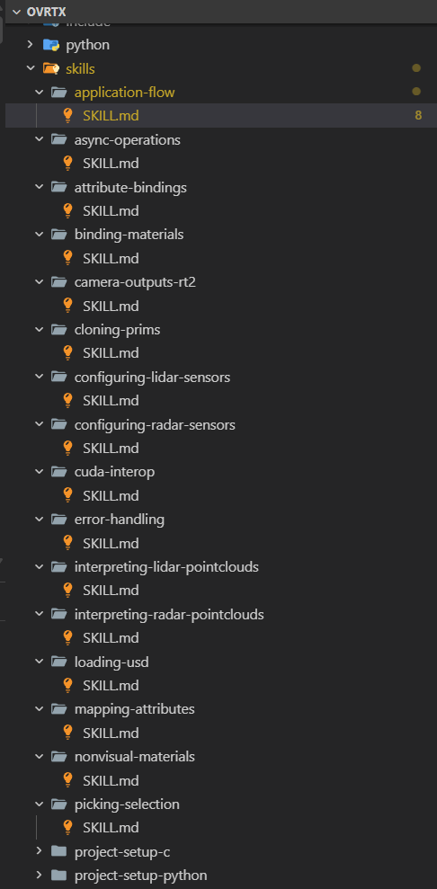

# I tried to integrate the NVIDIA Omniverse ovrtx library by hand. The agent beat me by a day. The reason wasn't the agent.

#### Author: Ashley Goldstein, Lead Tech Marketing | Omniverse


Last Friday, I had two things on my plate: integrate the NVIDIA Omniverse rendering library, [ovrtx](https://github.com/nvidia-omniverse/ovrtx), into a showfloor demo, and sit in a meeting that I knew was going to run long. I started the agent on the integration while I was getting on the call, expecting to come back to a half-finished scaffold I'd have to clean up. When the meeting ended I came back to a working integration. First try. Compiled, ran, produced a correct rendered frame against the USD scene.


*Caption: Rendered output of DSX Racks for a demo*  
*Alt Caption: Photorealistic 3D rendering of DSX server racks in a modern data center, featuring dense cable management overhead and liquid cooling infrastructure.*

That composition is a day of work if I do it by hand. The version with an agent-first skill in the loop is closer to the integration this article opened with: I kick it off, take a meeting, come back to something working. 

That had not happened to me before with any library. I spent the next afternoon trying to figure out why.

### What ovrtx is

ovrtx is NVIDIA's standalone Python and C library for real-time, physically accurate rendering and sensor simulation, built on the Omniverse RTX renderer. One of NVIDIA's new standalone [Omniverse libraries](https://developer.nvidia.com/omniverse) — meant to be embedded as a `pip install` dependency inside your own application, not launched as a Kit app. Version 0.3 is the current release; everything below is against that.

## TL;DR

The agent didn't suddenly get smarter on Friday. What changed is that `ovrtx` is one of the first libraries I've used that was built with the explicit expectation that an agent — not a human — would be the first reader of the docs and the first writer of the integration code. Once I started looking, the implications for human developers turned out to be larger than the agent-only framing suggests: the work a library team has to do to be "agent-friendly" is the work good library teams have always wanted to do for humans and never had the engineering hours to fund — and the bill shows up on my side as a day saved per integration. 

## What I asked the agent to do

The task: get `ovrtx` running in an empty repo against a sample USD scene, step the renderer, pull a rendered frame off the camera, and write it to disk. Nothing exotic. The kind of integration I've done many times before, and the kind I usually budget a day for — most of that day spent picking the right version, finding the right entrypoint, and writing the boilerplate to glue it together. 

I gave the agent a deliberately sparse prompt, because I wanted to see what the library's discoverability did, not what I could compensate for:

> Set up ovrtx in this empty repo to render this DSX rack scene to a PNG for a
> showfloor demo. Print the resolution of the output to stdout. Use the current
> released version. 

That's it. No links, no version pins, no documentation references, no template code.

## What worked, and what I noticed

The agent produced about 80 lines of Python, a `pyproject.toml` with a single pinned dependency (`ovrtx==0.3.0`), and a one-line shell command to run it. The script worked on the first try. The output frame opened correctly and matched what I would have produced by hand.

```json
pyproject.toml
[project]
name = "ovrtx-render-one-frame"
version = "0.1.0"
description = "Minimal ovrtx 0.3 integration matching the article's example."
requires-python = ">=3.10"
dependencies = [
    "ovrtx==0.3.0",
]

[project.scripts]
render-one-frame = "render_one_frame:main"

[build-system]
requires = ["setuptools>=68"]
build-backend = "setuptools.build_meta"

```

I would have called this lucky and moved on, except I noticed three things that made me stop.

The first was that the shape of the code matched the canonical ovrtx pattern almost line for line — `ovrtx.Renderer()`, then `open_usd(...)`, then `step(render_products={...}, delta_time=...)`, then a readback through `render_vars["LdrColor"]` and DLPack into a numpy array. I had not given the agent that shape. It converged on it because that's the shape the docs and examples prefer. Most libraries I've worked with offer at least two or three idiomatic ways to do the same thing depending on which docs page you happen to land on; the ovrtx surface seemed to have one. 

The second was the version pin. The agent had landed on `ovrtx==0.3.0` and left a brief comment explaining the choice — that 0.3 was the current pre-release version. That's the kind of bookkeeping a human integrator either knows from being burned or learns by reading release notes back to back. **The agent didn't guess**. It either read the release notes properly or read a skill file that captured the same information. 

The third was what happened when I asked the agent to break the integration on purpose — pass a render product path that doesn't exist in the sample stage, something like `render_products={"/Render/Wrong"}`. The error `ovrtx` surfaced was specific and actionable: it listed the available render products in the stage and pointed at the obvious correction. **I would have spent forty minutes debugging that error message a year ago**. This time it pointed at the fix in one sentence. 

## The actual reason

The actual reason is that the `ovrtx` team decided the agent — not the human — is the first reader of the library, and built the surface around that. I went looking for the apparatus that made that real and found it: \`ovrtx\` ships with a bundle of skill files — short, structured recipes an agent can consult when it's setting up the library, opening a USD, stepping the renderer, or diagnosing common errors. The docs are written in a register that's clearly aware an agent might be reading them: agent skills are organized, examples are short, runnable, and explicit about their assumptions; the API reference uses consistent verbs across object types; the error messages embed suggestions.  

*Caption: Screenshot of Skills folder in ovrtx*  
*Alt Caption: Screenshot of an IDE UI displaying the folder structure of skills, including all of the subfolders for each type of skill and their respective .md file for the skill.*

The interesting move `ovrtx` has made is to declare that the agent is the first reader, not the human — and use that declaration as the forcing function to fund the work that good library teams have always wanted to fund.

That, I think, is the part worth writing about. "Designed for agents first" sounds like a marketing line. In practice it means an investment in **API predictability**, in single-shape examples that compile, in **error messages that suggest fixes**, and in tight coupling between docs pages and **runnable samples**. These are the investments every library team I've worked with has wanted to make for human readers and has had to defer because they didn't move quarterly numbers. The agent-first framing is what finally makes the budget appear.

The benefit to me, a human developer, is that I now spend a day less on each `ovrtx` integration. I will take that benefit regardless of which audience the work was nominally done for.

## The honest counterpoint

This could go the other way too, and I want to acknowledge that before I oversell the case.

If a library team optimizes hard for agents — especially for a specific agent's quirks — the human-facing surface can regress. **Docs become brittle scaffolding for prompts** rather than explanatory text. Examples become demonstrations of the recipe instead of the underlying API. Error messages start to read like prompts to the next LLM rather than diagnostics for a person reading a stack trace. I haven't seen `ovrtx` slide into any of those failure modes yet, but I've seen other agent-first projects slide into them, and the distance between "agent-friendly" and "agent-only" is narrower than the marketing language admits.

The forcing function only works because agents and humans currently want roughly the same things from a library — **predictability, runnable examples, honest errors**. If those wants diverge — if agents end up preferring opaque one-call APIs while humans still want composable building blocks — the agent-first investment will stop benefiting humans, and library teams will have to pick a side. I don't think we're there yet. I think it's worth keeping an eye on when we get there.

## The example I now keep around

The minimal example below is the scaffold I point the agent to every new ovrtx job. It's pulled straight from the public repo, and that's exactly why it's useful — it pins down the `Renderer`, `open_usd`, `step()` with a frame time, and readback through `render_vars["LdrColor"]` into numpy via DLPack. Once that shape is in the agent's context, it stops guessing at the structure of an ovrtx integration and starts adding to it, which is most of where the day-saving comes from.

```py
import argparse
import sys
from pathlib import Path

import numpy as np
import ovrtx
from PIL import Image

USD_URL = "https://omniverse-content-production.s3.us-west-2.amazonaws.com/Samples/Robot-OVRTX/robot-ovrtx.usda"

def main():
    parser = argparse.ArgumentParser(description="Minimal ovrtx Python example")
    parser.add_argument("--png", action="store_true", help="Save render to _output/render.png instead of displaying")
    args = parser.parse_args()

    # Create the Renderer and load a USD layer into it
    print("Creating renderer. The first run will take some time as shaders are compiled and cached...", file=sys.stderr)
    renderer = ovrtx.Renderer()
    print("Renderer created.", file=sys.stderr)

    print(f"Opening {USD_URL}...", file=sys.stderr)
    renderer.open_usd(USD_URL)
    print("USD loaded.", file=sys.stderr)

    # Step the renderer to simulate the Camera at 60Hz
    print("Stepping renderer...", file=sys.stderr)
    products = renderer.step(
        render_products={"/Render/Camera"},
        delta_time=1.0 / 60,
    )
    print("Stepped renderer.", file=sys.stderr)

    # Get the Camera output for the step as a numpy array and display it
    print("Fetching results...", file=sys.stderr)
    for _product_name, product in products.items():
        for frame in product.frames:
            var = frame.render_vars["LdrColor"].map(device=ovrtx.Device.CPU)
            pixels = np.from_dlpack(var)
            img = Image.fromarray(pixels)
            if args.png:
                output_dir = Path("_output")
                output_dir.mkdir(exist_ok=True)
                img.save(output_dir / "render.png")
                print(f"Saved to {output_dir / 'render.png'}", file=sys.stderr)
            else:
                img.show()
    print("Fetched results.", file=sys.stderr)

if __name__ == "__main__":
    main()
```

### **What changes when the realtime viewer skill lands**

The minimal example above gets me one rendered frame. What I actually need most is an interactive, browser-viewable streamed viewport — which on this stack means composing multiple libraries with `ovrtx`. That composition is a day of work if I do it by hand. The version with an agent-first skill in the loop is: I kick it off, take a meeting, come back to something working. 

That skill exists — at least as a working prototype. The `omniverse-realtime-viewer` came out of NVIDIA's internal Omniverse AI Hackathon earlier this year, where teams built a string of agent-driven demos on top of the same libraries this article is about. It's now being polished for a wider release, and the prototype shape is already clear: it's the version of "agent-first" applied one layer up from a single library. Where the minimal `ovrtx` example shows the agent converging on a canonical render call, the realtime viewer skill is the agent converging on a canonical three-library viewer — same first-try shape, just at a bigger scope. Instead of handing the agent a library and watching it produce an integration, I hand the agent a USD scene and watch it produce a working streamed viewer. 

The thing I'm most curious to validate is whether the skill behaves the way the minimal ovrtx example does when the matrix drifts mid-project. When other Omniverse libraries ship on independent release cadences and the wire format between them changes more often than the version numbers suggest. If the skill catches that drift cleanly — at lockfile-write would be ideal, at first-frame is acceptable — it removes my single most common source of integration pain in this stack. If it doesn't, I'll know within a week and we'll have something concrete to push back on.

What I'd like this skill to be one year from now is the answer to "I need a viewer on top of this scene" the way `ovrtx.Renderer()` is the answer to "I need a render call." Same level of don't-think-about-it.

## What I'd do differently

I'd stop treating "agent-friendly" as a marketing claim and start treating it as a checklist. Before I integrate any new Omniverse library, I want to look for the same three things I noticed with `ovrtx`: a skill file that captures the why-not-just-the-what of API choices, error messages that suggest fixes, and examples that compile. Those are surface signals that the underlying work has been done. If they're missing, I should expect to lose a day to the integration the way I used to.

I'd also push back on my own first reaction to the Friday integration. When the agent got it right on the first try, **my instinct was to credit the agent**. The library deserves most of the credit. Agents are a multiplier; what they multiply is whatever the library team has prepared for them. `ovrtx` prepared a lot.

## What I'm still not sure about

I don't know whether this works for libraries with much messier surface areas — older USD codebases, or anything carrying fifteen years of accreted API. `ovrtx` benefits from being relatively young. A team starting from scratch with agent-first principles can hit this bar in a way that a team retrofitting agent-first behavior onto a legacy surface probably cannot, and I haven't seen what that retrofit looks like yet.

I also don't know the maintenance cost for the library team. Skill files have to be updated when the API changes. Error messages with suggestions become incorrect when the suggested fixes drift. The first-time investment is one thing; the upkeep is another, and I'd want to talk to the `ovrtx` team in a year to see whether the cost is sustainable or whether they're now spending half their week keeping the agent-facing surface honest.

And the open question I'd actually like an answer to: I don't know whether the `ovrtx` experience can be generalized, or whether it's specific to the kind of library `ovrtx` happens to be — a real-time renderer with a fairly narrow API surface and a clear contract about what it produces. A library with a fuzzier contract — anything content-generation-shaped, anything where "the right output" is subjective — might not benefit from agent-first preparation the same way, because the agent doesn't have a clean fail signal to lean on. I'd be curious to hear from anyone who's tried to apply the same approach to a less crisp surface and what happened.

If you want to try it yourself: ovrtx 0.3 is at github.com/nvidia-omniverse/ovrtx — clone it, point it at a USD scene you already have rights to, and hand the integration to whichever agent you're using. What I'd most like to hear back is where the surface broke down: where the agent stumbled, or a skill file should have said more, and if an error message wasn't the help it was trying to be. That's the next round of feedback worth funding. 

Check out the NVIDIA Omniverse ovrtx Github [https://github.com/nvidia-omniverse/ovrtx](https://github.com/nvidia-omniverse/ovrtx)

Watch: [Build an RTX USD Viewer With NVIDIA Omniverse and One AI Agent Prompt](https://www.youtube.com/watch?v=t2HYd5MF5b4&t=1s)
