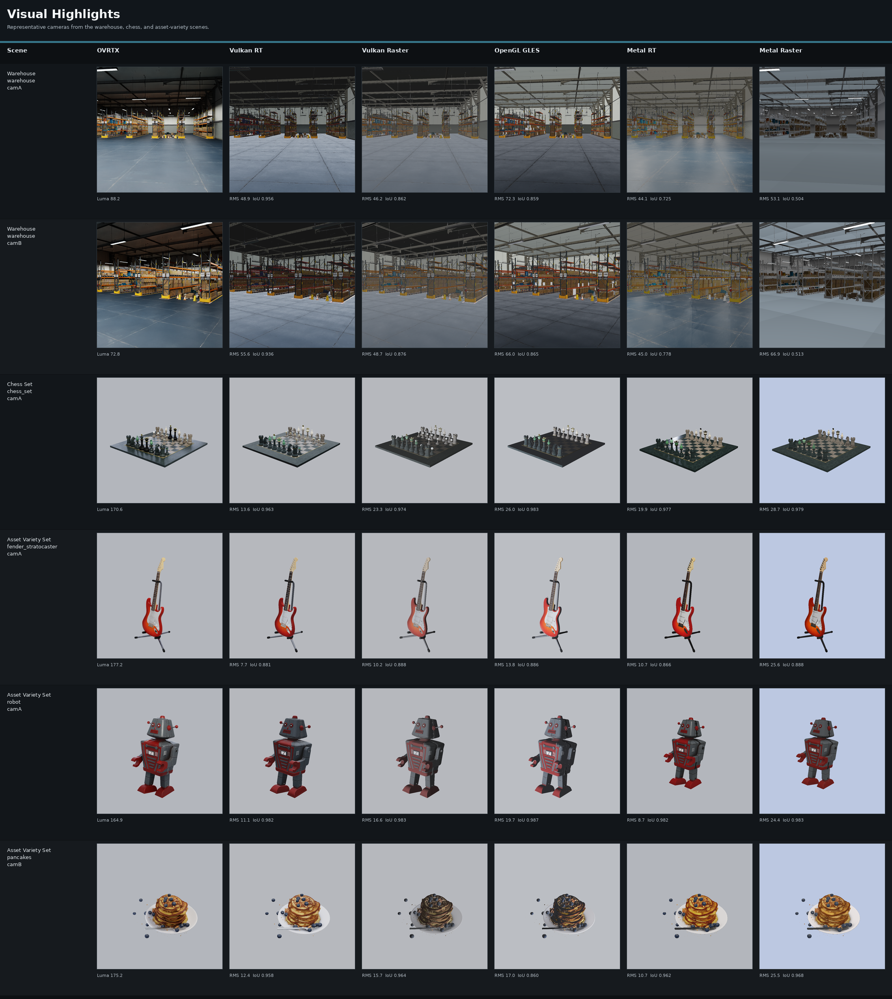
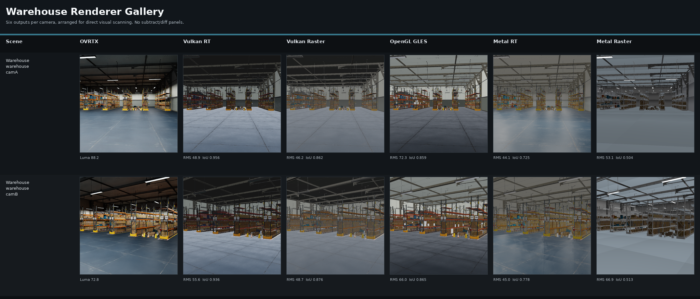
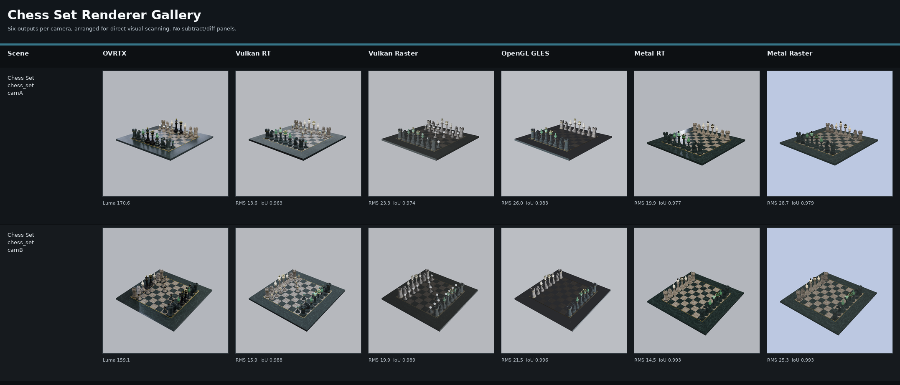
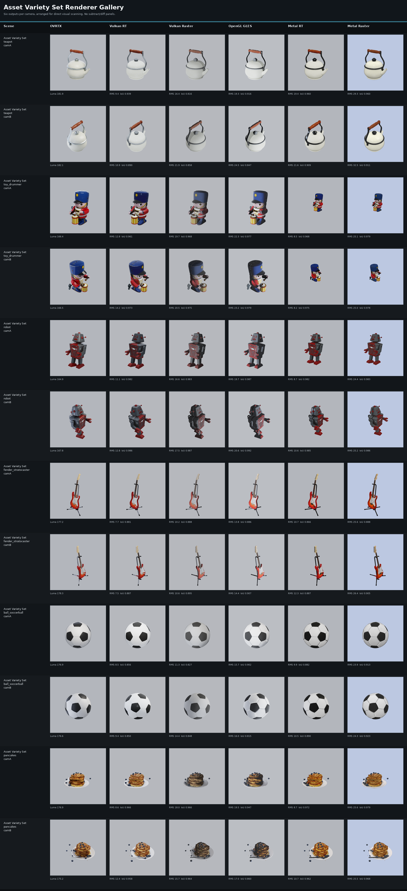
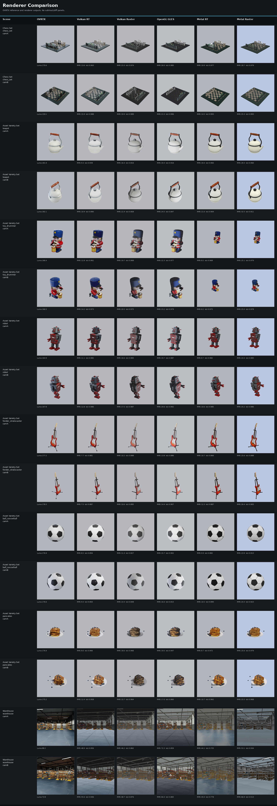

# Renderer Image Comparison

Regenerated on June 8, 2026 from the current comparison artifact directories.
Vulkan and OpenGL source artifacts were refreshed at 768 x 768 for this update;
Metal is included from the current main Metal comparison artifact set.

The gallery compares the same asset and camera across six outputs: OVRTX
reference, Vulkan RT, Vulkan Raster, OpenGL GLES, Metal RT, and Metal Raster.
The contact sheets are the primary review surface. RMS and silhouette IoU are
included for triage, but the visual read should decide whether a renderer is
acceptable.

For load-time and camera-orbit timing on Isaac Sim warehouse and NVIDIA DSX
datacenter scenes, see [`performance/README.md`](performance/README.md).

## Visual Highlights



## Current Read

- **Chess:** all renderers now produce complete, framed images for the unlit
  chess set. Vulkan RT is the closest current Vulkan/OpenGL mode. Vulkan Raster
  and OpenGL preserve coverage well, but their material/lighting response is
  still darker and flatter than OVRTX on the board and black pieces.
- **Asset variety set:** Vulkan RT and Metal RT are closest overall. Vulkan
  Raster and OpenGL keep materials and framing intact, with OpenGL generally
  brighter than OVRTX. Metal Raster remains visibly brighter on several assets.
- **Warehouse:** this remains the hardest visual case. Vulkan RT and Vulkan
  Raster are readable and framed correctly, but both still diverge from OVRTX in
  ceiling/floor tone, fixture contribution, shadow weight, and material contrast.
  OpenGL GLES is the largest Vulkan/OpenGL gap in this scene. Metal RT has the
  lowest warehouse RMS, but its silhouette/coverage score is lower than Vulkan.
- The remaining warehouse gap is a lighting and material-response issue, not a
  framing issue. The camera composition lines up; the visible mismatch is in how
  authored lights, fixture glow, floor bounce, ceiling response, and textured
  materials resolve relative to OVRTX.

## Metrics Summary

Lower RMS is closer to OVRTX. Higher IoU means the visible silhouette/framing
matches better.

| Set | Vulkan RT RMS / IoU | Vulkan Raster RMS / IoU | OpenGL GLES RMS / IoU | Metal RT RMS / IoU | Metal Raster RMS / IoU |
| --- | ---: | ---: | ---: | ---: | ---: |
| Chess | 14.7 / 0.976 | 21.6 / 0.981 | 23.7 / 0.990 | 17.2 / 0.985 | 27.0 / 0.986 |
| Apple assets | 10.4 / 0.927 | 16.1 / 0.915 | 18.8 / 0.918 | 11.6 / 0.936 | 26.1 / 0.948 |
| Warehouse | 52.3 / 0.946 | 47.4 / 0.869 | 69.1 / 0.862 | 44.6 / 0.751 | 60.0 / 0.508 |

## Warehouse Metrics

| Camera | Vulkan RT RMS / IoU | Vulkan Raster RMS / IoU | OpenGL GLES RMS / IoU | Metal RT RMS / IoU | Metal Raster RMS / IoU |
| --- | ---: | ---: | ---: | ---: | ---: |
| camA | 48.9 / 0.956 | 46.2 / 0.862 | 72.3 / 0.859 | 44.1 / 0.725 | 53.1 / 0.504 |
| camB | 55.6 / 0.936 | 48.7 / 0.876 | 66.0 / 0.865 | 45.0 / 0.778 | 66.9 / 0.513 |

## Chess Metrics

| Camera | Vulkan RT RMS / IoU | Vulkan Raster RMS / IoU | OpenGL GLES RMS / IoU | Metal RT RMS / IoU | Metal Raster RMS / IoU |
| --- | ---: | ---: | ---: | ---: | ---: |
| camA | 13.6 / 0.963 | 23.3 / 0.974 | 26.0 / 0.983 | 19.9 / 0.977 | 28.7 / 0.979 |
| camB | 15.9 / 0.988 | 19.9 / 0.989 | 21.5 / 0.996 | 14.5 / 0.993 | 25.3 / 0.993 |

## Scene Galleries

### Warehouse



### Chess



### Asset Variety



## Full Overview



## Sources

- Vulkan artifacts: `nanousd-vulkan-renderer/comparisons`
- OpenGL artifacts: `nanousd-opengl-renderer/comparisons`
- Metal artifacts: `nanousd-metal-renderer/comparisons`
- Parent gallery builder: `comparisons/make_all_renderer_contact_sheet.py`

## Regenerate

From the workspace root:

```bash
cd $HOME/nanousd-labs/nanousd-vulkan-renderer
PYTHONPATH=$HOME/nanousd-labs/.ovrtx03-venv/lib/python3.12/site-packages \
DISPLAY=:1 XAUTHORITY=/run/user/1000/gdm/Xauthority \
OVRTX_PYTHON=$HOME/nanousd-labs/.ovrtx03-venv/bin/python \
NUVIEW_OVRTX_DEFAULT_LIGHTING=0 \
python3 comparisons/render_backend_comparison.py --set all --width 768 --height 768

cd $HOME/nanousd-labs/nanousd-opengl-renderer
PYTHONPATH=$HOME/nanousd-labs/.ovrtx03-venv/lib/python3.12/site-packages \
DISPLAY=:1 XAUTHORITY=/run/user/1000/gdm/Xauthority \
OVRTX_PYTHON=$HOME/nanousd-labs/.ovrtx03-venv/bin/python \
NUVIEW_OVRTX_DEFAULT_LIGHTING=0 \
python3 comparisons/render_backend_comparison.py --set all --width 768 --height 768

cd $HOME/nanousd-labs
python3 comparisons/make_all_renderer_contact_sheet.py
```

The gallery builder uses NVIDIA FLIP labels when `flip_evaluator` is installed;
otherwise it falls back to RMS labels.
