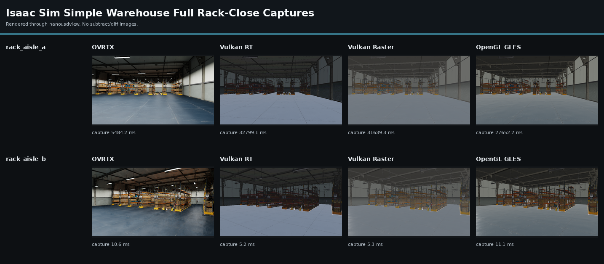
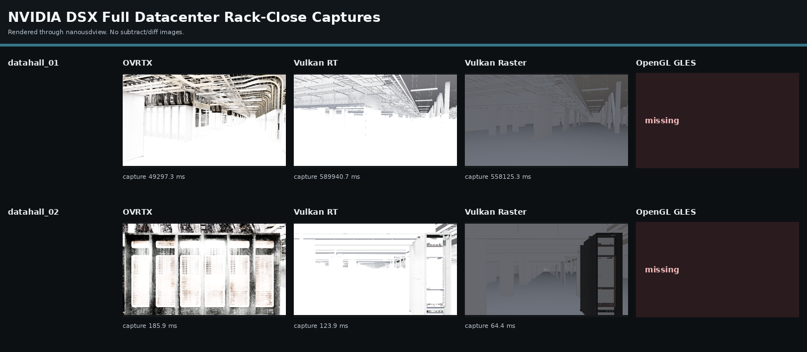

# Renderer Performance Comparison

This is a separate performance document from the visual parity comparison.
The benchmark uses `nanousdview._backend.OvrtxViewportRenderer` for every
row, so each renderer is loaded and driven through the same viewer-facing
`load_stage`, `set_camera`, and `render_ldr` path.

Scenes:

- Isaac Sim warehouse full: `$HOME/assets/Isaac/Environments/Simple_Warehouse/full_warehouse.usd`
- NVIDIA DSX full datacenter: `$HOME/dsx-assets/dsx_dataset_2.1/DSX_BP_/DSX_BP/Assembly/DSX_Main_BP.usda`

Renderer profiles: OVRTX, Vulkan RT, Vulkan Raster, and OpenGL GLES.

## Summary

### Isaac Sim Simple Warehouse Full

| Renderer      | OK runs | load_to_first mean ms | load CV | load range ms   | orbit fps mean | fps CV | fps range     | orbit p50 mean ms |
| ------------- | ------- | --------------------- | ------- | --------------- | -------------- | ------ | ------------- | ----------------- |
| OVRTX         | 5/5     | 5,661.4               | 7.4%    | 5354.3-6340.6   | 73.79          | 4.1%   | 70.20-77.43   | 13.7              |
| Vulkan RT     | 5/5     | 33,707.5              | 0.9%    | 33341.4-34144.2 | 227.01         | 1.9%   | 222.21-232.35 | 4.6               |
| Vulkan Raster | 5/5     | 32,941.1              | 1.5%    | 32410.8-33655.3 | 161.35         | 0.9%   | 159.39-162.90 | 6.2               |
| OpenGL GLES   | 5/5     | 29,717.3              | 1.9%    | 28938.9-30403.0 | 104.98         | 2.5%   | 101.37-108.88 | 9.5               |



Per-run detail:

| Run | Renderer      | Status | load_stage ms | first_frame ms | load_to_first ms | orbit fps | orbit p50 ms |
| --- | ------------- | ------ | ------------- | -------------- | ---------------- | --------- | ------------ |
| 1   | OVRTX         | ok     | 308.5         | 5,484.2        | 5,792.6          | 77.43     | 12.5         |
| 2   | OVRTX         | ok     | 294.0         | 5,115.2        | 5,409.3          | 76.07     | 13.7         |
| 3   | OVRTX         | ok     | 313.0         | 6,027.6        | 6,340.6          | 73.95     | 13.7         |
| 4   | OVRTX         | ok     | 301.1         | 5,053.2        | 5,354.3          | 71.33     | 14.2         |
| 5   | OVRTX         | ok     | 292.0         | 5,118.4        | 5,410.4          | 70.20     | 14.6         |
| 1   | Vulkan RT     | ok     | 1,345.1       | 32,799.1       | 34,144.2         | 228.05    | 4.6          |
| 2   | Vulkan RT     | ok     | 1,341.5       | 31,999.9       | 33,341.4         | 229.63    | 4.6          |
| 3   | Vulkan RT     | ok     | 1,359.2       | 32,376.7       | 33,735.9         | 222.21    | 4.7          |
| 4   | Vulkan RT     | ok     | 1,302.0       | 32,271.1       | 33,573.2         | 232.35    | 4.5          |
| 5   | Vulkan RT     | ok     | 1,320.3       | 32,422.6       | 33,742.9         | 222.80    | 4.7          |
| 1   | Vulkan Raster | ok     | 1,319.1       | 31,639.3       | 32,958.5         | 162.27    | 6.1          |
| 2   | Vulkan Raster | ok     | 1,322.6       | 31,267.8       | 32,590.3         | 161.69    | 6.2          |
| 3   | Vulkan Raster | ok     | 1,307.5       | 31,783.0       | 33,090.5         | 159.39    | 6.4          |
| 4   | Vulkan Raster | ok     | 1,345.1       | 32,310.2       | 33,655.3         | 162.90    | 6.1          |
| 5   | Vulkan Raster | ok     | 1,337.5       | 31,073.3       | 32,410.8         | 160.51    | 6.3          |
| 1   | OpenGL GLES   | ok     | 1,286.7       | 27,652.2       | 28,938.9         | 105.13    | 9.6          |
| 2   | OpenGL GLES   | ok     | 1,290.4       | 28,320.6       | 29,611.0         | 104.87    | 9.6          |
| 3   | OpenGL GLES   | ok     | 1,336.2       | 28,251.9       | 29,588.1         | 101.37    | 10.0         |
| 4   | OpenGL GLES   | ok     | 1,345.9       | 28,699.4       | 30,045.4         | 108.88    | 8.9          |
| 5   | OpenGL GLES   | ok     | 1,304.0       | 29,099.0       | 30,403.0         | 104.63    | 9.6          |

### NVIDIA DSX Full Datacenter

| Renderer      | OK runs | load_to_first mean ms | load CV | load range ms     | orbit fps mean | fps CV | fps range   | orbit p50 mean ms |
| ------------- | ------- | --------------------- | ------- | ----------------- | -------------- | ------ | ----------- | ----------------- |
| OVRTX         | 5/5     | 52,318.8              | 0.8%    | 51892.4-52990.4   | 5.47           | 2.2%   | 5.26-5.56   | 174.6             |
| Vulkan RT     | 5/5     | 550,757.3             | 4.3%    | 535343.8-590438.9 | 18.73          | 1.2%   | 18.41-18.94 | 42.2              |
| Vulkan Raster | 5/5     | 541,549.0             | 2.5%    | 527317.7-558625.6 | 19.03          | 1.3%   | 18.59-19.20 | 52.5              |
| OpenGL GLES   | 0/5     | -                     | -       | -                 | -              | -      | -           | -                 |



Per-run detail:

| Run | Renderer      | Status | load_stage ms | first_frame ms | load_to_first ms | orbit fps | orbit p50 ms |
| --- | ------------- | ------ | ------------- | -------------- | ---------------- | --------- | ------------ |
| 1   | OVRTX         | ok     | 3,693.1       | 49,297.3       | 52,990.4         | 5.46      | 175.8        |
| 2   | OVRTX         | ok     | 3,700.4       | 48,349.5       | 52,049.9         | 5.52      | 172.6        |
| 3   | OVRTX         | ok     | 3,709.1       | 48,183.3       | 51,892.4         | 5.26      | 180.9        |
| 4   | OVRTX         | ok     | 3,758.2       | 48,468.8       | 52,227.0         | 5.56      | 170.4        |
| 5   | OVRTX         | ok     | 3,777.8       | 48,656.8       | 52,434.5         | 5.55      | 173.1        |
| 1   | Vulkan RT     | ok     | 498.2         | 589,940.7      | 590,438.9        | 18.74     | 42.3         |
| 2   | Vulkan RT     | ok     | 498.1         | 534,845.7      | 535,343.8        | 18.41     | 45.3         |
| 3   | Vulkan RT     | ok     | 471.4         | 534,997.5      | 535,468.9        | 18.93     | 40.4         |
| 4   | Vulkan RT     | ok     | 505.3         | 536,178.5      | 536,683.8        | 18.94     | 40.3         |
| 5   | Vulkan RT     | ok     | 475.9         | 555,375.2      | 555,851.0        | 18.62     | 42.7         |
| 1   | Vulkan Raster | ok     | 500.3         | 558,125.3      | 558,625.6        | 18.59     | 53.8         |
| 2   | Vulkan Raster | ok     | 466.4         | 526,851.3      | 527,317.7        | 19.20     | 52.2         |
| 3   | Vulkan Raster | ok     | 496.8         | 527,056.8      | 527,553.6        | 19.16     | 52.0         |
| 4   | Vulkan Raster | ok     | 466.7         | 547,555.5      | 548,022.2        | 19.11     | 52.4         |
| 5   | Vulkan Raster | ok     | 463.3         | 545,762.4      | 546,225.7        | 19.09     | 52.2         |
| 1   | OpenGL GLES   | failed | -             | -              | -                | -         | -            |
| 2   | OpenGL GLES   | failed | -             | -              | -                | -         | -            |
| 3   | OpenGL GLES   | failed | -             | -              | -                | -         | -            |
| 4   | OpenGL GLES   | failed | -             | -              | -                | -         | -            |
| 5   | OpenGL GLES   | failed | -             | -              | -                | -         | -            |

Failed rows:

- OpenGL GLES: `worker timed out after 600.0s`
- OpenGL GLES: `worker timed out after 600.0s`
- OpenGL GLES: `worker timed out after 600.0s`
- OpenGL GLES: `worker timed out after 600.0s`
- OpenGL GLES: `worker timed out after 600.0s`

## Method

- `load_stage ms` times the `nanousdview` stage load call.
- `first_frame ms` is the first rack-close render after load. For nanousd
  renderer profiles this is where native scene materialization, upload,
  and acceleration setup can appear.
- `load_to_first ms` is `load_stage + first_frame`.
- `orbit fps` measures repeated camera updates plus `render_ldr` calls over
  `12` timed frames after `2` warmup frames.
- Each scene/profile row is repeated `5` times in
  independent worker subprocesses. CV is sample standard deviation divided
  by mean across successful runs.
- Worker timeout for this run: `600` seconds.
- Rack-close captures use authored/hand-picked camera views near warehouse
  shelves and DSX data-hall racks. No subtract/diff images are generated.

## Reproduce

From the repo root:

```bash
$HOME/nanousd-labs/.venv/bin/python \
  comparisons/performance/benchmark_nanousdview_perf.py \
  --width 960 --height 540 \
  --frames 12 --warmup 2 \
  --runs 5 --timeout 600 \
  --allow-failures
```

Use `--profiles` or `--scenes` to run a subset while iterating. The official
OVRTX row uses `--ovrtx-python` and defaults to
`$HOME/nanousd-labs/.ovrtx03-venv/bin/python`.

Raw results: [`results.json`](results.json).
