# Backend comparison: apple

## What is compared

- **OVRTX 0.3** (reference, **reused**): NVIDIA OVRTX path tracer. The `*_ovrtx.png` reference frames are reused (committed), not rendered by this harness.
- **Metal RT**: local `nusd_renderer` `NuRenderer(enable_rt=True)`, `render(NU_RENDER_RT)` — hardware ray tracing on Metal.
- **Metal Raster**: local `nusd_renderer` `NuRenderer(enable_rt=False)`, `render(NU_RENDER_RASTER)` — rasterizer.

- **Resolution**: 768x768 (**square**, for camera parity). The native Metal backend treats `fov_degrees` as the vertical FOV and derives horizontal FOV from the aspect; OVRTX derives its projection from focal_length + horizontal/vertical aperture (authored equal). At a square aspect (1.0) hfov==vfov in both, so the subjects co-register — which is what makes the reused OVRTX references valid.
- **Cameras**: two angles per asset, set programmatically on the Metal backend. Chess and the Apple assets use bbox-framed angles (camA front three-quarter, camB higher/opposite). The warehouse uses explicit interior look-at cameras at forklift/eye height.
- **Lighting rig (shared)**: constant-color `DomeLight` (no HDR) + Key + Fill `SphereLight` positioned from the asset bbox. The wrapper *sub-layers* the asset (so material bindings survive) — byte-identical to the wrapper that produced the reused OVRTX references.

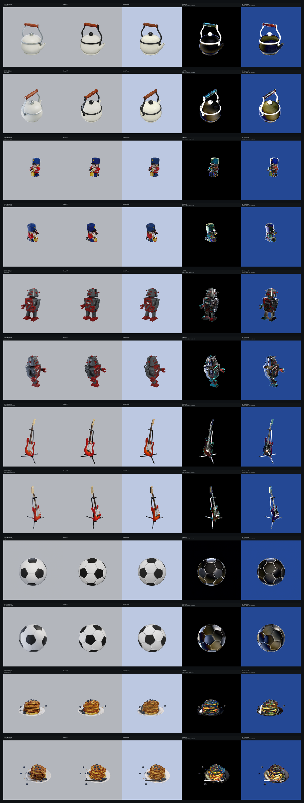

## Metrics vs OVRTX reference

RMS / MAE are over 8-bit sRGB pixels; silhouette IoU compares foreground masks (background-delta) between each Metal backend and the OVRTX reference.

| Asset | Cam | RT RMS | RT MAE | RT IoU | Raster RMS | Raster MAE | Raster IoU | Notes |
| --- | --- | ---: | ---: | ---: | ---: | ---: | ---: | --- |
| teapot | camA | 19.4 | 3.9 | 0.960 | 29.3 | 22.5 | 0.960 | ok |
| teapot | camB | 21.6 | 4.7 | 0.909 | 32.5 | 24.1 | 0.911 | ok |
| toy_drummer | camA | 8.5 | 1.1 | 0.968 | 25.1 | 21.5 | 0.979 | ok |
| toy_drummer | camB | 8.2 | 1.2 | 0.975 | 25.0 | 21.5 | 0.978 | ok |
| robot | camA | 8.7 | 1.8 | 0.982 | 24.4 | 20.7 | 0.983 | ok |
| robot | camB | 10.6 | 2.3 | 0.985 | 25.2 | 21.4 | 0.986 | ok |
| fender_stratocaster | camA | 10.7 | 1.6 | 0.866 | 25.6 | 21.7 | 0.888 | ok |
| fender_stratocaster | camB | 12.3 | 1.7 | 0.887 | 26.4 | 22.0 | 0.905 | ok |
| ball_soccerball | camA | 9.9 | 2.7 | 0.882 | 23.9 | 20.1 | 0.913 | ok |
| ball_soccerball | camB | 10.5 | 3.1 | 0.890 | 24.3 | 20.8 | 0.923 | ok |
| pancakes | camA | 8.7 | 1.6 | 0.972 | 25.6 | 21.5 | 0.979 | ok |
| pancakes | camB | 10.7 | 2.4 | 0.962 | 25.5 | 21.8 | 0.968 | ok |

### Mean RGB (black-frame sanity)

| Asset | Cam | OVRTX mean RGB | Metal RT mean RGB | Metal Raster mean RGB |
| --- | --- | --- | --- | --- |
| teapot | camA | (180.0, 182.0, 186.3) | (177.4, 179.1, 183.1) | (185.3, 194.9, 214.8) |
| teapot | camB | (180.1, 182.2, 186.9) | (177.7, 179.3, 183.5) | (185.8, 195.4, 215.4) |
| toy_drummer | camA | (175.7, 177.6, 183.7) | (175.0, 176.9, 183.0) | (183.4, 194.1, 218.3) |
| toy_drummer | camB | (175.2, 177.4, 183.8) | (174.5, 176.5, 182.9) | (183.1, 193.9, 218.3) |
| robot | camA | (169.2, 168.6, 174.1) | (168.4, 167.4, 172.8) | (176.5, 184.1, 206.4) |
| robot | camB | (170.3, 170.8, 176.8) | (169.4, 169.2, 174.8) | (177.6, 185.9, 208.5) |
| fender_stratocaster | camA | (176.8, 176.8, 182.0) | (176.1, 175.7, 181.0) | (184.3, 192.8, 215.6) |
| fender_stratocaster | camB | (177.2, 178.1, 183.5) | (176.3, 176.8, 182.2) | (184.7, 194.0, 217.3) |
| ball_soccerball | camA | (174.5, 177.0, 181.8) | (173.2, 175.6, 180.5) | (180.4, 190.3, 211.0) |
| ball_soccerball | camB | (173.9, 176.8, 182.6) | (173.7, 176.2, 181.2) | (181.6, 191.5, 212.2) |
| pancakes | camA | (176.7, 176.7, 179.5) | (176.9, 176.5, 178.8) | (184.3, 192.6, 212.8) |
| pancakes | camB | (174.8, 175.0, 178.4) | (176.1, 175.6, 178.1) | (184.2, 192.2, 212.1) |

## Per-asset comparisons

### teapot

_Apple AR Quick Look: teapot.usdz_  (up axis: Y)

**camA** — camera eye (65.9738905694, 50.4278948732, 75.1230621368), target (2.11928653717, 18.6193514862, -1.43051147461e-06), FOV 35 deg

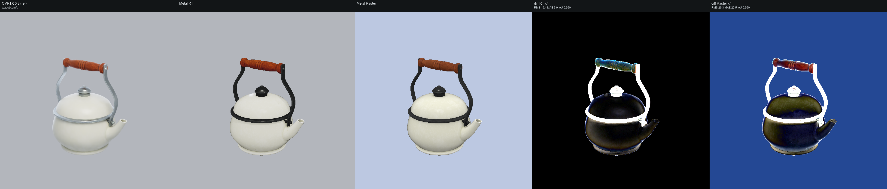

**camB** — camera eye (-64.5872867182, 79.1599286949, 50.029928511), target (2.11928653717, 18.6193514862, -1.43051147461e-06), FOV 35 deg

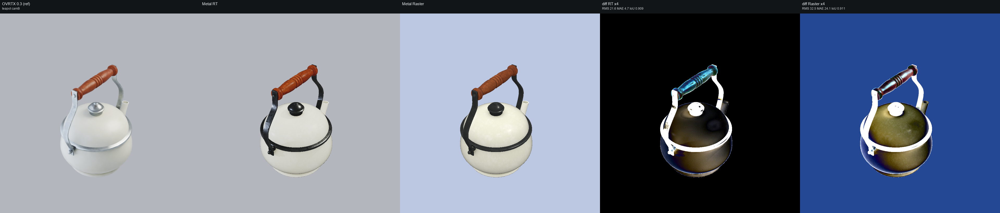

### toy_drummer

_Apple AR Quick Look: toy_drummer.usdz_  (up axis: Y)

**camA** — camera eye (41.249844671, 25.7367870601, 50.964132422), target (-1.24789905548, 4.48367132187, 0.96678686142), FOV 35 deg

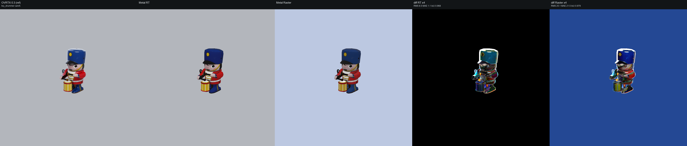

**camB** — camera eye (-45.6437401706, 44.8590826033, 34.2636676977), target (-1.24789905548, 4.48367132187, 0.96678686142), FOV 35 deg

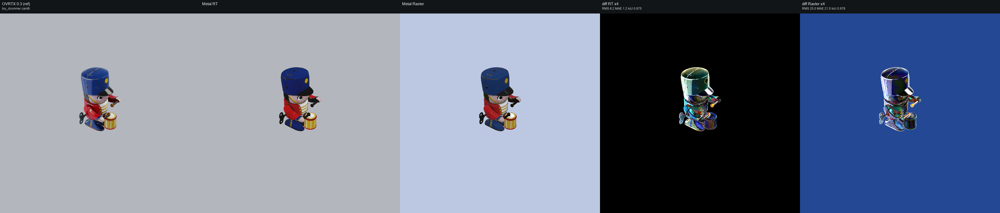

### robot

_Apple AR Quick Look: robot.usdz_  (up axis: Y)

**camA** — camera eye (49.0648248985, 38.1757216731, 56.0882160751), target (0.00169992446899, 14.0627783966, -1.63310742378), FOV 35 deg

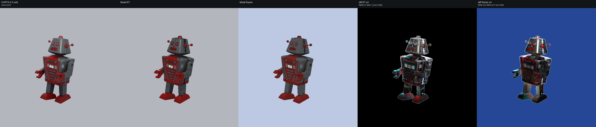

**camB** — camera eye (-51.2527552527, 60.2521778272, 36.8077339591), target (0.00169992446899, 14.0627783966, -1.63310742378), FOV 35 deg

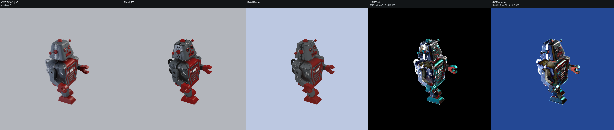

### fender_stratocaster

_Apple AR Quick Look: fender_stratocaster.usdz_  (up axis: Y)

**camA** — camera eye (154.590017436, 135.967927287, 175.471154632), target (0, 60.6261821842, -6.39945411682), FOV 35 deg

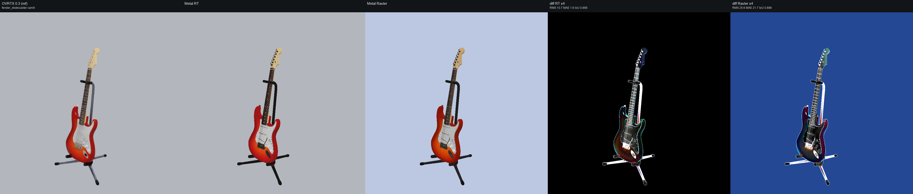

**camB** — camera eye (-161.49454654, 205.527290731, 114.721455788), target (0, 60.6261821842, -6.39945411682), FOV 35 deg

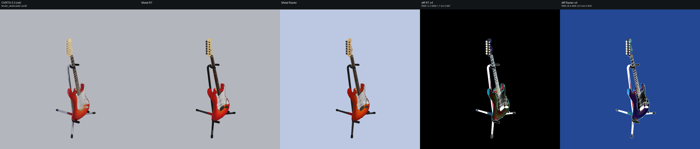

### ball_soccerball

_Apple AR Quick Look: ball_soccerball_realistic.usdz_  (up axis: Y)

**camA** — camera eye (0.455802290729, 0.241307095092, 0.536237989093), target (0, 0.0131635800004, 0), FOV 35 deg

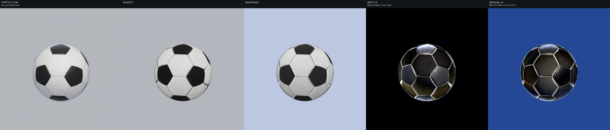

**camB** — camera eye (-0.476160010031, 0.446400009404, 0.357120007523), target (0, 0.0131635800004, 0), FOV 35 deg

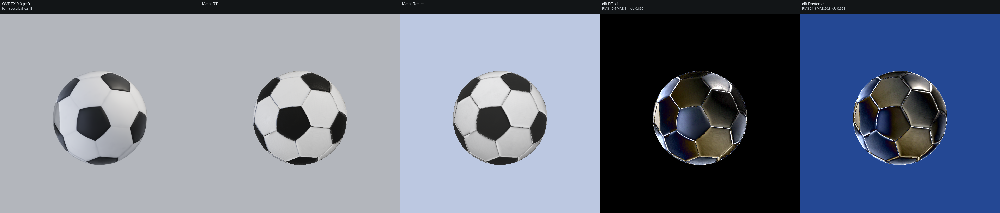

### pancakes

_Apple AR Quick Look: pancakes_photogrammetry.usdz_  (up axis: Y)

**camA** — camera eye (45.355848378, 30.2083723167, 51.7193815779), target (-2.20693206787, 5.63967655867, -4.23683071136), FOV 35 deg

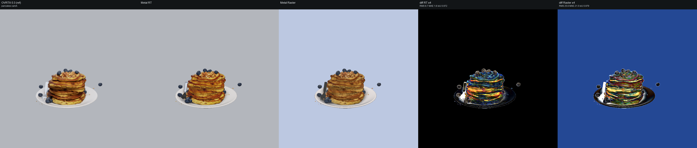

**camB** — camera eye (-51.8940320998, 51.6097330665, 33.0284943126), target (-2.20693206787, 5.63967655867, -4.23683071136), FOV 35 deg

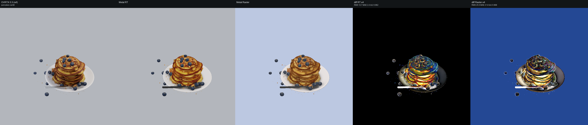

## Notes

These Apple AR assets use baked texture-map PBR (base-color / roughness / metallic / normal via UsdPreviewSurface). Both Metal backends load the materials and textures (e.g. teapot: 1 material + 5 textures) and the subjects co-register with the OVRTX reference — silhouette IoU is 0.89–0.99 across all 12 frames, confirming the square-output camera parity holds.
The dominant metric difference is **background / dome handling, not the subject**. Metal RT renders the constant-color DomeLight as a near-white background (brighter than OVRTX's mid-grey), so RT RMS (~67–71, with MAE almost equal to RMS) is a near-uniform brightness offset dominated by the background. Metal Raster fills the no-HDR background with a blue-ish hemisphere ambient that sits closer to the reference, so Raster RMS (~28–39) is markedly lower. The masked silhouette IoU is the cleaner subject-level signal here.
Subject shading is faithful with textures applied on both Metal paths (verified on the teapot — white enamel body, wood handle, metal fittings — and the painted-metal robot).

_See [../README.md](../README.md) for the cross-set write-up and caveats._

## Repro steps

macOS + Metal only. All commands assume the repo at `$HOME/nanousd-labs/nanousd-metal-renderer`.

### 1. Build the Metal renderer library

```bash
cd $HOME/nanousd-labs/nanousd-metal-renderer
./build.sh
```

This produces `build/libnusd_renderer.dylib`, discovered automatically by the
`nusd_renderer` ctypes bindings (or point at it explicitly with
`NUSD_RENDERER_LIB=/path/to/libnusd_renderer.dylib`).

### 2. Python environment

You need a Python with **OpenUSD (`pxr`)**, `numpy` and `Pillow`. The harness
imports `pxr` for wrapper generation + bbox framing and `nusd_renderer` from
`$HOME/nanousd-labs/nanousd-metal-renderer/python` (added to `sys.path` automatically).

```bash
python -c "import pxr, numpy, PIL"   # must succeed
```

If the Metal renderer dlopens a separate nanousd USD-parsing backend on your
build, point at it with `NANOUSD_BACKEND=/path/to/libnanousd.dylib`.

### 3. Assets

- **OVRTX references are reused** — the committed
  `comparisons/<set>/frames/<asset>_<cam>_ovrtx.png` files. This harness does NOT
  render OVRTX. (They were rendered by the Vulkan renderer's comparison harness
  from the identical wrapper + camera.)
- **Chess (MaterialX)**: set `NUSD_CHESS_USD=/path/to/OpenChessSet/chess_set.usda`
  (or place it at `comparisons/.assets/chess/chess_set.usda`).
- **Warehouse (Isaac Sim `Simple_Warehouse/full_warehouse.usd`)**: set
  `NUSD_WAREHOUSE_USD=/path/to/full_warehouse.usd` (fetch the whole
  `Simple_Warehouse/` dir incl. its `Materials/` + `Props/` subtrees).
- **Apple USDZ**: downloaded automatically into `comparisons/.assets/apple/`
  (git-ignored) from `https://developer.apple.com/augmented-reality/quick-look/models/<dir>/<file>.usdz`.

### 4. Run the harness

```bash
cd $HOME/nanousd-labs/nanousd-metal-renderer
python comparisons/render_backend_comparison.py --set all
```

Use `--set chess|apple|warehouse` for a single set, or `--gate` for a quick
chess camA black-frame pre-flight. `--readme-only` regenerates the
READMEs/contact sheets from an existing `metrics.json` (no render).

The harness regenerates the co-located sub-layer wrapper next to each asset's
root layer at run time (`<asset_dir>/_nusd_backend_compare_wrapper_<label>.usda`)
— required so the nanousd material loader's `.mtlx`/texture scan (keyed off the
root layer's directory) finds the asset's materials. The copy committed under
`<set>/wrappers/<label>.usda` is a record of the generated text.

