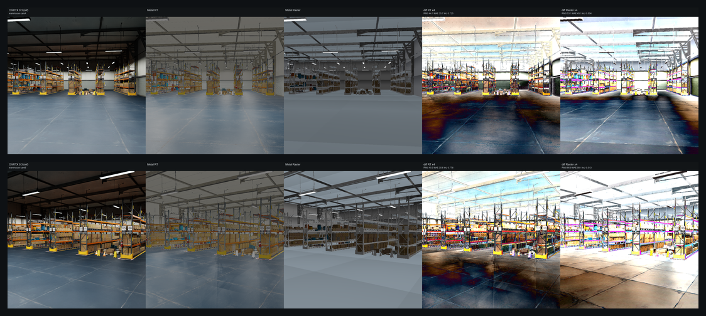
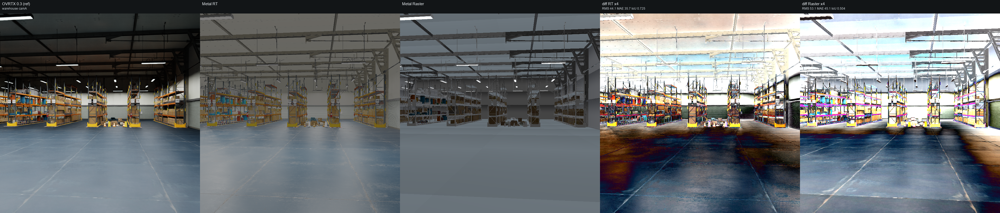
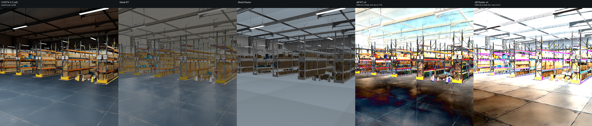

# Backend comparison: warehouse

## What is compared

- **OVRTX 0.3** (reference, **reused**): NVIDIA OVRTX path tracer. The `*_ovrtx.png` reference frames are reused (committed), not rendered by this harness.
- **Metal RT**: local `nusd_renderer` `NuRenderer(enable_rt=True)`, `render(NU_RENDER_RT)` — hardware ray tracing on Metal.
- **Metal Raster**: local `nusd_renderer` `NuRenderer(enable_rt=False)`, `render(NU_RENDER_RASTER)` — rasterizer.

- **Resolution**: 768x768 (**square**, for camera parity). The native Metal backend treats `fov_degrees` as the vertical FOV and derives horizontal FOV from the aspect; OVRTX derives its projection from focal_length + horizontal/vertical aperture (authored equal). At a square aspect (1.0) hfov==vfov in both, so the subjects co-register — which is what makes the reused OVRTX references valid.
- **Cameras**: two angles per asset, set programmatically on the Metal backend. Chess and the Apple assets use bbox-framed angles (camA front three-quarter, camB higher/opposite). The warehouse uses explicit interior look-at cameras at forklift/eye height.
- **Lighting rig (shared)**: constant-color `DomeLight` (no HDR) + Key + Fill `SphereLight` positioned from the asset bbox. The wrapper *sub-layers* the asset (so material bindings survive) — byte-identical to the wrapper that produced the reused OVRTX references.



## Metrics vs OVRTX reference

RMS / MAE are over 8-bit sRGB pixels; silhouette IoU compares foreground masks (background-delta) between each Metal backend and the OVRTX reference.

| Asset | Cam | RT RMS | RT MAE | RT IoU | Raster RMS | Raster MAE | Raster IoU | Notes |
| --- | --- | ---: | ---: | ---: | ---: | ---: | ---: | --- |
| warehouse | camA | 44.1 | 35.7 | 0.725 | 53.1 | 45.1 | 0.504 | ok |
| warehouse | camB | 45.0 | 35.6 | 0.778 | 66.9 | 58.1 | 0.513 | ok |

### Mean RGB (black-frame sanity)

| Asset | Cam | OVRTX mean RGB | Metal RT mean RGB | Metal Raster mean RGB |
| --- | --- | --- | --- | --- |
| warehouse | camA | (84.6, 88.2, 88.7) | (101.2, 103.6, 102.3) | (88.5, 94.5, 99.0) |
| warehouse | camB | (73.2, 72.4, 69.4) | (88.3, 90.0, 87.4) | (103.5, 109.5, 113.7) |

## Per-asset comparisons

### warehouse

_Isaac Sim Simple_Warehouse/full_warehouse.usd (interior, local PBR materials)_  (up axis: Z)

**camA** — camera eye (-2, -16, 1.9), target (-6, 22, 1.4), FOV 50 deg



**camB** — camera eye (3.5, -6, 2.6), target (-14, 20, 1), FOV 50 deg



## Notes

Isaac Sim `Simple_Warehouse/full_warehouse.usd` (Z-up, local OmniPBR/MDL materials); two explicit interior look-at cameras at forklift/eye height.
_Populate backend-specific shading observations from the rendered compare strips after a run._

_See [../README.md](../README.md) for the cross-set write-up and caveats._

## Repro steps

macOS + Metal only. All commands assume the repo at `$HOME/nanousd-labs/nanousd-metal-renderer`.

### 1. Build the Metal renderer library

```bash
cd $HOME/nanousd-labs/nanousd-metal-renderer
./build.sh
```

This produces `build/libnusd_renderer.dylib`, discovered automatically by the
`nusd_renderer` ctypes bindings (or point at it explicitly with
`NUSD_RENDERER_LIB=/path/to/libnusd_renderer.dylib`).

### 2. Python environment

You need a Python with **OpenUSD (`pxr`)**, `numpy` and `Pillow`. The harness
imports `pxr` for wrapper generation + bbox framing and `nusd_renderer` from
`$HOME/nanousd-labs/nanousd-metal-renderer/python` (added to `sys.path` automatically).

```bash
python -c "import pxr, numpy, PIL"   # must succeed
```

If the Metal renderer dlopens a separate nanousd USD-parsing backend on your
build, point at it with `NANOUSD_BACKEND=/path/to/libnanousd.dylib`.

### 3. Assets

- **OVRTX references are reused** — the committed
  `comparisons/<set>/frames/<asset>_<cam>_ovrtx.png` files. This harness does NOT
  render OVRTX. (They were rendered by the Vulkan renderer's comparison harness
  from the identical wrapper + camera.)
- **Chess (MaterialX)**: set `NUSD_CHESS_USD=/path/to/OpenChessSet/chess_set.usda`
  (or place it at `comparisons/.assets/chess/chess_set.usda`).
- **Warehouse (Isaac Sim `Simple_Warehouse/full_warehouse.usd`)**: set
  `NUSD_WAREHOUSE_USD=/path/to/full_warehouse.usd` (fetch the whole
  `Simple_Warehouse/` dir incl. its `Materials/` + `Props/` subtrees).
- **Apple USDZ**: downloaded automatically into `comparisons/.assets/apple/`
  (git-ignored) from `https://developer.apple.com/augmented-reality/quick-look/models/<dir>/<file>.usdz`.

### 4. Run the harness

```bash
cd $HOME/nanousd-labs/nanousd-metal-renderer
python comparisons/render_backend_comparison.py --set all
```

Use `--set chess|apple|warehouse` for a single set, or `--gate` for a quick
chess camA black-frame pre-flight. `--readme-only` regenerates the
READMEs/contact sheets from an existing `metrics.json` (no render).

The harness regenerates the co-located sub-layer wrapper next to each asset's
root layer at run time (`<asset_dir>/_nusd_backend_compare_wrapper_<label>.usda`)
— required so the nanousd material loader's `.mtlx`/texture scan (keyed off the
root layer's directory) finds the asset's materials. The copy committed under
`<set>/wrappers/<label>.usda` is a record of the generated text.

