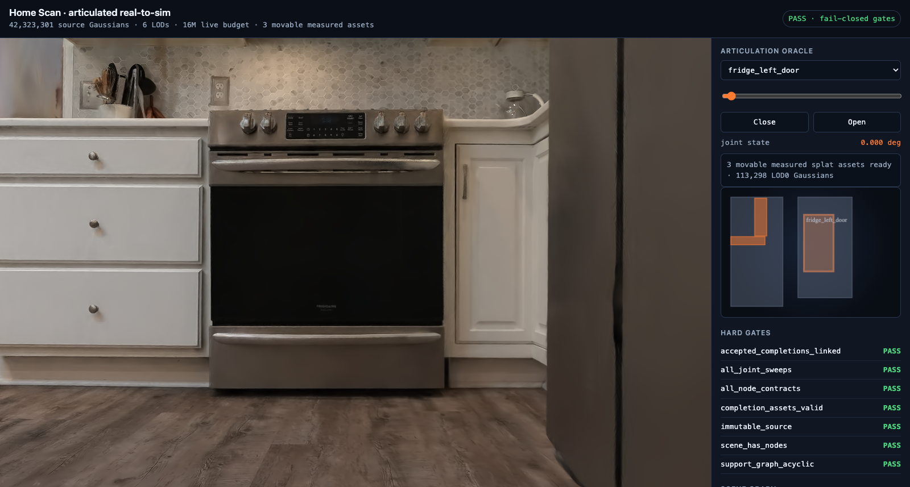
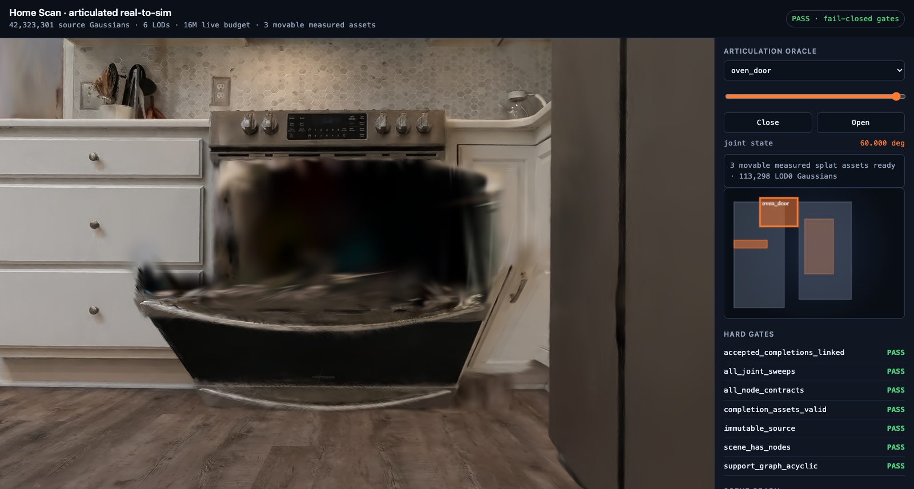
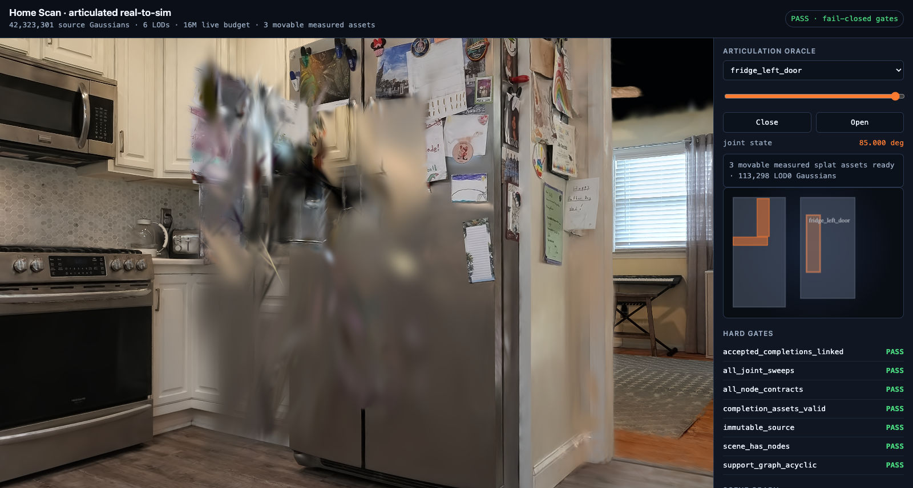
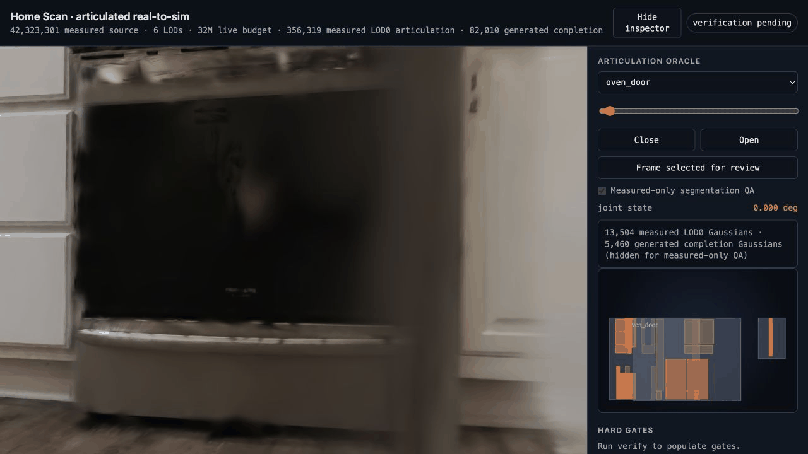
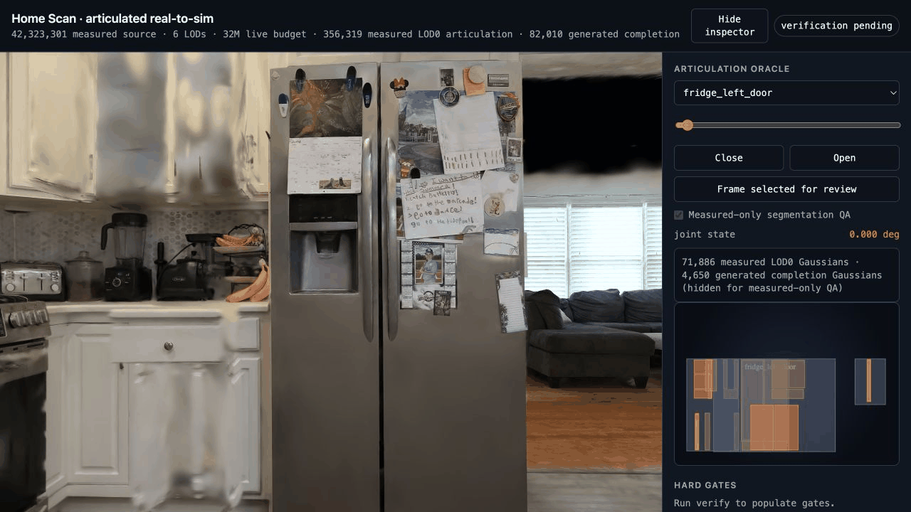

# NanoUSD agentic Gaussian real-to-sim

This experiment is a local Apple-Metal development oracle for turning a Gaussian
scene into a registered, interactive robotics scene. It is designed for Codex to
operate through deterministic tools and evidence, and for a later Tinker RLVR
environment to consume the same action traces and hard-gate reward vector.

The central invariant is a three-way separation:

- **Measured visual truth:** the immutable source PLY and stable source-row IDs.
- **Physical truth:** registered colliders, support edges, joints, voxel occupancy,
  and collision meshes.
- **Generated priors:** hidden-interior completion candidates that are always marked
  non-measured and require explicit acceptance.

No tool silently replaces the Gaussian scene with a mesh. Every node stores its
source-row selection and collider atomically, and every operation appends to
`trace/operations.jsonl`.

## Home Scan gallery

These are captures from the local Metal experience preview. The photographs and
measured fronts are Gaussian-splat evidence; articulated interiors are explicitly
generated, non-measured completion assets. The pose reels are deterministic
closed/half/open review captures, not a claim of continuous learned animation.

| Kitchen scan | Oven interaction | Refrigerator interaction |
| --- | --- | --- |
|  |  |  |

| Oven pose reel | Refrigerator pose reel |
| --- | --- |
|  |  |

Run the live experience locally at [http://127.0.0.1:8765/preview/index.html](http://127.0.0.1:8765/preview/index.html). Use **Hide inspector** for the full scene and the articulated selector to drive doors and drawers.

## What works locally

- PLY ingest and PlayCanvas SOG/LOD ingest through `splat-transform`.
- Native NanoUSD Metal RGB, depth, normal, and stable Gaussian-ID AOVs.
- AABB or render-mask object selection with immutable source provenance.
- Support-tree inference and explicit support authoring.
- DRAWER-style prismatic drawer and revolute door fitting with confidence and
  diagnostics.
- Hidden-interior Gaussian completion candidates with candidate/accepted/rejected
  lifecycle.
- DRAWER-inspired category-template fitting into explicit OBJ meshes, deterministic
  UV atlases, five-map PBR bundles, and mesh-bound Gaussians that retain triangle,
  barycentric, UV, and face-frame associations.
- A material-provider seam with an M5-local measured-front palette fallback and an
  importer for UV-aligned learned PBR bundles produced by MatFuse or another
  external worker.
- Deterministic gravity settle, push, and articulation-sweep checks.
- Full-scene or per-node voxel occupancy and collision GLB generation.
- Explicit registration of `splat-transform` GLBs back into NanoUSD PLY coordinates,
  including winding repair and a residual gate.
- USDA compilation with USD Physics bodies, collisions, joints, source selections,
  and generated-completion provenance.
- NanoUSD proxy-scene render validation.
- Dependency-free interactive HTML preview with joint sliders, front/top/side
  projections, scene graph, hard gates, completion state, and embedded Gaussian
  evidence.
- Pinned local SuperSplat experience preview that streams the immutable original
  SOG/LOD hierarchy at a configurable live budget while showing the registered
  articulation oracle alongside it.
- A single-use `RealToSimEpisode` adapter with sequential `step(action)` calls,
  public observations, trainer-only reward vectors, anti-freezing interactivity
  requirements, and fail-closed terminal rewards.
- Bounded JSON agent plans; unknown actions fail closed and arbitrary shell commands
  are not part of the plan surface.

This local verifier is intentionally labeled as conservative AABB/voxel physics. It
does not claim PhysX contact fidelity. Isaac Sim/Isaac Lab remains the promotion
lane for high-speed dynamics, robot-task success, deformables, and final simulator
parity.

## Quick start on the M5

From `projects/nanousd-labs/nanousd-metal-renderer`:

```bash
export PYTHONPATH="$PWD/experiments/agentic_real_to_sim/src"
PYTHON=../.venv/bin/python

$PYTHON -m nanousd_rts doctor
$PYTHON -m nanousd_rts demo /tmp/nanousd-rts-drawer
open /tmp/nanousd-rts-drawer/preview/index.html
```

The demo creates a cabinet with a sliding drawer and hinged door, proposes hidden
interior completions, accepts the best sweep-safe candidates, renders the Gaussian
and USDA representations, and runs all local gates.

An isolated install also works:

```bash
uv run --project experiments/agentic_real_to_sim nanousd-rts doctor
uv run --project experiments/agentic_real_to_sim \
  nanousd-rts demo /tmp/nanousd-rts-drawer
```

## Home Scan

The supplied Home Scan is a 42.3M-Gaussian, six-LOD PlayCanvas asset. Start with its
671,787-Gaussian lowest LOD:

```bash
$PYTHON -m nanousd_rts ingest \
  "$HOME/Downloads/Home Scan (Creation process in description)" \
  /tmp/nanousd-home-scan-rts \
  --lod 5 --up-axis Y

$PYTHON -m nanousd_rts render /tmp/nanousd-home-scan-rts \
  --name top-full --width 1200 --height 800 \
  --eye -3.90055 15.5 -6.12868 \
  --target -3.90055 -1.55229 -6.12868 \
  --up 0 0 -1 --fov 60

$PYTHON -m nanousd_rts add-node /tmp/nanousd-home-scan-rts \
  --id environment_scan --label "Home Scan Gaussian environment" \
  --role background \
  --bounds -17.1 -3.21 -14.66 9.30 0.10 2.41 \
  --tag measured --tag gaussian-environment

$PYTHON -m nanousd_rts voxelize /tmp/nanousd-home-scan-rts \
  --voxel-size 0.15 --opacity-threshold 0.2 --mesh-shape faces

$PYTHON -m nanousd_rts author-home-kitchen /tmp/nanousd-home-scan-rts
$PYTHON -m nanousd_rts fit-mesh-pbr /tmp/nanousd-home-scan-rts \
  --node oven_door --texture-size 512
$PYTHON -m nanousd_rts verify /tmp/nanousd-home-scan-rts
$PYTHON -m nanousd_rts experience-preview /tmp/nanousd-home-scan-rts \
  --budget 32
$PYTHON -m nanousd_rts serve-preview /tmp/nanousd-home-scan-rts \
  --budget 32 --open
```

### Measured-only segmentation review and viewer quality

The source contains 42.3M Gaussians across six streamed LODs; the 671,787-point
LOD used for deterministic selection is deliberately not the beauty source. The
experience viewer now defaults to a 32M live budget. Click **Hide inspector** to
use the full browser canvas before judging sharpness. Its header reports four
different counts: immutable source, live budget, measured LOD0 articulation, and
generated completion. Do not confuse a thumbnail/contact sheet or generated
interior with the source reconstruction.

Every kitchen front is reviewed without generated surfaces before it is accepted:

```bash
$PYTHON -m nanousd_rts segmentation-review-plan /tmp/nanousd-home-scan-rts
# Browse /preview/index.html?segmentation-review=1 and inspect closed, half, open.
$PYTHON -m nanousd_rts check-segmentation-review /tmp/nanousd-home-scan-rts
$PYTHON -m nanousd_rts accept-segmentation-review /tmp/nanousd-home-scan-rts \
  --reviewer codex --note "Measured-only pose triplets accepted."
$PYTHON -m nanousd_rts verify /tmp/nanousd-home-scan-rts
```

The review rejects stale scene revisions and verifies a visible pose delta. It is
particularly important for narrow trim-heavy or partially occluded fronts: refine
the planar selection using tangent occupancy plus positive/negative references,
then reauthor and recapture rather than masking a bad extraction with an interior.
The Home Scan’s 28 articulated fronts have this gate; their accepted visual review
also supplies explicit registration evidence when a sparse splat selection makes a
pure AABB-overlap diagnostic pessimistic.

The background role deliberately keeps the measured scan collider-free. The
voxel command produces a separate derived collision GLB, preserving the visual
source instead of pretending the scan's full AABB is valid physics.

`author-home-kitchen` installs the deterministic Home Scan kitchen profile: 28
articulated parts spanning both refrigerator doors, the oven door, upper and base
cabinet doors, and drawers. Each part keeps its measured front as an extracted
LOD0 asset, adds a world-attached generated cavity plus joint-attached generated
backside/interior, and receives an explicit collider and sweep-verified joint.

The oven also demonstrates full-cavity background replacement. Unobserved dark
source splats inside the aperture are opacity-masked only in the streamed
background derivative, while the measured door extraction remains untouched and
the accepted generated cavity/racks stay labeled `measured=false`. This is the
local category-template analogue of amodal completion; it is not a claim that the
hidden surfaces were measured from scan evidence.

`fit-mesh-pbr` is the first DRAWER fidelity bridge. It turns the accepted cavity and
moving interior into UV-mapped meshes, writes base color, roughness, metallic,
normal, and AO maps, then resamples the visible completion as anisotropic
face-aligned Gaussians. Every Gaussian retains its mesh triangle, barycentric
coordinates, UV, and face frame in `mesh-bindings.npz`. The default
`measured-front-palette-pbr-v1` provider runs locally on Apple Silicon and is still
generated, not learned. A learned worker can consume each `material-request.json`
and return the same UV-aligned map contract:

```bash
$PYTHON -m nanousd_rts fit-mesh-pbr /tmp/nanousd-home-scan-rts \
  --node oven_door \
  --material-provider external-pbr-atlas-v1 \
  --material-bundle /absolute/path/to/oven-material-bundle
```

The external bundle may contain maps at its root or in `static-cavity/` and
`moving-interior/` subdirectories. `baseColor.png`, `roughness.png`, and
`normal.png` are required; missing metallic and AO maps receive explicit neutral
defaults. This keeps DRAWER's legacy CUDA/PyTorch3D MatFuse stack out of the M5
authoring process while preserving one deterministic artifact and provenance
contract for the isolated MPS worker.

### Official MatFuse and StableMaterials on Apple Metal

The learned-material worker uses the authors' official Hugging Face weights,
pinned by commit, through an isolated Python 3.12 environment. It does not use
DRAWER's legacy CUDA/PyTorch3D environment and it never commits checkpoints to
the repository:

```bash
UV_PROJECT_ENVIRONMENT=.venv-materials \
  uv sync --project experiments/agentic_real_to_sim \
  --python 3.12 --extra learned-materials

MATERIAL_PYTHON=experiments/agentic_real_to_sim/.venv-materials/bin/python
export PYTHONPATH="$PWD/experiments/agentic_real_to_sim/src"

$MATERIAL_PYTHON -m nanousd_rts material-models
```

First run the deterministic provider once to preserve the fitted mesh, UV atlas,
and `material-request.json` files. Then generate one bundle with each model:

```bash
REQUESTS=/tmp/nanousd-home-scan-rts/generated/mesh-pbr-completions/oven_door
DEMO=/tmp/nanousd-home-scan-rts/learned-material-demos

$MATERIAL_PYTHON -m nanousd_rts generate-materials \
  "$REQUESTS" "$DEMO/matfuse" \
  --backend matfuse --device mps --seed 42

$MATERIAL_PYTHON -m nanousd_rts generate-materials \
  "$REQUESTS" "$DEMO/stablematerials" \
  --backend stablematerials --stable-variant lcm --device mps --seed 42

$MATERIAL_PYTHON -m nanousd_rts compare-materials \
  "$DEMO/matfuse" "$DEMO/stablematerials" "$DEMO/index.html"
```

MatFuse runs its native 256-pixel, 50-step paper pipeline and combines text with
the measured front palette. StableMaterials defaults to the official 512-pixel,
four-step LCM and enables its feature-rolling tileability path. The generated
manifest records the exact model revision, device, dtype, prompt, seed, sampling
settings, map hashes, and measured-to-generated boundary.

The map adapter is intentionally explicit. MatFuse predicts diffuse, normal,
roughness, and specular; `specular.png` is preserved, while metallic and AO get
neutral values because specular is not the same quantity as metalness.
StableMaterials predicts base color, normal, height, roughness, and metallic;
`height.png` is preserved and only AO is neutral. Both outputs can then be
imported through the existing `external-pbr-atlas-v1` provider.

Verification hashes every mesh, binding sidecar, material request, and PBR map.
USDA compilation carries portable references and checksums for the full bundle.
The current Metal RT path also keeps each generated mesh asset below 4,096
Gaussians because its large-scene sigma clamp is tuned for naturally dense source
splats; split a completion into more role assets instead of silently crossing that
limit.

The high-fidelity preview deliberately does not use `file://`: streamed
`lod-meta.json` assets and their WebP chunks require local HTTP. It pins
`@playcanvas/supersplat-viewer`, materializes the static viewer into the workspace,
and symlinks the immutable original source instead of copying or transcoding it.
The NanoUSD LOD remains the deterministic selection/physics lane; it is not used as
the final beauty renderer.

For interior scenes, add `--external-fill 1.6`; after choosing a known-free seed
point, add `--carve 1.6 0.2 --seed X Y Z`. These settings materially change
occupancy, so they remain explicit agent actions and are recorded in the trace.

Object nodes can be authored from a canonical AABB:

```bash
$PYTHON -m nanousd_rts add-node /tmp/nanousd-home-scan-rts \
  --id cabinet --label "kitchen cabinet" --role static \
  --bounds MIN_X MIN_Y MIN_Z MAX_X MAX_Y MAX_Z \
  --collision-mode shell
```

Or from a segmentation mask resolved through a stable-ID render:

```bash
$PYTHON -m nanousd_rts add-node /tmp/nanousd-home-scan-rts \
  --id drawer --label "upper drawer" --role movable \
  --id-aov /tmp/nanousd-home-scan-rts/evidence/render/top-full/id.npy \
  --mask /absolute/path/to/drawer-mask.png \
  --tag drawer
```

Then:

```bash
$PYTHON -m nanousd_rts infer-support /tmp/nanousd-home-scan-rts
$PYTHON -m nanousd_rts fit-joint /tmp/nanousd-home-scan-rts --node drawer --kind auto
$PYTHON -m nanousd_rts propose-completions /tmp/nanousd-home-scan-rts --node drawer
$PYTHON -m nanousd_rts completions /tmp/nanousd-home-scan-rts
$PYTHON -m nanousd_rts accept-completion /tmp/nanousd-home-scan-rts \
  --completion drawer.interior.01
$PYTHON -m nanousd_rts fit-mesh-pbr /tmp/nanousd-home-scan-rts \
  --node drawer
$PYTHON -m nanousd_rts sweep /tmp/nanousd-home-scan-rts --node drawer
$PYTHON -m nanousd_rts compile /tmp/nanousd-home-scan-rts
$PYTHON -m nanousd_rts render-usda /tmp/nanousd-home-scan-rts
$PYTHON -m nanousd_rts verify /tmp/nanousd-home-scan-rts
$PYTHON -m nanousd_rts preview /tmp/nanousd-home-scan-rts --open
```

## Agent action contract

`nanousd-rts tools` prints the machine-readable catalog. `run-plan` accepts only
those actions:

```bash
$PYTHON -m nanousd_rts run-plan /tmp/workspace examples/drawer-plan.json
```

The expected loop is:

1. Ingest and render AOV evidence.
2. Select measured source rows into semantic nodes.
3. Bind and visually inspect physical proxies.
4. Infer or author support.
5. Fit joints; override uncertain axes, origins, or limits explicitly.
6. Propose hidden completions; never relabel generated content as measured.
7. Fit accepted category templates into mesh/PBR bundles and preserve each
   Gaussian-to-face association.
8. Sweep, settle, push, and voxelize.
9. Compile USDA and render the proxy scene through NanoUSD.
10. Run `verify`; do not promote a scene with a failed hard gate.
11. Inspect the interactive preview and package the evidence.

## Agent recipes for humans

The system works best when an AI agent is treated as a bounded scene author:
give it the source location, the desired interaction, and the hard evidence you
expect back. Do not ask it to "make it look good" without requiring source
provenance, a measured-only visual review, and a verification report.

The complete copy/paste recipes are in [docs/AGENT_RECIPES.md](docs/AGENT_RECIPES.md).
These are the three most useful starting prompts:

**1. Build an interactive scene from a scan**

```text
Use the nanousd-real-to-sim workflow on <SOURCE> and create a workspace at
<WORKSPACE>. Preserve the source immutably. Render RGB/depth/normal/stable-ID
evidence before selecting objects. Author support, colliders, and joints for the
visible drawers and cabinet doors. For every movable front, capture measured-only
closed/half/open evidence, accept it only if the selection moves independently,
then run verify and report every hard gate plus source/live/LOD0/generated counts.
```

**2. Repair a bad articulated extraction**

```text
The front for <NODE> looks wrong when opened. Work only from measured evidence:
open the streamed preview in measured-only segmentation QA mode, inspect closed,
half, and open poses, and refine the planar selection using tangent occupancy and
positive/negative references. Reauthor the LOD0 extraction, recapture the pose
triplet, run check-segmentation-review and verify. Do not conceal a bad measured
selection with a generated interior or widened collider.
```

**3. Add learned materials without laundering provenance**

```text
For accepted completion <NODE>, fit the mesh/PBR request and run both official
MatFuse and StableMaterials workers in the isolated materials environment. Compare
their UV-aligned bundles, import the selected bundle as external-pbr-atlas-v1,
and verify every map/binding hash. Keep all learned maps and resampled interior
Gaussians marked measured=false; report the model revision, prompt, seed, and the
measured-to-generated boundary.
```

## Workspace contract

```text
workspace/
  scene.json
  source/source.ply
  selections/<node>.npy
  generated/completions/<node>/*.ply
  generated/visual-completions/<node>/*.ply
  generated/mesh-pbr-completions/<node>/
    manifest.json
    {static-cavity,moving-interior}/
      mesh.obj
      material.mtl
      material-request.json
      {baseColor,roughness,metallic,normal,ao}.png
      mesh-bound.ply
      mesh-bindings.npz
  evidence/render/<name>/{rgb,depth,normal,id,...}
  evidence/sweeps/<node>/sweep.json
  evidence/verification/report.json
  exports/scene.usda
  exports/scene.manifest.json
  exports/voxel/<scope>/*
  preview/index.html
  preview/physics.html
  preview/visual/{index.html,index.css,index.js,settings.json,content}
  trace/operations.jsonl
  trace/plan-result.json
```

## RLVR/Tinker bridge

The JSON plan is the policy action sequence, `operations.jsonl` is the tool trace,
and `evidence/verification/report.json` is the deterministic reward input. A
multi-turn Tinker environment can expose the catalog as tools, feed compact AOV
summaries and failed gates back to the policy, and score:

- source/selection provenance;
- visual-collider registration;
- support-graph validity;
- joint sweep and forbidden-overlap gates;
- USDA load/render success;
- completion provenance and accepted-candidate linkage;
- mesh-fit diagnostics, PBR bundle completeness, and Gaussian-to-face binding;
- task-specific robot evaluation from the external simulator lane.

Use paired fidelity and stability scores. Never reward stability alone, because an
agent can otherwise make the entire scene static.

The dependency-free episode seam can be imported directly by a cookbook
`MessageEnv` or tool environment:

```python
from nanousd_rts import EpisodeRequirements, RealToSimEpisode, Workspace

episode = RealToSimEpisode(
    Workspace.open("/tmp/nanousd-rts-task"),
    EpisodeRequirements(
        required_nodes=("cabinet", "drawer"),
        required_interactive_nodes=("drawer",),
        required_mesh_pbr_nodes=("drawer",),
    ),
)
initial = episode.public_observation()
turn = episode.step({"tool": "render", "name": "policy-view"})
```

Attach each turn's `trainer_reward.dense_score` to Kevin-style discounted future
credit. Use `terminal_reward` for submission; it is zero unless all local hard
gates, hidden semantic/interactivity requirements, and required artifacts pass.
Mesh/PBR tasks can name exact nodes in `required_mesh_pbr_nodes`; the evaluator then
requires the accepted `mesh-bound-gaussian-pbr` representation and exposes a
separate `mesh_pbr_fidelity` reward component without revealing the hidden target
list to the policy.

## Verification

```bash
PYTHONPATH=experiments/agentic_real_to_sim/src \
  ../.venv/bin/python -m unittest discover \
  -s experiments/agentic_real_to_sim/tests -v

cmake --build build --target nusd_renderer test_gaussian_render --parallel
./build/test_gaussian_render
```

The repo-local operating procedure is
[`nanousd-real-to-sim`](../../../agentic-skills/nanousd-real-to-sim/SKILL.md).
