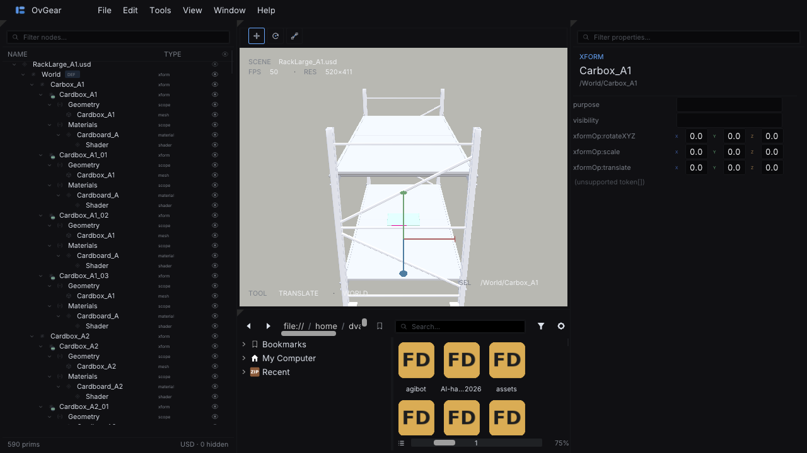
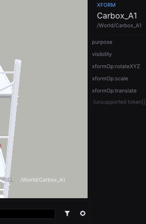
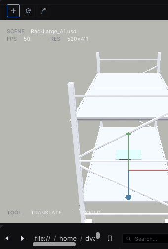
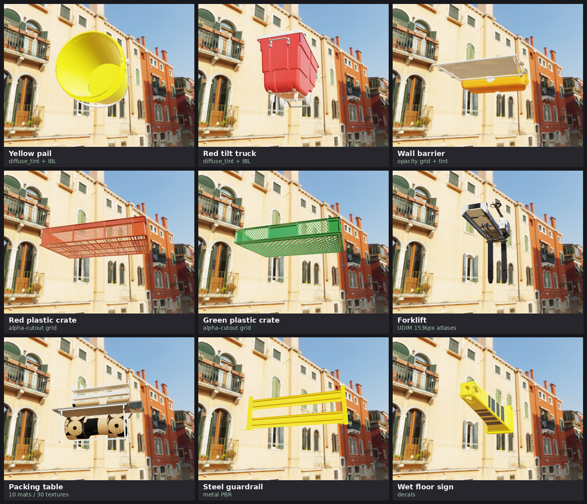
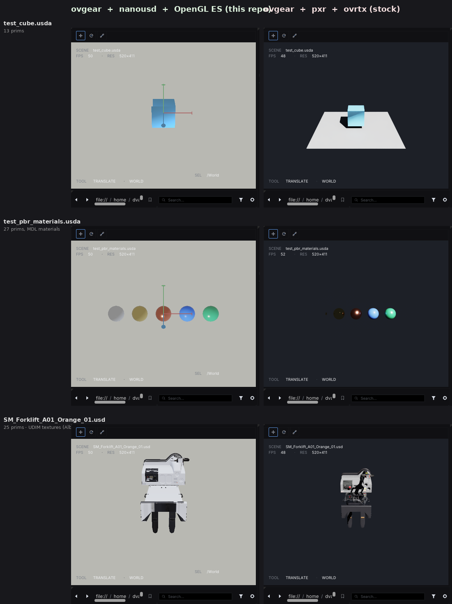

# nanousd-opengl-renderer

> **Part of [`nanousd-labs`](..)** — an experimental fleet that generates USD implementations and stacks from the [USD Core Specification](https://github.com/aousd/specifications-public/tree/main/core). This component is the **OpenGL renderer backend**. The [fleet README](..) has the full picture — the stack, how the repos fit together, and the skillgraph that drives it.

A lightweight USD scene renderer on **OpenGL ES 3.1** and
[**nanousd**](../nanousd). No OpenUSD and no
ray tracing — composed USD scenes rendered with PBR materials in well under
100 MB of GPU memory. The public viewer path is the shared OVRTX viewer
(`../nanousdview/run.sh --backend opengl`). Lower-level binaries and ovgear
experiments are retained only as implementation/debug tools.

## Quick start

```bash
./build.sh     # clean release build
./run.sh       # opens nanousdview through the OVRTX API on test_cube.usda
```

Both scripts accept `--help` for flags. The same `build.sh`/`run.sh` shape is used across the fleet repos — `cd` into any repo and run those two commands.



The screenshot above is loading
[`nvidia/PhysicalAI-SimReady-Warehouse-01`](https://huggingface.co/datasets/nvidia/PhysicalAI-SimReady-Warehouse-01)'s
`RackLarge_A1` (590 prims after composition). Stage Browser populated,
viewport rendering the rack and crates, translate gizmo on
`/World/Carbox_A1`, Property Inspector showing its xformOps —
all driven by the C API in [nanousd](../nanousd)
and the OpenGL ES renderer in this repo.

| Property Inspector | Viewport with gizmo |
|---|---|
|  |  |

Headless gallery (no UI) — same libraries driven by the Python ctypes
launcher, nine warehouse assets:



Side-by-side against stock ovgear (pxr + ovrtx, ray-traced, right
half of each frame):



---

## Architecture

```
                            ┌──────────────────────────────┐
       Python ─►  ovgear UI │ omni.ui (ovui standalone)    │
                            └──┬────────────┬──────────────┘
                  StageAdapter │            │ RendererAdapter
                               │            │
                ┌──────────────▼─┐    ┌─────▼─────────────┐
                │NanousdStage    │    │GlesRendererAdapter│
                │PropertyAdapter │    └─────┬─────────────┘
                │TransformAdapter│          │
                └─────┬──────────┘          │
                      │ ctypes        ctypes│
                ┌─────▼──────────┐  ┌───────▼──────────┐
                │libnanousdapi.so│  │libnusd_gles.so   │
                │ read + write   │  │ worker thread +  │
                │                │  │ EGL/CGL headless │
                └────────────────┘  └──────────────────┘
                                            │
                                     OpenGL ES 3.1
                                     (Linux / Apple GL 4.1 on macOS)
```

Two shared libraries, both built from this repo plus the workspace
`nanousd` checkout or install prefix, both opened from Python via `ctypes`:

- **`libnanousdapi.so`** parses USDA / USDC, runs composition
  (sublayers, references, payloads, native instances), and exposes
  ~100 read/write entry points behind opaque handles.

- **`libnusd_gles.so`** owns the GL context. Every viewer GL call
  runs on a dedicated worker thread inside the library, so the
  embedder's main-thread GL state (omni.ui's framebuffer) is never
  touched. Linux uses an EGL pbuffer; macOS uses a CGL FBO.

The old ovgear adapter classes are implementation/debug code, not the public
renderer interface:

| Adapter | What it does |
|---|---|
| `NanousdStageAdapter` | Stage browser tree, composition badges, visibility composition, `nanousd_set_attrib_token("visibility", …)` for the eye column |
| `NanousdPropertyAdapter` | Typed reads (vec2/3/4 of f/d/i, matrix4d, bool, int, float, double, token, string, asset); schema-default fallbacks; multi-selection with `is_ambiguous`; edits dispatched through `nanousd_set_attrib*` |
| `NanousdTransformAdapter` | Local + world transforms; gizmo write-back authors a single `xformOp:transform` matrix4d |
| `GlesRendererAdapter` | Hands `(view, proj, eye)` to `viewer_render_to_rgba`, returns `(H, W, 4)` uint8 RGBA; ray-AABB picking over Gprim extents |

The old ovgear launcher (`nusd_gles.ovgear_app`) and the active render/capture
scripts now route through `nanousdview --backend opengl` or
`OvrtxViewportRenderer`, so viewer integration enters through `ovrtx.Renderer`
instead of the historical direct `GlesRendererAdapter` monkey patches. The
adapter classes remain for renderer-internal debugging.

---

## Build & run

**Prerequisites** (beyond a C/C++ toolchain):
- **CMake ≥ 3.26** — the pinned MaterialX (`v1.39.4`) FetchContent requires it, so the declared `cmake_minimum_required(3.16)` isn't sufficient in practice. (Ubuntu 22.04's apt cmake is 3.22 — install a newer one.)
- **GLES3 dev headers** (`GLES3/gl32.h`, `GLES2/gl2ext.h`) from **`libglvnd-dev`** — NVIDIA ships the GLES *libraries* by default but not these headers.
- **Ptex deps** (default `NUSD_ENABLE_PTEX=ON`): **`libdeflate-dev`**, plus the Ptex source compiled from `../nanousd-vulkan-renderer/third_party/ptex` — i.e. it assumes the vulkan renderer is checked out as a sibling. To build this repo on its own, configure with **`-DNUSD_ENABLE_PTEX=OFF`**.

```bash
cmake -B build -DCMAKE_BUILD_TYPE=Release
cmake --build build -j$(nproc)
ctest --test-dir build       # 13 tests: scene, gprim, xform_correctness, determinism, python_bindings, compare_smoke, ...

# Interactive viewer (nanousdview with the OpenGL backend; see run.sh)
./run.sh scene.usd

# Headless screenshot via the shared OVRTX viewer
./run.sh --screenshot out.ppm --width 1024 --height 768

# Compatibility wrapper for old ovgear commands; routes through nanousdview
PYTHONPATH=python python -m nusd_gles.ovgear_app scene.usda
```

nanousdview controls: WASD fly, arrows orbit, PgUp/PgDn zoom,
Shift = 3× sprint, LMB drag orbit, MMB pan, RMB / scroll zoom,
`F` frame (Shift+`F` toggles fly) / `T` cycles render mode
(Raster⇄Shadow⇄RT) / `H` HUD. Screenshots are the `--screenshot`
CLI flag, not a key.

For the warehouse example, fetch the dataset from Hugging Face and
point at any `*.usd` under it:

```bash
python -c "from huggingface_hub import snapshot_download; \
    snapshot_download('nvidia/PhysicalAI-SimReady-Warehouse-01', \
                      repo_type='dataset', local_dir='/data/warehouse', \
                      allow_patterns=['*.usd','*.usda','*.csv'])"
```

To regenerate the docs/compare gallery (drives this stack and stock
ovrtx side-by-side over 16 assets):

```bash
NUSD_USD_INSTALL=/path/to/openusd/install \
NUSD_OVGEAR_VENV=/path/to/.venv-ovgear   \
DISPLAY=:1 XAUTHORITY=$XAUTHORITY        \
python scripts/run_extensive_compare.py
```

---

## Repository layout

```
src/                          C sources for the binary + libnusd_gles.so
  viewer.{c,h}                public C API
  gl_thread.{c,h}             worker pthread that owns EGL/CGL
  egl_headless / cgl_headless headless GL context (Linux / macOS)
  scene.c material.c gpu_opengles.c shaders_gles.h
python/nusd_gles/             Python package (ctypes + 4 adapters + launcher)
../nanousd/ or ../.local/lib   workspace nanousd checkout/install
tests/                        CTest suite (scene, gprim, xform_correctness, determinism, ...)
scripts/                      compare.py, run_extensive_compare.py, adapter_diff.py
docs/                         screenshots; docs/compare/*.png is the 16-asset set
```

Built end-to-end by AI agents (Claude Code), in tight collaboration
with a human director who chose what to build, evaluated renders
against reference scenes, and steered priorities. The underlying
[nanousd](../nanousd) library was also
written end-to-end by AI — a from-scratch USD parser and composition
engine in C/C++ with no OpenUSD dependency.

## Contributing

This project is currently not accepting contributions.
