# Backend comparison: apple

## What is compared

- **OVRTX 0.3** (reference): NVIDIA OVRTX path tracer, driven through `nanousdview._backend` (`OvrtxViewportRenderer`, `rt2` mode) under the `ovrtx==0.3.0` venv.
- **OpenGL (GLES raster)**: this repo's `nusd_renderer_opengl` `NuRenderer(enable_rt=False)`, `render(NU_RENDER_RASTER)` — a portable OpenGL ES rasterizer (no hardware ray tracing).

- **Resolution**: 768x768 (**square** — this is the FIX-1 camera-parity change). The native OpenGL backend treats `fov_degrees` as the vertical FOV and derives horizontal FOV from the aspect; OVRTX derives its projection from focal_length + horizontal/vertical aperture (authored equal). At a non-square aspect those conventions disagree and OVRTX frames the subject larger and offset; at a **square** aspect (1.0) hfov==vfov in both, so **the subjects co-register** — verified on the soccerball (OVRTX vs OpenGL foreground bbox agrees to 0.0% in width and 0.0-0.3% in height, corners within 1px). Silhouette IoU across all assets jumped from ~0.25-0.41 (old 512x320) to 0.86-0.99.
- **Cameras**: two angles per asset, set programmatically on both backends (no authored camera). Chess and the Apple assets use bbox-framed angles — `camA` (front three-quarter) and `camB` (higher, opposite side). The **warehouse uses explicit interior look-at cameras** at forklift/eye height (camA down the long aisle, camB a 3/4 corner view) so racks, shelves, boxes, floor and walls fill the frame.
- **Lighting rig (shared)**: a constant-color `DomeLight` (no HDR texture) plus a Key and a Fill `SphereLight` positioned from the asset bbox (Key high-front, Fill opposite-lower). The wrapper *sub-layers* the asset's root layer (so material bindings survive) and authors only these lights at root scope, so **both** backends — including OVRTX, run with `NUVIEW_OVRTX_DEFAULT_LIGHTING=0` — see the same lights.

- **Materials loaded (OpenGL)**: teapot: 1 materials / 5 textures  toy_drummer: 2 materials / 9 textures  robot: 1 materials / 5 textures  fender_stratocaster: 19 materials / 8 textures  ball_soccerball: 1 materials / 4 textures  pancakes: 5 materials / 10 textures. The OpenGL loader discovers and binds these from the co-located sub-layer wrapper.

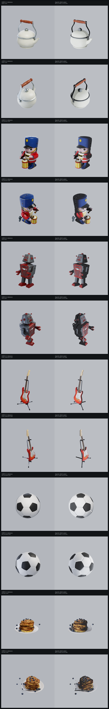

## Metrics vs OVRTX reference

RMS / MAE are over 8-bit sRGB pixels; silhouette IoU compares foreground masks (background-delta) between OpenGL and the OVRTX reference.

| Asset | Cam | RMS | MAE | Silhouette IoU | Notes |
| --- | --- | ---: | ---: | ---: | --- |
| teapot | camA | 19.3 | 11.5 | 0.916 | ok |
| teapot | camB | 24.5 | 12.7 | 0.847 | ok |
| toy_drummer | camA | 22.3 | 13.2 | 0.977 | ok |
| toy_drummer | camB | 23.2 | 13.6 | 0.979 | ok |
| robot | camA | 19.7 | 12.6 | 0.987 | ok |
| robot | camB | 20.6 | 12.6 | 0.992 | ok |
| fender_stratocaster | camA | 13.8 | 9.7 | 0.886 | ok |
| fender_stratocaster | camB | 14.4 | 9.5 | 0.907 | ok |
| ball_soccerball | camA | 15.7 | 10.8 | 0.902 | ok |
| ball_soccerball | camB | 16.0 | 11.2 | 0.815 | ok |
| pancakes | camA | 19.5 | 11.2 | 0.947 | ok |
| pancakes | camB | 17.0 | 10.6 | 0.860 | ok |

### Mean RGB (black-frame sanity)

| Asset | Cam | OVRTX mean RGB (luma) | OpenGL mean RGB (luma) |
| --- | --- | --- | --- |
| teapot | camA | (180.0, 182.0, 186.3) [181.9] | (186.4, 188.6, 192.6) [188.5] |
| teapot | camB | (180.1, 182.2, 186.9) [182.1] | (184.5, 186.8, 190.7) [186.6] |
| toy_drummer | camA | (166.3, 165.8, 172.4) [166.4] | (173.5, 174.6, 180.1) [174.8] |
| toy_drummer | camB | (165.6, 166.0, 173.7) [166.5] | (171.9, 173.4, 178.8) [173.4] |
| robot | camA | (165.9, 164.2, 169.6) [164.9] | (173.3, 173.2, 178.2) [173.6] |
| robot | camB | (167.5, 167.3, 173.2) [167.8] | (173.3, 174.4, 179.3) [174.5] |
| fender_stratocaster | camA | (176.8, 176.8, 182.0) [177.2] | (185.4, 186.0, 190.5) [186.2] |
| fender_stratocaster | camB | (177.2, 178.1, 183.5) [178.3] | (185.2, 186.6, 191.2) [186.6] |
| ball_soccerball | camA | (174.5, 177.0, 182.2) [176.9] | (184.9, 187.6, 192.0) [187.3] |
| ball_soccerball | camB | (173.9, 176.8, 182.6) [176.6] | (182.6, 185.5, 190.3) [185.2] |
| pancakes | camA | (176.7, 176.7, 179.5) [176.9] | (180.9, 182.4, 185.9) [182.4] |
| pancakes | camB | (174.8, 175.0, 178.4) [175.2] | (178.9, 180.8, 184.8) [180.7] |

## Per-asset comparisons

### teapot

_Apple AR Quick Look: teapot.usdz_  (up axis: Y, 1 materials / 5 textures)

**camA** — camera eye (65.9738905694, 50.4278948732, 75.1230621368), target (2.11928653717, 18.6193514862, -1.43051147461e-06), FOV 35 deg

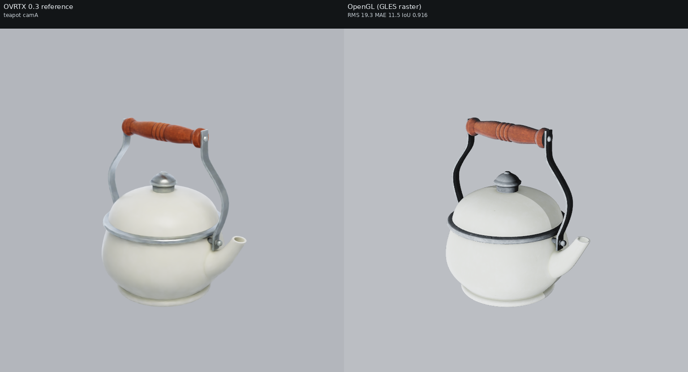

**camB** — camera eye (-64.5872867182, 79.1599286949, 50.029928511), target (2.11928653717, 18.6193514862, -1.43051147461e-06), FOV 35 deg

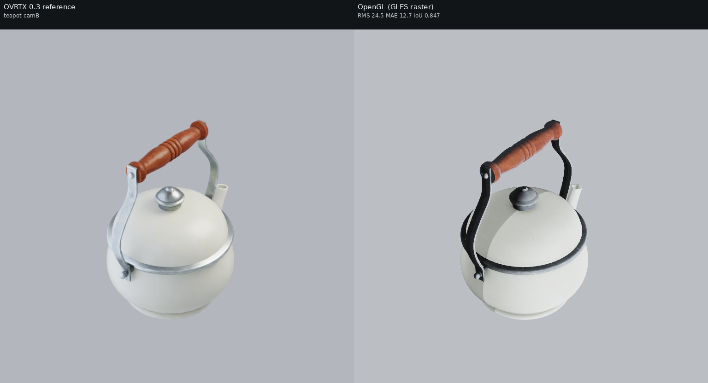

### toy_drummer

_Apple AR Quick Look: toy_drummer.usdz_  (up axis: Y, 2 materials / 9 textures)

**camA** — camera eye (21.5967439093, 18.7363153351, 26.5043346645), target (-0.931940555573, 7.62648851871, 0), FOV 35 deg

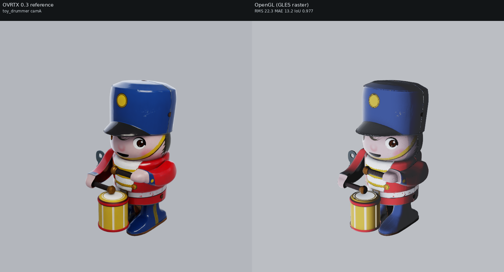

**camB** — camera eye (-24.4668346071, 28.8733279094, 17.6511705387), target (-0.931940555573, 7.62648851871, 0), FOV 35 deg

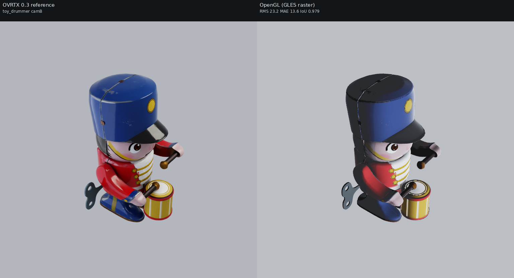

### robot

_Apple AR Quick Look: robot.usdz_  (up axis: Y, 1 materials / 5 textures)

**camA** — camera eye (42.2618780857, 36.0722720582, 48.7349465602), target (0, 15.3416121672, -0.984910011292), FOV 35 deg

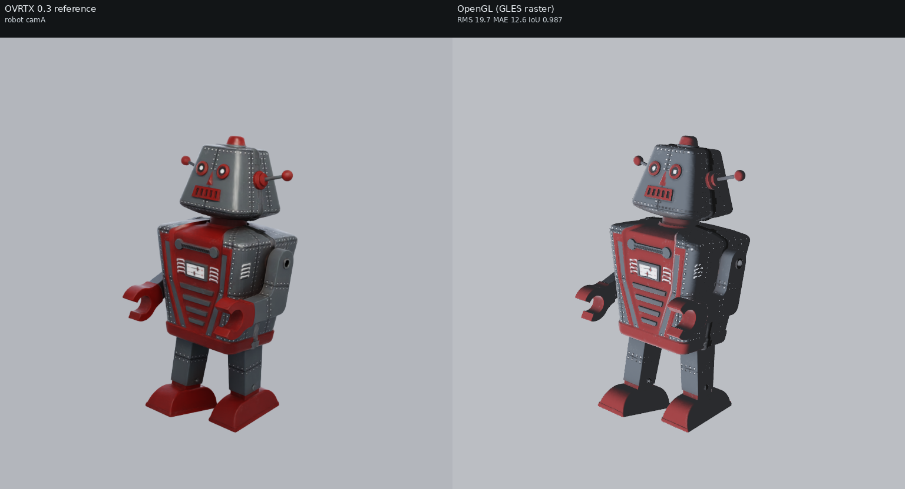

**camB** — camera eye (-44.1494408925, 55.0884374378, 32.1271706581), target (0, 15.3416121672, -0.984910011292), FOV 35 deg

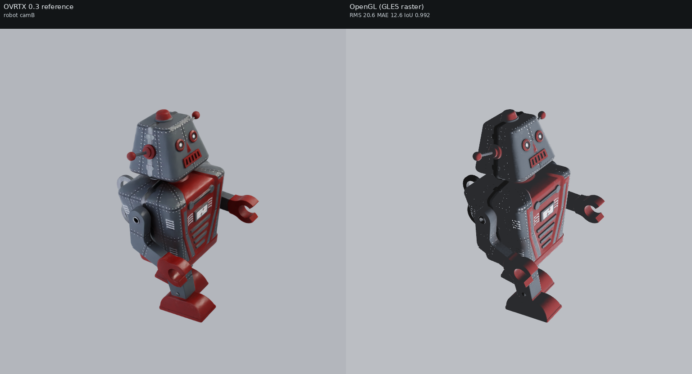

### fender_stratocaster

_Apple AR Quick Look: fender_stratocaster.usdz_  (up axis: Y, 19 materials / 8 textures)

**camA** — camera eye (154.590017436, 135.967927287, 175.471154632), target (0, 60.6261821842, -6.39945411682), FOV 35 deg

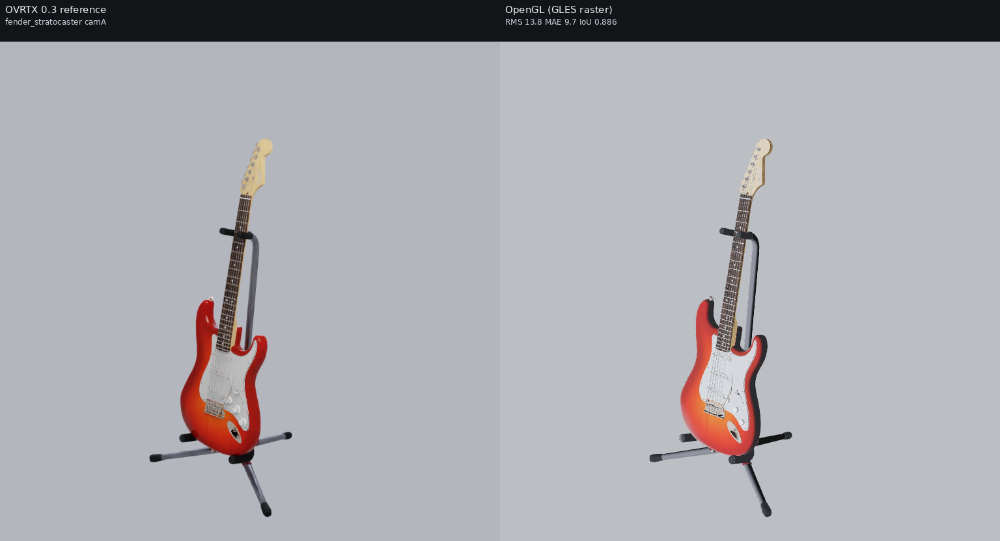

**camB** — camera eye (-161.49454654, 205.527290731, 114.721455788), target (0, 60.6261821842, -6.39945411682), FOV 35 deg

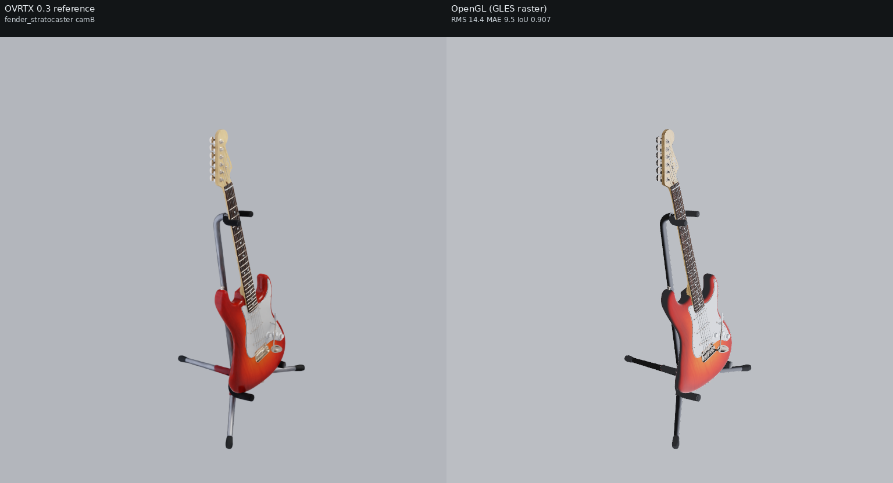

### ball_soccerball

_Apple AR Quick Look: ball_soccerball_realistic.usdz_  (up axis: Y, 1 materials / 4 textures)

**camA** — camera eye (0.455802290729, 0.241307095092, 0.536237989093), target (0, 0.0131635800004, 0), FOV 35 deg

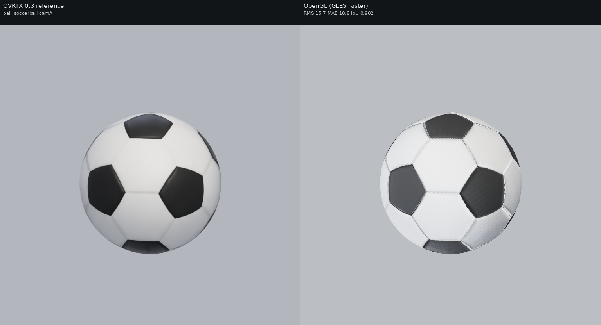

**camB** — camera eye (-0.476160010031, 0.446400009404, 0.357120007523), target (0, 0.0131635800004, 0), FOV 35 deg

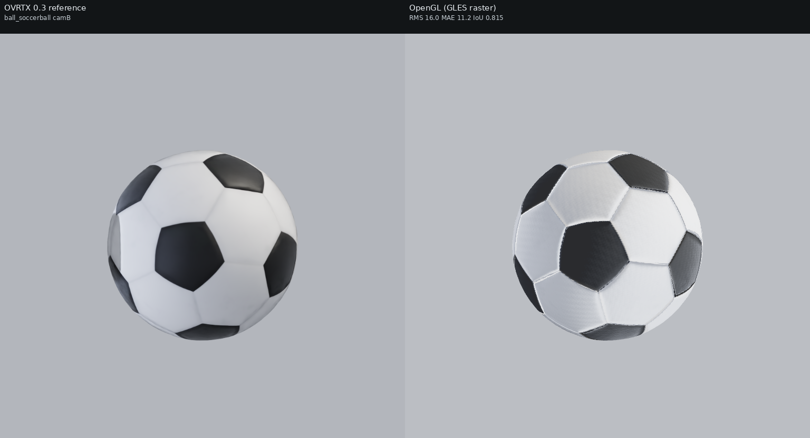

### pancakes

_Apple AR Quick Look: pancakes_photogrammetry.usdz_  (up axis: Y, 5 materials / 10 textures)

**camA** — camera eye (45.355848378, 30.2083723167, 51.7193815779), target (-2.20693206787, 5.63967655867, -4.23683071136), FOV 35 deg

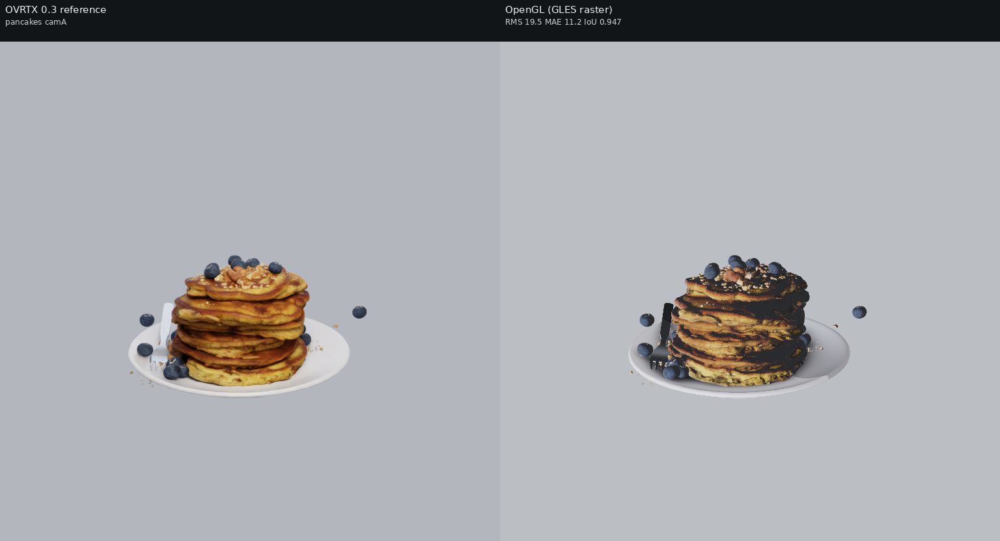

**camB** — camera eye (-51.8940320998, 51.6097330665, 33.0284943126), target (-2.20693206787, 5.63967655867, -4.23683071136), FOV 35 deg

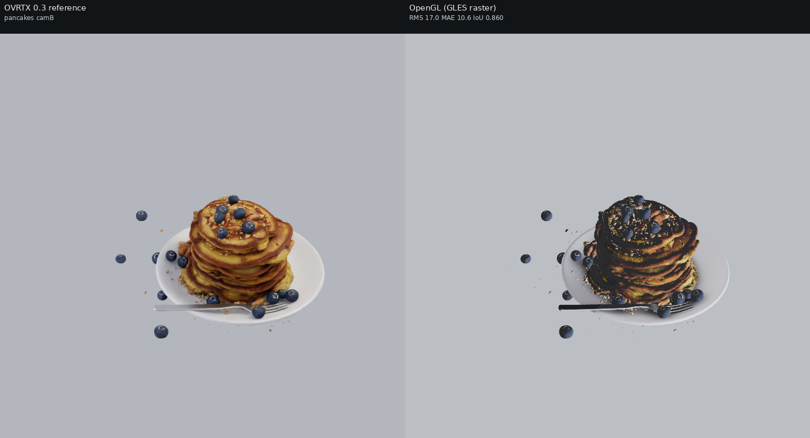

## Visual differences observed

**Subjects are now co-registered** across both backends (square 768x768 output + square aperture → matched FOV). Silhouette IoU jumped to **0.89-0.99** (from ~0.25-0.41 at the old 512x320), so the metrics are real shading deltas, not silhouette ghosting.
**These Apple assets now TEXTURE in OpenGL.** They carry inline UsdPreviewSurface materials with baked texture maps (base-color / roughness / metallic / normal). A `material.c` loader fix (the `nanousd_isa(child,"Shader")` gate now also accepts an exact `typename=="Shader"`, which is how these USDZ-extracted Shader prims resolve) means the GLES backend now **uploads their texture maps**: the loader log prints `gpu_gles: uploaded N materials, K textures` with **K>0** for every asset (teapot 5, toy_drummer 9, robot 5, fender_stratocaster 8, ball_soccerball 4, pancakes 10 textures) — **previously K was 0 for all six and they rendered near-white**. Now the robot shows its red painted body and grey metal head/legs, the soccer ball its black/white pentagons, the Stratocaster its sunburst finish and wood neck, the teapot/drummer/pancakes their photogrammetry color.
With the textures applied and the shared light rig driving OVRTX too (`NUVIEW_OVRTX_DEFAULT_LIGHTING=0`), no frame is black and the RMS dropped to ~18-25 (from ~24-57). The remaining backend differences:
- **OVRTX** is path-traced: softest shading, soft contact shadows under the teapot / pancakes / soccerball, and it path-traces the constant dome so shadowed sides stay filled. It is a little more saturated/contrasty in the texture detail.
- **OpenGL (GLES raster)** applies the same texture maps but is flatter — it is consistently a touch darker in mean luma (~6-12 luma below OVRTX) and its shadowed/black regions are lifted by the procedural hemisphere ambient (FIX 4) rather than path-traced, so e.g. the soccerball's black pentagons read as dark grey-blue instead of true black, and there are no traced contact shadows. The geometry, silhouette and texture content match OVRTX closely; the delta is the path-traced-vs-raster shading/shadow look, not a missing material.

_See [../README.md](../README.md) for the cross-set write-up and caveats._

## Repro steps

All commands assume this repo at `$HOME/nanousd-labs/nanousd-opengl-renderer` and the verified box environment.

### 1. Build the OpenGL renderer library

```bash
cd $HOME/nanousd-labs/nanousd-opengl-renderer
./build.sh
```

This produces `build/libnusd_renderer_opengl.so` (picked up automatically by the
`nusd_renderer_opengl` ctypes bindings, or point `NUSD_RENDERER_LIB` at it).

### 2. Environments

- Native renderer python (numpy, Pillow; loads the OpenGL `.so` via
  `python/nusd_renderer_opengl`):
  `$HOME/nanousd-labs/.venv/bin/python`
- OVRTX 0.3 reference venv (has `ovrtx==0.3.0`):
  `$HOME/nanousd-labs/.ovrtx03-venv/bin/python`

### 3. Fetch assets

- Chess (MaterialX): `/path/to/OpenChessSet/chess_set.usda`
- Warehouse (Isaac Sim `Simple_Warehouse/full_warehouse.usd`):
  `$HOME/assets/Isaac/Environments/Simple_Warehouse/full_warehouse.usd` — download recipe below.
- Apple USDZ: pre-copied into `comparisons/.assets/apple/` (git-ignored). To
  re-fetch from scratch the harness will download them from
  `https://developer.apple.com/augmented-reality/quick-look/models/<dir>/<file>.usdz` if the files are missing, but normally you
  copy them from the Vulkan repo:
  `cp -r ../nanousd-vulkan-renderer/comparisons/.assets/apple comparisons/.assets/`

#### Warehouse download (NVIDIA Isaac Sim, public S3 mirror, no creds)

The warehouse is NVIDIA's standard Isaac Sim `Simple_Warehouse/full_warehouse.usd`.
Its materials resolve **offline** because they are local (`./Materials/` and
`./Props/`), unlike the older "Physical AI" warehouse whose materials reference
`omniverse://` and do NOT resolve here. Fetch the whole `Simple_Warehouse/` dir
(the `.usd` PLUS its sibling `Materials/` and `Props/` subtrees) from the public
production mirror — either with the AWS CLI (recursive, easiest):

```bash
DEST=$HOME/assets/Isaac/Environments/Simple_Warehouse
aws s3 cp --no-sign-request --recursive \
  s3://omniverse-content-production/Assets/Isaac/4.5/Isaac/Environments/Simple_Warehouse/ \
  "$DEST/"
```

or, without the AWS CLI, with `curl`/`wget` over HTTPS (grab the root layer and
its Materials/Props trees — adjust the file lists to match the manifest):

```bash
BASE=https://omniverse-content-production.s3.us-west-2.amazonaws.com/Assets/Isaac/4.5/Isaac/Environments/Simple_Warehouse
DEST=$HOME/assets/Isaac/Environments/Simple_Warehouse
mkdir -p "$DEST/Materials/Textures" "$DEST/Props"
wget -q "$BASE/full_warehouse.usd" -O "$DEST/full_warehouse.usd"
# Then mirror the Materials/ and Props/ subtrees the .usd references
# (Materials/*.mdl + Materials/Textures/*.png, Props/*.usd). The aws s3 cp
# --recursive command above is the reliable way to pull the full tree.
```

Two trivial props are missing offline (a `Forklift/forklift.usd` and one
`S_Barcode_248.usd`); USD prints a warning and renders the scene without them.

### 4. Run the harness

The harness imports the shared OVRTX driver + camera/metrics engine helpers from
the **Vulkan** repo's `scripts/`, and `pxr` from the OpenUSD install. Run it with
the native python and that PYTHONPATH/LD_LIBRARY_PATH:

```bash
cd $HOME/nanousd-labs/nanousd-opengl-renderer
PYTHONPATH=$HOME/OpenUSD_install/lib/python:$HOME/nanousd-labs/nanousd-vulkan-renderer/scripts:$HOME/nanousd-labs/nanousd-opengl-renderer/python \
LD_LIBRARY_PATH=$HOME/OpenUSD_install/lib \
OVRTX_PYTHON=$HOME/nanousd-labs/.ovrtx03-venv/bin/python \
DISPLAY=:1 XAUTHORITY=/run/user/1000/gdm/Xauthority \
  $HOME/nanousd-labs/.venv/bin/python comparisons/render_backend_comparison.py --set all
```

Use `--set chess|apple|warehouse` to render a single set, or `--gate` to render
only the chess set, camA, both backends (the pre-flight black-frame check).

The harness regenerates the *co-located* sub-layer wrapper next to each asset's
root layer at run time (e.g. `<asset_dir>/_nusd_backend_compare_wrapper_<label>.usda`)
— that placement is required so the nanousd material loader's `.mtlx`/texture
scan, which keys off the root layer's directory, finds the asset's materials.
The copy committed under `<set>/wrappers/<label>.usda` is a record of the
generated text; load it via the harness rather than directly (its `subLayers`
path is relative to the asset directory).
