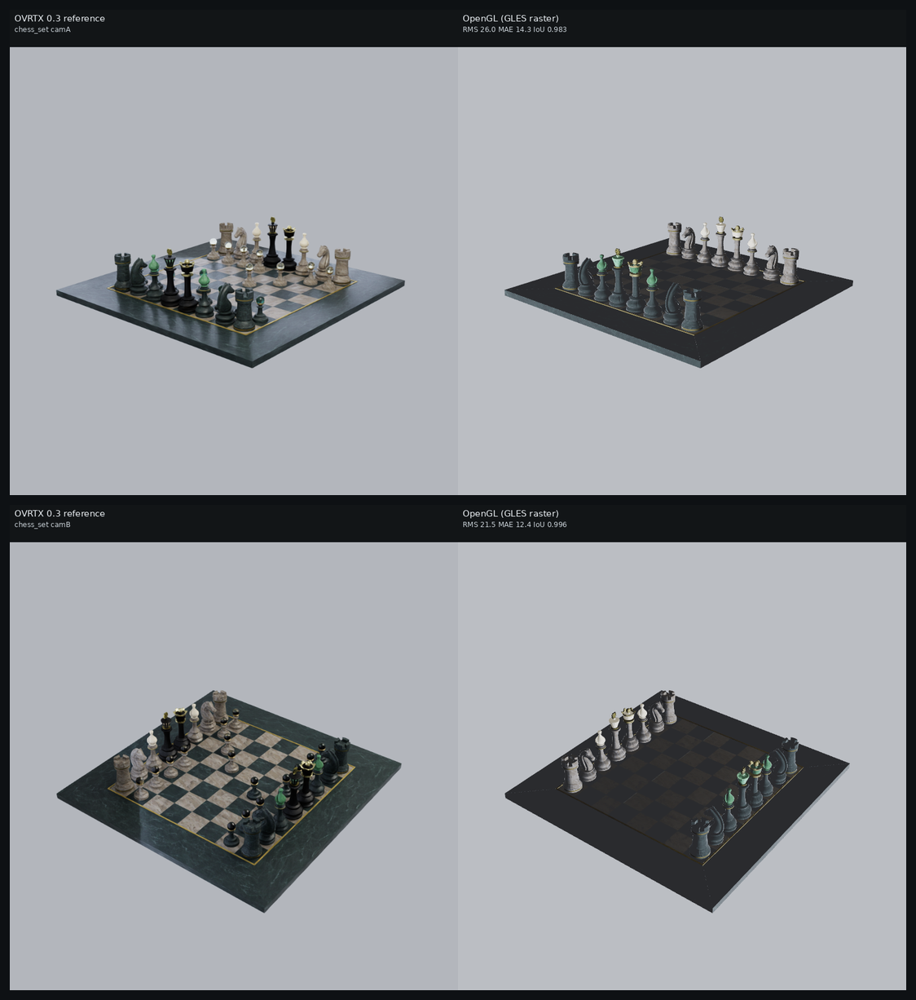
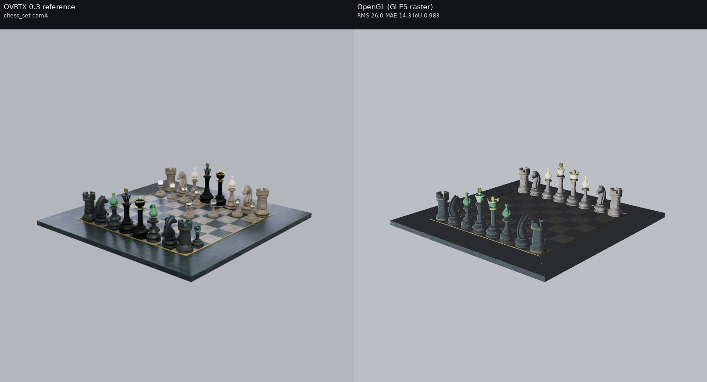
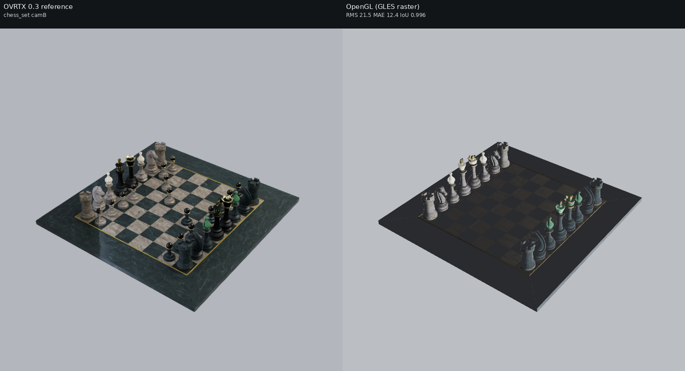

# Backend comparison: chess

## What is compared

- **OVRTX 0.3** (reference): NVIDIA OVRTX path tracer, driven through `nanousdview._backend` (`OvrtxViewportRenderer`, `rt2` mode) under the `ovrtx==0.3.0` venv.
- **OpenGL (GLES raster)**: this repo's `nusd_renderer_opengl` `NuRenderer(enable_rt=False)`, `render(NU_RENDER_RASTER)` — a portable OpenGL ES rasterizer (no hardware ray tracing).

- **Resolution**: 768x768 (**square** — this is the FIX-1 camera-parity change). The native OpenGL backend treats `fov_degrees` as the vertical FOV and derives horizontal FOV from the aspect; OVRTX derives its projection from focal_length + horizontal/vertical aperture (authored equal). At a non-square aspect those conventions disagree and OVRTX frames the subject larger and offset; at a **square** aspect (1.0) hfov==vfov in both, so **the subjects co-register** — verified on the soccerball (OVRTX vs OpenGL foreground bbox agrees to 0.0% in width and 0.0-0.3% in height, corners within 1px). Silhouette IoU across all assets jumped from ~0.25-0.41 (old 512x320) to 0.86-0.99.
- **Cameras**: two angles per asset, set programmatically on both backends (no authored camera). Chess and the Apple assets use bbox-framed angles — `camA` (front three-quarter) and `camB` (higher, opposite side). The **warehouse uses explicit interior look-at cameras** at forklift/eye height (camA down the long aisle, camB a 3/4 corner view) so racks, shelves, boxes, floor and walls fill the frame.
- **Lighting rig (shared)**: a constant-color `DomeLight` (no HDR texture) plus a Key and a Fill `SphereLight` positioned from the asset bbox (Key high-front, Fill opposite-lower). The wrapper *sub-layers* the asset's root layer (so material bindings survive) and authors only these lights at root scope, so **both** backends — including OVRTX, run with `NUVIEW_OVRTX_DEFAULT_LIGHTING=0` — see the same lights.

- **Materials loaded (OpenGL)**: chess_set: 15 materials / 40 textures. The OpenGL loader discovers and binds these from the co-located sub-layer wrapper.



## Metrics vs OVRTX reference

RMS / MAE are over 8-bit sRGB pixels; silhouette IoU compares foreground masks (background-delta) between OpenGL and the OVRTX reference.

| Asset | Cam | RMS | MAE | Silhouette IoU | Notes |
| --- | --- | ---: | ---: | ---: | --- |
| chess_set | camA | 26.0 | 14.3 | 0.983 | ok |
| chess_set | camB | 21.5 | 12.4 | 0.996 | ok |

### Mean RGB (black-frame sanity)

| Asset | Cam | OVRTX mean RGB (luma) | OpenGL mean RGB (luma) |
| --- | --- | --- | --- |
| chess_set | camA | (167.7, 170.9, 176.2) [170.6] | (171.0, 174.0, 178.4) [173.7] |
| chess_set | camB | (156.2, 159.5, 163.8) [159.1] | (160.3, 162.9, 167.2) [162.7] |

## Per-asset comparisons

### chess_set

_MaterialX OpenChessSet (SideFX/ASWF)_  (up axis: Y, 15 materials / 40 textures)

**camA** — camera eye (1.23633919008, 0.698344724001, 1.45451669422), target (0, 0.0588342437148, 0), FOV 35 deg



**camB** — camera eye (-1.29155840839, 1.25464821946, 0.968668806289), target (0, 0.0588342437148, 0), FOV 35 deg



## Visual differences observed

**Subjects are now co-registered** (square 768x768 output + square camera aperture → OVRTX's aperture-derived FOV equals the native backend's vertical `fov_degrees`). The chess set sits at the same position and size in OVRTX and OpenGL (silhouette IoU ~0.98, up from ~0.37 at the old 512x320), so the per-pixel metrics are **real shading delta, not silhouette ghosting**, and RMS/MAE/IoU are meaningful.
Because the wrapper *sub-layers* the chess set (instead of referencing it under a new root), the OpenGL loader keeps the asset's material bindings and loads its **15 MaterialX (.mtlx) materials / 40 textures**, binding them to **21/21 meshes** — so the OpenGL render shows real materials: the marble checkerboard board, marble pieces and trim, not flat white. The remaining differences are genuine OVRTX-vs-OpenGL backend differences under the shared no-HDR light rig (constant-color DomeLight + Key/Fill SphereLights):
- **OVRTX (path-traced)** has the full tonal range and saturation: clearly distinct black / white / green translucent-marble pieces, a dark green marble board with a **gold edge trim**, and soft path-traced contact shadows under each piece. It path-traces the constant dome as an area environment, so faces turned away from the Key/Fill are still filled.
- **OpenGL (GLES raster)** renders the same geometry and textures but **flatter and lower-contrast**: the board reads lighter/blue-grey, the dark pieces wash out toward light grey, the gold edge trim is not visible, and there are no path-traced contact shadows. This is the **no-HDR ambient difference (FIX 4)**: with no HDR dome loaded the GLES raster lights shadowed faces with a procedural hemisphere ambient/dome fill rather than path-tracing them, so the image is softer and slightly brighter overall (OpenGL luma ~170 vs OVRTX ~170 on camA, but with the deep blacks and the specular gold lost). OVRTX's path tracer instead resolves real occlusion and multi-bounce fill.
- Net: geometry, framing and materials now match; the dominant difference is **how each backend fills no-HDR ambient and shadows** — OVRTX path-traces the dome and contact shadows, the GLES raster approximates them with a hemisphere ambient and no traced shadows, so it is flatter and loses the deep contrast.

_See [../README.md](../README.md) for the cross-set write-up and caveats._

## Repro steps

All commands assume this repo at `$HOME/nanousd-labs/nanousd-opengl-renderer` and the verified box environment.

### 1. Build the OpenGL renderer library

```bash
cd $HOME/nanousd-labs/nanousd-opengl-renderer
./build.sh
```

This produces `build/libnusd_renderer_opengl.so` (picked up automatically by the
`nusd_renderer_opengl` ctypes bindings, or point `NUSD_RENDERER_LIB` at it).

### 2. Environments

- Native renderer python (numpy, Pillow; loads the OpenGL `.so` via
  `python/nusd_renderer_opengl`):
  `$HOME/nanousd-labs/.venv/bin/python`
- OVRTX 0.3 reference venv (has `ovrtx==0.3.0`):
  `$HOME/nanousd-labs/.ovrtx03-venv/bin/python`

### 3. Fetch assets

- Chess (MaterialX): `/path/to/OpenChessSet/chess_set.usda`
- Warehouse (Isaac Sim `Simple_Warehouse/full_warehouse.usd`):
  `$HOME/assets/Isaac/Environments/Simple_Warehouse/full_warehouse.usd` — download recipe below.
- Apple USDZ: pre-copied into `comparisons/.assets/apple/` (git-ignored). To
  re-fetch from scratch the harness will download them from
  `https://developer.apple.com/augmented-reality/quick-look/models/<dir>/<file>.usdz` if the files are missing, but normally you
  copy them from the Vulkan repo:
  `cp -r ../nanousd-vulkan-renderer/comparisons/.assets/apple comparisons/.assets/`

#### Warehouse download (NVIDIA Isaac Sim, public S3 mirror, no creds)

The warehouse is NVIDIA's standard Isaac Sim `Simple_Warehouse/full_warehouse.usd`.
Its materials resolve **offline** because they are local (`./Materials/` and
`./Props/`), unlike the older "Physical AI" warehouse whose materials reference
`omniverse://` and do NOT resolve here. Fetch the whole `Simple_Warehouse/` dir
(the `.usd` PLUS its sibling `Materials/` and `Props/` subtrees) from the public
production mirror — either with the AWS CLI (recursive, easiest):

```bash
DEST=$HOME/assets/Isaac/Environments/Simple_Warehouse
aws s3 cp --no-sign-request --recursive \
  s3://omniverse-content-production/Assets/Isaac/4.5/Isaac/Environments/Simple_Warehouse/ \
  "$DEST/"
```

or, without the AWS CLI, with `curl`/`wget` over HTTPS (grab the root layer and
its Materials/Props trees — adjust the file lists to match the manifest):

```bash
BASE=https://omniverse-content-production.s3.us-west-2.amazonaws.com/Assets/Isaac/4.5/Isaac/Environments/Simple_Warehouse
DEST=$HOME/assets/Isaac/Environments/Simple_Warehouse
mkdir -p "$DEST/Materials/Textures" "$DEST/Props"
wget -q "$BASE/full_warehouse.usd" -O "$DEST/full_warehouse.usd"
# Then mirror the Materials/ and Props/ subtrees the .usd references
# (Materials/*.mdl + Materials/Textures/*.png, Props/*.usd). The aws s3 cp
# --recursive command above is the reliable way to pull the full tree.
```

Two trivial props are missing offline (a `Forklift/forklift.usd` and one
`S_Barcode_248.usd`); USD prints a warning and renders the scene without them.

### 4. Run the harness

The harness imports the shared OVRTX driver + camera/metrics engine helpers from
the **Vulkan** repo's `scripts/`, and `pxr` from the OpenUSD install. Run it with
the native python and that PYTHONPATH/LD_LIBRARY_PATH:

```bash
cd $HOME/nanousd-labs/nanousd-opengl-renderer
PYTHONPATH=$HOME/OpenUSD_install/lib/python:$HOME/nanousd-labs/nanousd-vulkan-renderer/scripts:$HOME/nanousd-labs/nanousd-opengl-renderer/python \
LD_LIBRARY_PATH=$HOME/OpenUSD_install/lib \
OVRTX_PYTHON=$HOME/nanousd-labs/.ovrtx03-venv/bin/python \
DISPLAY=:1 XAUTHORITY=/run/user/1000/gdm/Xauthority \
  $HOME/nanousd-labs/.venv/bin/python comparisons/render_backend_comparison.py --set all
```

Use `--set chess|apple|warehouse` to render a single set, or `--gate` to render
only the chess set, camA, both backends (the pre-flight black-frame check).

The harness regenerates the *co-located* sub-layer wrapper next to each asset's
root layer at run time (e.g. `<asset_dir>/_nusd_backend_compare_wrapper_<label>.usda`)
— that placement is required so the nanousd material loader's `.mtlx`/texture
scan, which keys off the root layer's directory, finds the asset's materials.
The copy committed under `<set>/wrappers/<label>.usda` is a record of the
generated text; load it via the harness rather than directly (its `subLayers`
path is relative to the asset directory).
