# Backend comparison: apple

## What is compared

- **OVRTX 0.3** (reference): NVIDIA OVRTX path tracer, driven through `nanousdview._backend` (`OvrtxViewportRenderer`, `rt2` mode).
- **Vulkan RT**: local `nusd_renderer` `NuRenderer(enable_rt=True)`, `render(NU_RENDER_RT)` — hardware ray tracing.
- **Vulkan Raster**: local `nusd_renderer` `NuRenderer(enable_rt=False)`, `render(NU_RENDER_RASTER)` — rasterizer.

- **Resolution**: 768x768 (**square** — this is the FIX-1 camera-parity change). The native Vulkan backends treat `fov_degrees` as the vertical FOV and derive horizontal FOV from the aspect; OVRTX derives its projection from focal_length + horizontal/vertical aperture (authored equal). At a non-square aspect those conventions disagree and OVRTX framed the subject ~1.8x larger. At a **square** aspect (1.0) hfov==vfov in both, so **the subjects co-register** — verified on the soccerball (OVRTX vs RT foreground bbox agrees within ~0.3% in width/height, corners within 1px).
- **Cameras**: two angles per asset, set programmatically on every backend (no authored camera). Chess and the Apple assets use bbox-framed angles — `camA` (front three-quarter) and `camB` (higher, opposite side). The **warehouse uses explicit interior look-at cameras** at forklift/eye height (camA down the long aisle, camB a 3/4 corner view) so racks, shelves, boxes, floor and walls fill the frame.
- **Lighting rig (shared)**: a constant-color `DomeLight` (no HDR texture) plus a Key and a Fill `SphereLight` positioned from the asset bbox (Key high-front, Fill opposite-lower). The wrapper *sub-layers* the asset's root layer (so material bindings survive) and authors only these lights at root scope, so all three backends — including OVRTX, run with `NUVIEW_OVRTX_DEFAULT_LIGHTING=0` — see the same lights. The chess and Apple assets ship no authored lights of their own; the warehouse is the exception (it carries ~39 of its own lights, plus the shared rig).

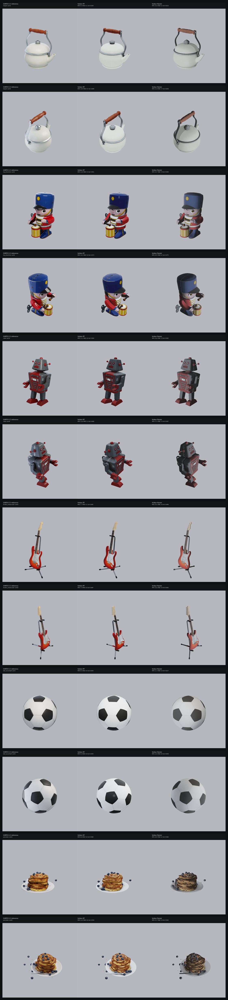

## Metrics vs OVRTX reference

RMS / MAE are over 8-bit sRGB pixels; silhouette IoU compares foreground masks (background-delta) between each backend and the OVRTX reference.

| Asset | Cam | RT RMS | RT MAE | RT IoU | Raster RMS | Raster MAE | Raster IoU | Notes |
| --- | --- | ---: | ---: | ---: | ---: | ---: | ---: | --- |
| teapot | camA | 9.4 | 4.1 | 0.939 | 16.4 | 6.2 | 0.816 | ok |
| teapot | camB | 10.9 | 4.5 | 0.890 | 21.9 | 7.7 | 0.858 | ok |
| toy_drummer | camA | 12.8 | 5.4 | 0.961 | 19.7 | 7.9 | 0.968 | ok |
| toy_drummer | camB | 14.2 | 5.8 | 0.973 | 20.5 | 8.3 | 0.975 | ok |
| robot | camA | 11.1 | 4.8 | 0.982 | 16.6 | 7.0 | 0.983 | ok |
| robot | camB | 12.8 | 5.3 | 0.986 | 17.5 | 7.0 | 0.987 | ok |
| fender_stratocaster | camA | 7.7 | 3.1 | 0.881 | 10.2 | 3.8 | 0.888 | ok |
| fender_stratocaster | camB | 7.5 | 3.0 | 0.887 | 10.6 | 3.6 | 0.895 | ok |
| ball_soccerball | camA | 8.5 | 4.6 | 0.856 | 11.3 | 5.6 | 0.827 | ok |
| ball_soccerball | camB | 9.4 | 4.8 | 0.850 | 14.4 | 6.6 | 0.848 | ok |
| pancakes | camA | 8.6 | 3.6 | 0.966 | 18.0 | 6.2 | 0.966 | ok |
| pancakes | camB | 12.4 | 4.6 | 0.958 | 15.7 | 5.9 | 0.964 | ok |

### Mean RGB (black-frame sanity)

| Asset | Cam | OVRTX mean RGB | Vulkan RT mean RGB | Vulkan Raster mean RGB |
| --- | --- | --- | --- | --- |
| teapot | camA | (180.0, 182.0, 186.3) | (182.3, 183.7, 187.7) | (179.0, 180.6, 184.6) |
| teapot | camB | (180.1, 182.2, 186.9) | (182.6, 183.9, 188.0) | (177.5, 179.1, 183.1) |
| toy_drummer | camA | (166.3, 165.7, 172.4) | (168.1, 166.9, 172.2) | (168.0, 168.6, 173.5) |
| toy_drummer | camB | (165.6, 166.0, 173.7) | (167.7, 167.2, 173.5) | (166.7, 167.5, 172.6) |
| robot | camA | (165.9, 164.2, 169.6) | (166.1, 164.6, 169.4) | (167.5, 167.4, 172.0) |
| robot | camB | (167.5, 167.3, 173.2) | (168.3, 167.3, 172.3) | (167.8, 168.3, 172.9) |
| fender_stratocaster | camA | (176.8, 176.8, 182.0) | (179.0, 178.6, 183.1) | (179.4, 179.7, 184.3) |
| fender_stratocaster | camB | (177.2, 178.1, 183.5) | (179.5, 179.6, 184.2) | (179.5, 180.3, 184.9) |
| ball_soccerball | camA | (174.5, 177.0, 182.2) | (179.5, 181.2, 185.5) | (177.6, 179.3, 183.7) |
| ball_soccerball | camB | (173.9, 176.8, 182.6) | (178.5, 180.5, 185.2) | (174.9, 176.8, 181.5) |
| pancakes | camA | (176.7, 176.7, 179.5) | (179.7, 179.0, 181.3) | (175.4, 176.2, 179.9) |
| pancakes | camB | (174.8, 175.0, 178.5) | (179.5, 178.8, 181.4) | (173.5, 174.5, 178.5) |

## Per-asset comparisons

### teapot

_Apple AR Quick Look: teapot.usdz_  (up axis: Y)

**camA** — camera eye (65.9738905694, 50.4278948732, 75.1230621368), target (2.11928653717, 18.6193514862, -1.43051147461e-06), FOV 35 deg

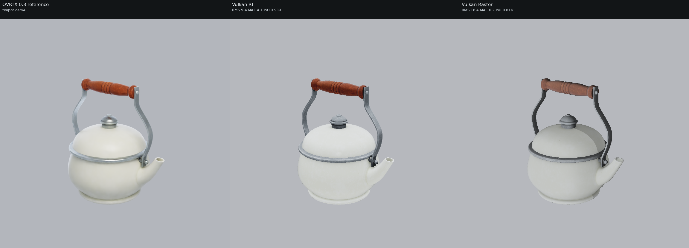

**camB** — camera eye (-64.5872867182, 79.1599286949, 50.029928511), target (2.11928653717, 18.6193514862, -1.43051147461e-06), FOV 35 deg

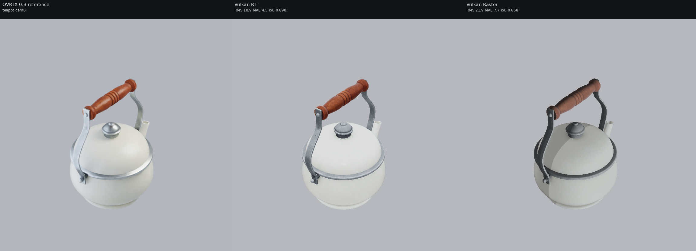

### toy_drummer

_Apple AR Quick Look: toy_drummer.usdz_  (up axis: Y)

**camA** — camera eye (21.5967439093, 18.7363153351, 26.5043346645), target (-0.931940555573, 7.62648851871, 0), FOV 35 deg

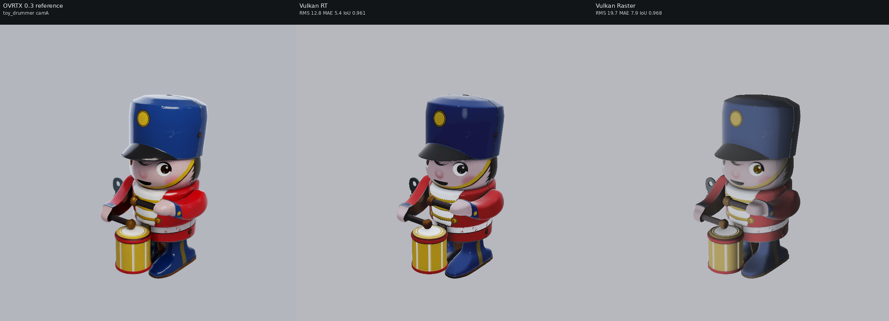

**camB** — camera eye (-24.4668346071, 28.8733279094, 17.6511705387), target (-0.931940555573, 7.62648851871, 0), FOV 35 deg

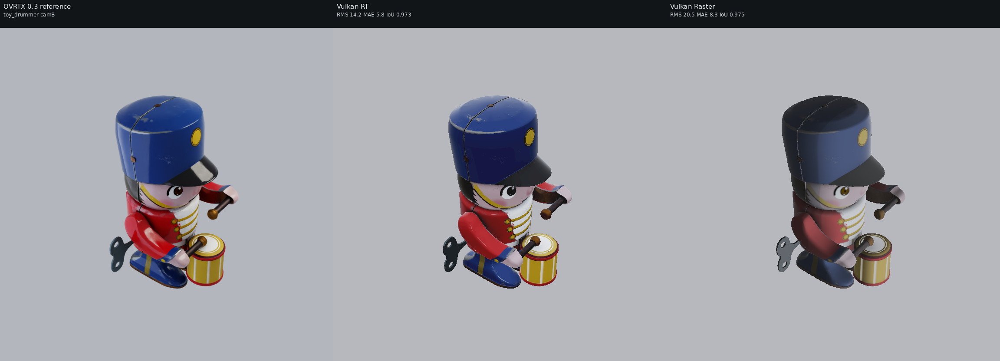

### robot

_Apple AR Quick Look: robot.usdz_  (up axis: Y)

**camA** — camera eye (42.2618780857, 36.0722720582, 48.7349465602), target (0, 15.3416121672, -0.984910011292), FOV 35 deg

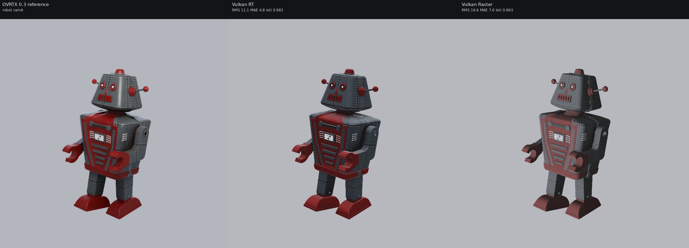

**camB** — camera eye (-44.1494408925, 55.0884374378, 32.1271706581), target (0, 15.3416121672, -0.984910011292), FOV 35 deg

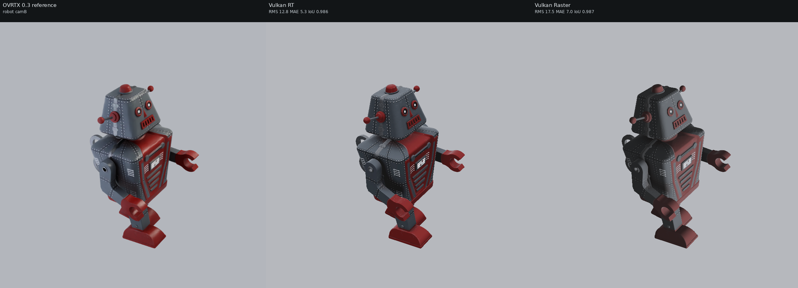

### fender_stratocaster

_Apple AR Quick Look: fender_stratocaster.usdz_  (up axis: Y)

**camA** — camera eye (154.590017436, 135.967927287, 175.471154632), target (0, 60.6261821842, -6.39945411682), FOV 35 deg

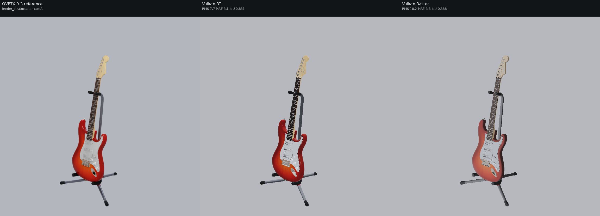

**camB** — camera eye (-161.49454654, 205.527290731, 114.721455788), target (0, 60.6261821842, -6.39945411682), FOV 35 deg

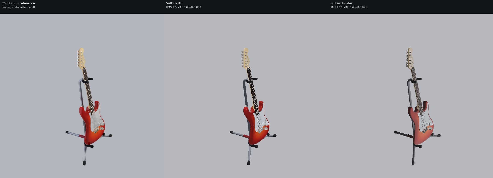

### ball_soccerball

_Apple AR Quick Look: ball_soccerball_realistic.usdz_  (up axis: Y)

**camA** — camera eye (0.455802290729, 0.241307095092, 0.536237989093), target (0, 0.0131635800004, 0), FOV 35 deg

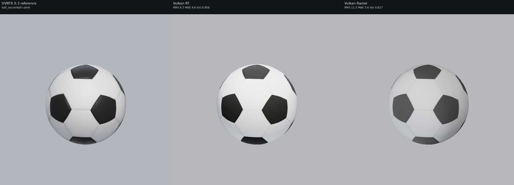

**camB** — camera eye (-0.476160010031, 0.446400009404, 0.357120007523), target (0, 0.0131635800004, 0), FOV 35 deg

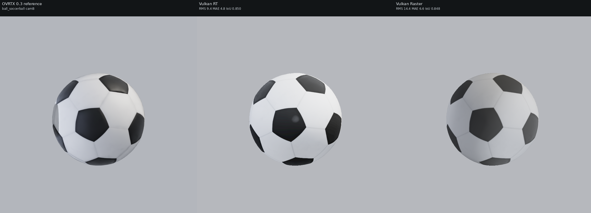

### pancakes

_Apple AR Quick Look: pancakes_photogrammetry.usdz_  (up axis: Y)

**camA** — camera eye (45.355848378, 30.2083723167, 51.7193815779), target (-2.20693206787, 5.63967655867, -4.23683071136), FOV 35 deg

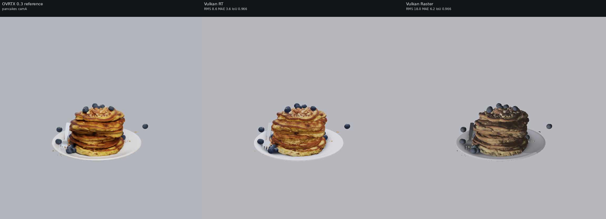

**camB** — camera eye (-51.8940320998, 51.6097330665, 33.0284943126), target (-2.20693206787, 5.63967655867, -4.23683071136), FOV 35 deg

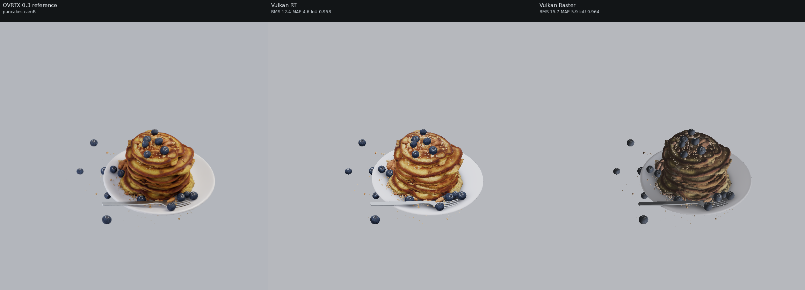

## Visual differences observed

**Subjects are now co-registered** across the three backends (square 768x768 output + square aperture → matched FOV; verified on the soccerball, where the OVRTX vs RT foreground bbox agrees within ~0.3% in width/height and the bbox corners to within 1px). The metrics are real shading deltas, not silhouette ghosting.
These assets use **baked texture-map PBR** (base-color / roughness / metallic / normal maps via UsdPreviewSurface) which **all three backends apply** — textures and silhouettes match well on every frame. With the shared light rig driving OVRTX too (`NUVIEW_OVRTX_DEFAULT_LIGHTING=0`), no frame is black. The real backend differences:
- **OVRTX** is path-traced: softest shading, soft contact shadows under the teapot / pancakes / soccerball, and it path-traces the constant dome so shadowed sides stay filled.
- **Vulkan RT** lights from the authored dome + Key/Fill with traced shadows. On bright-albedo assets (soccerball, teapot, pancakes) it tracks OVRTX closely; on low-albedo / metallic assets (the painted-metal robot) it reads darker than Raster because of the FIX-3 ambient asymmetry. Reflections on glossy surfaces are sharp and physically placed.
- **Vulkan Raster** applies the same textures and is typically the **brightest Vulkan result** — see FIX 3: its `mesh.frag` keeps the full procedural hemisphere ambient where RT attenuates it to ~32-38% under authored lights. That extra fill is what keeps the robot and other dark materials readable. Its contact shadows are flatter (no traced shadows). Compare the per-frame mean-RGB table to see the gap quantitatively.
- Fine-detail tone (soccerball black pentagons, guitar sunburst gradient, pancake syrup specular) is marginally crisper in OVRTX's path tracer; this is a transport/softness difference, not a material mismatch.

_See [../README.md](../README.md) for the cross-set write-up and caveats._

## Repro steps

All commands assume the repo at `$HOME/nanousd-labs/nanousd-vulkan-renderer` and the verified box environment.

### 1. Build the renderer library

```bash
cd $HOME/nanousd-labs/nanousd-vulkan-renderer
NANOUSD_DIR=$HOME/nanousd-labs/nanousd \
  PATH=$HOME/blender/lib/linux_x64/shaderc/bin:$PATH \
  ./build.sh
```

This produces `build/libnusd_renderer.so` (picked up automatically by the
`nusd_renderer` ctypes bindings).

### 2. Environments

- Native renderer python (has `nusd_renderer`, numpy, Pillow):
  `$HOME/nanousd-labs/.venv/bin/python`
- OVRTX 0.3 reference venv (has `ovrtx==0.3.0`):
  `$HOME/nanousd-labs/.ovrtx03-venv/bin/python`

### 3. Fetch assets

- Chess (MaterialX): `/path/to/OpenChessSet/chess_set.usda`
- Warehouse (Isaac Sim `Simple_Warehouse/full_warehouse.usd`):
  `$HOME/assets/Isaac/Environments/Simple_Warehouse/full_warehouse.usd` — download recipe below.
- Apple USDZ: downloaded automatically by the harness into
  `comparisons/.assets/apple/` (git-ignored) from
  `https://developer.apple.com/augmented-reality/quick-look/models/<dir>/<file>.usdz`.

#### Warehouse download (NVIDIA Isaac Sim, public S3 mirror, no creds)

The warehouse is NVIDIA's standard Isaac Sim `Simple_Warehouse/full_warehouse.usd`.
Its materials resolve **offline** because they are local (`./Materials/` and
`./Props/`), unlike the older "Physical AI" warehouse whose materials reference
`omniverse://` and do NOT resolve here. Fetch the whole `Simple_Warehouse/` dir
(the `.usd` PLUS its sibling `Materials/` and `Props/` subtrees) from the public
production mirror — either with the AWS CLI (recursive, easiest):

```bash
DEST=$HOME/assets/Isaac/Environments/Simple_Warehouse
aws s3 cp --no-sign-request --recursive \
  s3://omniverse-content-production/Assets/Isaac/4.5/Isaac/Environments/Simple_Warehouse/ \
  "$DEST/"
```

or, without the AWS CLI, with `curl`/`wget` over HTTPS (grab the root layer and
its Materials/Props trees — adjust the file lists to match the manifest):

```bash
BASE=https://omniverse-content-production.s3.us-west-2.amazonaws.com/Assets/Isaac/4.5/Isaac/Environments/Simple_Warehouse
DEST=$HOME/assets/Isaac/Environments/Simple_Warehouse
mkdir -p "$DEST/Materials/Textures" "$DEST/Props"
wget -q "$BASE/full_warehouse.usd" -O "$DEST/full_warehouse.usd"
# Then mirror the Materials/ and Props/ subtrees the .usd references
# (Materials/*.mdl + Materials/Textures/*.png, Props/*.usd). The aws s3 cp
# --recursive command above is the reliable way to pull the full tree.
```

Two trivial props are missing offline (a `Forklift/forklift.usd` and one
`S_Barcode_248.usd`); USD prints a warning and renders the scene without them.

### 4. Run the harness

```bash
cd $HOME/nanousd-labs/nanousd-vulkan-renderer
PYTHONPATH=$HOME/OpenUSD_install/lib/python:$HOME/nanousd-labs/nanousd-vulkan-renderer/scripts \
LD_LIBRARY_PATH=$HOME/OpenUSD_install/lib \
OVRTX_PYTHON=$HOME/nanousd-labs/.ovrtx03-venv/bin/python \
DISPLAY=:1 XAUTHORITY=/run/user/1000/gdm/Xauthority \
  $HOME/nanousd-labs/.venv/bin/python comparisons/render_backend_comparison.py --set all
```

Use `--set chess|apple|warehouse` to render a single set, or `--gate` to render
only the chess set, camA, all three backends (the pre-flight black-frame check).

The harness regenerates the *co-located* sub-layer wrapper next to each asset's
root layer at run time (e.g. `<asset_dir>/_nusd_backend_compare_wrapper_<label>.usda`)
— that placement is required so the nanousd material loader's `.mtlx`/texture
scan, which keys off the root layer's directory, finds the asset's materials.
The copy committed under `<set>/wrappers/<label>.usda` is a record of the
generated text; load it via the harness rather than directly (its `subLayers`
path is relative to the asset directory).
