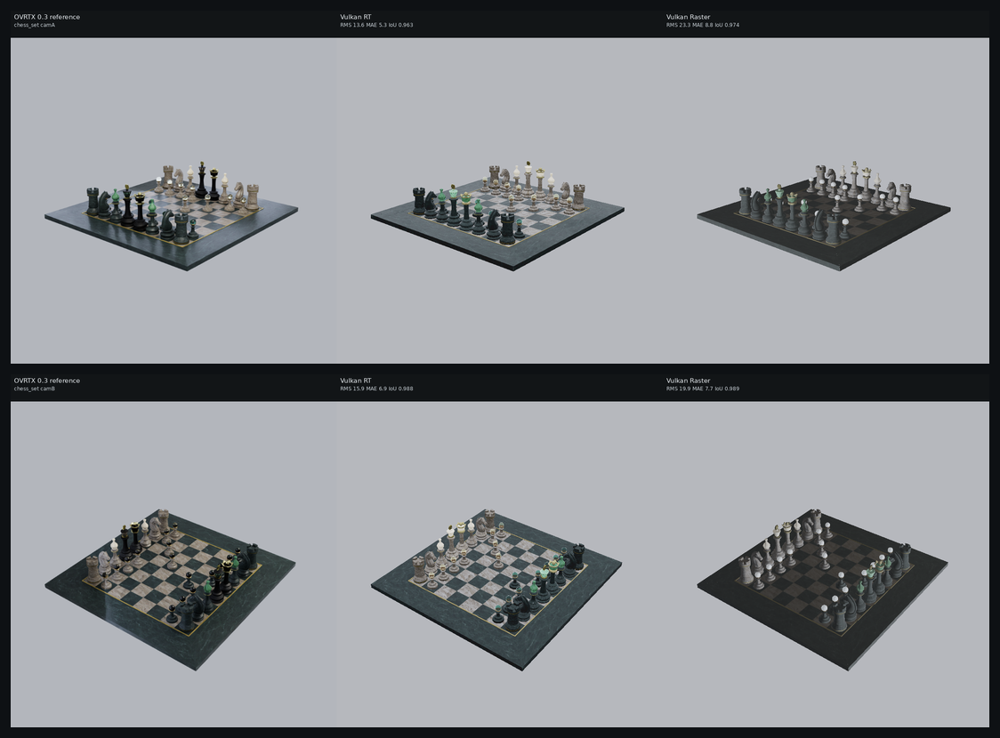
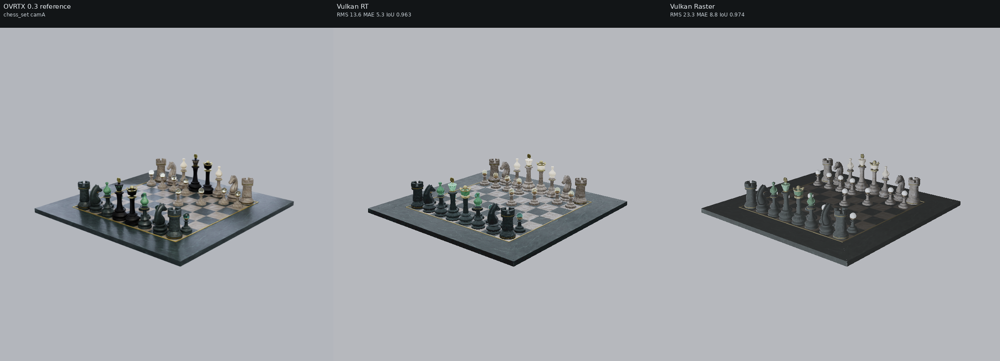
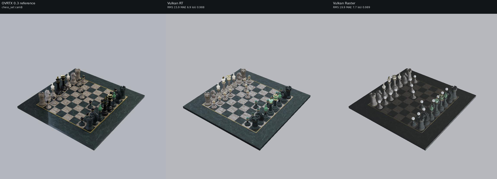

# Backend comparison: chess

## What is compared

- **OVRTX 0.3** (reference): NVIDIA OVRTX path tracer, driven through `nanousdview._backend` (`OvrtxViewportRenderer`, `rt2` mode).
- **Vulkan RT**: local `nusd_renderer` `NuRenderer(enable_rt=True)`, `render(NU_RENDER_RT)` — hardware ray tracing.
- **Vulkan Raster**: local `nusd_renderer` `NuRenderer(enable_rt=False)`, `render(NU_RENDER_RASTER)` — rasterizer.

- **Resolution**: 768x768 (**square** — this is the FIX-1 camera-parity change). The native Vulkan backends treat `fov_degrees` as the vertical FOV and derive horizontal FOV from the aspect; OVRTX derives its projection from focal_length + horizontal/vertical aperture (authored equal). At a non-square aspect those conventions disagree and OVRTX framed the subject ~1.8x larger. At a **square** aspect (1.0) hfov==vfov in both, so **the subjects co-register** — verified on the soccerball (OVRTX vs RT foreground bbox agrees within ~0.3% in width/height, corners within 1px).
- **Cameras**: two angles per asset, set programmatically on every backend (no authored camera). Chess and the Apple assets use bbox-framed angles — `camA` (front three-quarter) and `camB` (higher, opposite side). The **warehouse uses explicit interior look-at cameras** at forklift/eye height (camA down the long aisle, camB a 3/4 corner view) so racks, shelves, boxes, floor and walls fill the frame.
- **Lighting rig (shared)**: a constant-color `DomeLight` (no HDR texture) plus a Key and a Fill `SphereLight` positioned from the asset bbox (Key high-front, Fill opposite-lower). The wrapper *sub-layers* the asset's root layer (so material bindings survive) and authors only these lights at root scope, so all three backends — including OVRTX, run with `NUVIEW_OVRTX_DEFAULT_LIGHTING=0` — see the same lights. The chess and Apple assets ship no authored lights of their own; the warehouse is the exception (it carries ~39 of its own lights, plus the shared rig).



## Metrics vs OVRTX reference

RMS / MAE are over 8-bit sRGB pixels; silhouette IoU compares foreground masks (background-delta) between each backend and the OVRTX reference.

| Asset | Cam | RT RMS | RT MAE | RT IoU | Raster RMS | Raster MAE | Raster IoU | Notes |
| --- | --- | ---: | ---: | ---: | ---: | ---: | ---: | --- |
| chess_set | camA | 13.6 | 5.3 | 0.963 | 23.3 | 8.8 | 0.974 | ok |
| chess_set | camB | 15.9 | 6.9 | 0.988 | 19.9 | 7.7 | 0.989 | ok |

### Mean RGB (black-frame sanity)

| Asset | Cam | OVRTX mean RGB | Vulkan RT mean RGB | Vulkan Raster mean RGB |
| --- | --- | --- | --- | --- |
| chess_set | camA | (167.7, 170.9, 176.2) | (171.0, 173.4, 177.8) | (167.4, 169.4, 173.6) |
| chess_set | camB | (156.2, 159.5, 163.8) | (162.3, 165.3, 169.4) | (157.0, 158.9, 162.7) |

## Per-asset comparisons

### chess_set

_MaterialX OpenChessSet (SideFX/ASWF)_  (up axis: Y)

**camA** — camera eye (1.23633919008, 0.698344724001, 1.45451669422), target (0, 0.0588342437148, 0), FOV 35 deg



**camB** — camera eye (-1.29155840839, 1.25464821946, 0.968668806289), target (0, 0.0588342437148, 0), FOV 35 deg



## Visual differences observed

**Subjects are now co-registered** across all three backends (square 768x768 output + square camera aperture → OVRTX's aperture-derived FOV equals the native backends' vertical `fov_degrees`). The chess set sits at the same position and size in OVRTX, Vulkan RT and Vulkan Raster, so the per-pixel metrics below are **real shading deltas, not silhouette ghosting**, and the RMS/MAE/IoU numbers are meaningful.
The wrapper *sub-layers* the chess set, so the nanousd loader keeps its material bindings and loads the **MaterialX materials / textures** — all three backends show real materials: the marble checkerboard board, the green/black/white translucent-marble pieces and the gold trim. The remaining differences are genuine backend differences under the shared light rig (constant-color DomeLight + Key/Fill SphereLights, no HDR):
- **OVRTX** (path-traced) is the softest: it path-traces the constant-color dome as an area environment, so even faces turned away from the Key/Fill are filled and contact shadows under the pieces are soft. The board reads as clean grey/green marble.
- **Vulkan RT** renders the same materials with traced shadows. Where a surface turns away from the authored Key/Fill it falls off more sharply than OVRTX (no path-traced multi-bounce fill); piece highlights and board reflections are crisp.
- **Vulkan Raster** is the **brightest Vulkan result**. This is a genuine **lighting-config asymmetry, documented under FIX 3**: with no HDR dome loaded, both Vulkan paths add a procedural sky/ground hemisphere ambient, but the **RT path attenuates that fallback to ~32-38% when authored lights are present** (raytrace.rchit.glsl) while the **raster path keeps it at full strength** (mesh.frag.glsl). That extra ambient is what lifts raster's shadowed marble above RT. There is no clean env/define toggle to disable just the raster fallback, so per the task it is documented rather than hacked out of the shader.
- Net: geometry and materials match across all three; the dominant tone difference is **how each backend fills no-HDR ambient** — OVRTX path-traces the dome, RT keeps a small attenuated hemisphere fallback, and Raster keeps the full hemisphere fallback (so it is the brightest).

_See [../README.md](../README.md) for the cross-set write-up and caveats._

## Repro steps

All commands assume the repo at `$HOME/nanousd-labs/nanousd-vulkan-renderer` and the verified box environment.

### 1. Build the renderer library

```bash
cd $HOME/nanousd-labs/nanousd-vulkan-renderer
NANOUSD_DIR=$HOME/nanousd-labs/nanousd \
  PATH=$HOME/blender/lib/linux_x64/shaderc/bin:$PATH \
  ./build.sh
```

This produces `build/libnusd_renderer.so` (picked up automatically by the
`nusd_renderer` ctypes bindings).

### 2. Environments

- Native renderer python (has `nusd_renderer`, numpy, Pillow):
  `$HOME/nanousd-labs/.venv/bin/python`
- OVRTX 0.3 reference venv (has `ovrtx==0.3.0`):
  `$HOME/nanousd-labs/.ovrtx03-venv/bin/python`

### 3. Fetch assets

- Chess (MaterialX): `/path/to/OpenChessSet/chess_set.usda`
- Warehouse (Isaac Sim `Simple_Warehouse/full_warehouse.usd`):
  `$HOME/assets/Isaac/Environments/Simple_Warehouse/full_warehouse.usd` — download recipe below.
- Apple USDZ: downloaded automatically by the harness into
  `comparisons/.assets/apple/` (git-ignored) from
  `https://developer.apple.com/augmented-reality/quick-look/models/<dir>/<file>.usdz`.

#### Warehouse download (NVIDIA Isaac Sim, public S3 mirror, no creds)

The warehouse is NVIDIA's standard Isaac Sim `Simple_Warehouse/full_warehouse.usd`.
Its materials resolve **offline** because they are local (`./Materials/` and
`./Props/`), unlike the older "Physical AI" warehouse whose materials reference
`omniverse://` and do NOT resolve here. Fetch the whole `Simple_Warehouse/` dir
(the `.usd` PLUS its sibling `Materials/` and `Props/` subtrees) from the public
production mirror — either with the AWS CLI (recursive, easiest):

```bash
DEST=$HOME/assets/Isaac/Environments/Simple_Warehouse
aws s3 cp --no-sign-request --recursive \
  s3://omniverse-content-production/Assets/Isaac/4.5/Isaac/Environments/Simple_Warehouse/ \
  "$DEST/"
```

or, without the AWS CLI, with `curl`/`wget` over HTTPS (grab the root layer and
its Materials/Props trees — adjust the file lists to match the manifest):

```bash
BASE=https://omniverse-content-production.s3.us-west-2.amazonaws.com/Assets/Isaac/4.5/Isaac/Environments/Simple_Warehouse
DEST=$HOME/assets/Isaac/Environments/Simple_Warehouse
mkdir -p "$DEST/Materials/Textures" "$DEST/Props"
wget -q "$BASE/full_warehouse.usd" -O "$DEST/full_warehouse.usd"
# Then mirror the Materials/ and Props/ subtrees the .usd references
# (Materials/*.mdl + Materials/Textures/*.png, Props/*.usd). The aws s3 cp
# --recursive command above is the reliable way to pull the full tree.
```

Two trivial props are missing offline (a `Forklift/forklift.usd` and one
`S_Barcode_248.usd`); USD prints a warning and renders the scene without them.

### 4. Run the harness

```bash
cd $HOME/nanousd-labs/nanousd-vulkan-renderer
PYTHONPATH=$HOME/OpenUSD_install/lib/python:$HOME/nanousd-labs/nanousd-vulkan-renderer/scripts \
LD_LIBRARY_PATH=$HOME/OpenUSD_install/lib \
OVRTX_PYTHON=$HOME/nanousd-labs/.ovrtx03-venv/bin/python \
DISPLAY=:1 XAUTHORITY=/run/user/1000/gdm/Xauthority \
  $HOME/nanousd-labs/.venv/bin/python comparisons/render_backend_comparison.py --set all
```

Use `--set chess|apple|warehouse` to render a single set, or `--gate` to render
only the chess set, camA, all three backends (the pre-flight black-frame check).

The harness regenerates the *co-located* sub-layer wrapper next to each asset's
root layer at run time (e.g. `<asset_dir>/_nusd_backend_compare_wrapper_<label>.usda`)
— that placement is required so the nanousd material loader's `.mtlx`/texture
scan, which keys off the root layer's directory, finds the asset's materials.
The copy committed under `<set>/wrappers/<label>.usda` is a record of the
generated text; load it via the harness rather than directly (its `subLayers`
path is relative to the asset directory).
