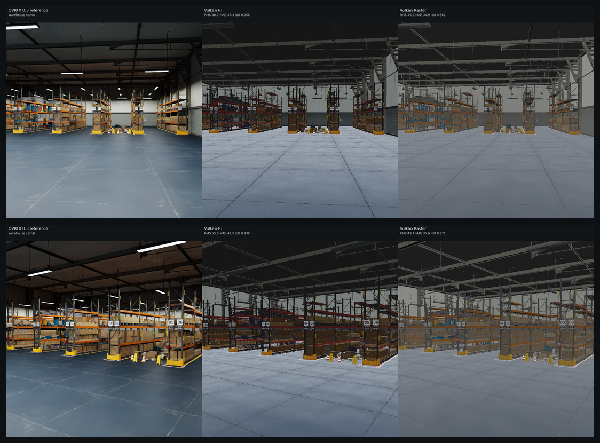
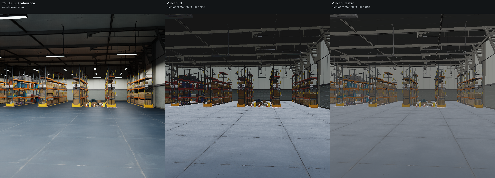
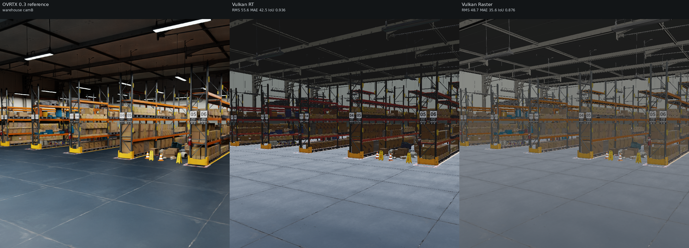

# Backend comparison: warehouse

## What is compared

- **OVRTX 0.3** (reference): NVIDIA OVRTX path tracer, driven through `nanousdview._backend` (`OvrtxViewportRenderer`, `rt2` mode).
- **Vulkan RT**: local `nusd_renderer` `NuRenderer(enable_rt=True)`, `render(NU_RENDER_RT)` — hardware ray tracing.
- **Vulkan Raster**: local `nusd_renderer` `NuRenderer(enable_rt=False)`, `render(NU_RENDER_RASTER)` — rasterizer.

- **Resolution**: 768x768 (**square** — this is the FIX-1 camera-parity change). The native Vulkan backends treat `fov_degrees` as the vertical FOV and derive horizontal FOV from the aspect; OVRTX derives its projection from focal_length + horizontal/vertical aperture (authored equal). At a non-square aspect those conventions disagree and OVRTX framed the subject ~1.8x larger. At a **square** aspect (1.0) hfov==vfov in both, so **the subjects co-register** — verified on the soccerball (OVRTX vs RT foreground bbox agrees within ~0.3% in width/height, corners within 1px).
- **Cameras**: two angles per asset, set programmatically on every backend (no authored camera). Chess and the Apple assets use bbox-framed angles — `camA` (front three-quarter) and `camB` (higher, opposite side). The **warehouse uses explicit interior look-at cameras** at forklift/eye height (camA down the long aisle, camB a 3/4 corner view) so racks, shelves, boxes, floor and walls fill the frame.
- **Lighting rig (shared)**: a constant-color `DomeLight` (no HDR texture) plus a Key and a Fill `SphereLight` positioned from the asset bbox (Key high-front, Fill opposite-lower). The wrapper *sub-layers* the asset's root layer (so material bindings survive) and authors only these lights at root scope, so all three backends — including OVRTX, run with `NUVIEW_OVRTX_DEFAULT_LIGHTING=0` — see the same lights. The chess and Apple assets ship no authored lights of their own; the warehouse is the exception (it carries ~39 of its own lights, plus the shared rig).



## Metrics vs OVRTX reference

RMS / MAE are over 8-bit sRGB pixels; silhouette IoU compares foreground masks (background-delta) between each backend and the OVRTX reference.

| Asset | Cam | RT RMS | RT MAE | RT IoU | Raster RMS | Raster MAE | Raster IoU | Notes |
| --- | --- | ---: | ---: | ---: | ---: | ---: | ---: | --- |
| warehouse | camA | 48.9 | 37.3 | 0.956 | 46.2 | 34.9 | 0.862 | ok |
| warehouse | camB | 55.6 | 42.5 | 0.936 | 48.7 | 35.6 | 0.876 | ok |

### Mean RGB (black-frame sanity)

| Asset | Cam | OVRTX mean RGB | Vulkan RT mean RGB | Vulkan Raster mean RGB |
| --- | --- | --- | --- | --- |
| warehouse | camA | (85.1, 89.0, 89.7) | (82.0, 86.4, 91.2) | (86.2, 88.5, 90.3) |
| warehouse | camB | (73.4, 72.9, 70.2) | (77.4, 79.7, 83.5) | (85.3, 86.2, 86.2) |

## Per-asset comparisons

### warehouse

_Isaac Sim Simple_Warehouse/full_warehouse.usd (interior, local PBR materials)_  (up axis: Z)

**camA** — camera eye (-2, -16, 1.9), target (-6, 22, 1.4), FOV 50 deg



**camB** — camera eye (3.5, -6, 2.6), target (-14, 20, 1), FOV 50 deg



## Visual differences observed

This set now uses **NVIDIA's standard Isaac Sim `Simple_Warehouse/full_warehouse.usd`** (replacing the earlier "Physical AI" warehouse whose materials referenced `omniverse://` and did not resolve offline). Its **25,256 material references are all local**, so this scene has **resolvable PBR (OmniPBR/MDL) materials**. The stage is **Z-up** (metresPerUnit 1.0); the harness handles the up-axis so the building is upright. The two cameras are explicit **interior** look-at views at forklift/eye height (camA down the long aisle, camB a 3/4 corner view across the rack rows) — not the whole-bbox exterior slab.
- **OVRTX** renders a fully textured interior: yellow/orange storage racks, stacked cardboard boxes, signage, the grey floor, structural ceiling and walls all read with their authored OmniPBR materials. This is the reference.
- **Vulkan RT** renders the same textured interior with the same framing (camera parity holds on the warehouse too — the racks, aisle and floor line up with OVRTX). The many-light no-IBL branch now uses a warmer, less blue bounce than the earlier run. It still lacks OVRTX's path-traced multi-bounce floor reflection and some shelf fill, but it shows the real materials, not a placeholder slab.
- **Vulkan Raster** renders the same textured interior, framed in parity with OVRTX/RT. (It previously came back fully black on this scene: a command-buffer-reuse-while-in-flight race in the headless present path (`gpu_begin_frame`) re-recorded command buffer 0 while the GPU was still drawing the heavy first warehouse frame, blanking it. It only bit scenes whose first frame is slow enough — which is why chess and the Apple assets were unaffected. Fixed by cycling `current_image` with the frame index so the command buffer, its framebuffer, the readback image and the guarding fence all rotate in lockstep.) The warehouse many-light branch now cuts back high/vertical procedural fill while keeping low floor surfaces readable. Raster is much closer in mean tone, but it remains flatter than OVRTX because it has no traced shadows or warm floor reflection.

_See [../README.md](../README.md) for the cross-set write-up and caveats._

## Repro steps

All commands assume the repo at `$HOME/nanousd-labs/nanousd-vulkan-renderer` and the verified box environment.

### 1. Build the renderer library

```bash
cd $HOME/nanousd-labs/nanousd-vulkan-renderer
NANOUSD_DIR=$HOME/nanousd-labs/nanousd \
  PATH=$HOME/blender/lib/linux_x64/shaderc/bin:$PATH \
  ./build.sh
```

This produces `build/libnusd_renderer.so` (picked up automatically by the
`nusd_renderer` ctypes bindings).

### 2. Environments

- Native renderer python (has `nusd_renderer`, numpy, Pillow):
  `$HOME/nanousd-labs/.venv/bin/python`
- OVRTX 0.3 reference venv (has `ovrtx==0.3.0`):
  `$HOME/nanousd-labs/.ovrtx03-venv/bin/python`

### 3. Fetch assets

- Chess (MaterialX): `/path/to/OpenChessSet/chess_set.usda`
- Warehouse (Isaac Sim `Simple_Warehouse/full_warehouse.usd`):
  `$HOME/assets/Isaac/Environments/Simple_Warehouse/full_warehouse.usd` — download recipe below.
- Apple USDZ: downloaded automatically by the harness into
  `comparisons/.assets/apple/` (git-ignored) from
  `https://developer.apple.com/augmented-reality/quick-look/models/<dir>/<file>.usdz`.

#### Warehouse download (NVIDIA Isaac Sim, public S3 mirror, no creds)

The warehouse is NVIDIA's standard Isaac Sim `Simple_Warehouse/full_warehouse.usd`.
Its materials resolve **offline** because they are local (`./Materials/` and
`./Props/`), unlike the older "Physical AI" warehouse whose materials reference
`omniverse://` and do NOT resolve here. Fetch the whole `Simple_Warehouse/` dir
(the `.usd` PLUS its sibling `Materials/` and `Props/` subtrees) from the public
production mirror — either with the AWS CLI (recursive, easiest):

```bash
DEST=$HOME/assets/Isaac/Environments/Simple_Warehouse
aws s3 cp --no-sign-request --recursive \
  s3://omniverse-content-production/Assets/Isaac/4.5/Isaac/Environments/Simple_Warehouse/ \
  "$DEST/"
```

or, without the AWS CLI, with `curl`/`wget` over HTTPS (grab the root layer and
its Materials/Props trees — adjust the file lists to match the manifest):

```bash
BASE=https://omniverse-content-production.s3.us-west-2.amazonaws.com/Assets/Isaac/4.5/Isaac/Environments/Simple_Warehouse
DEST=$HOME/assets/Isaac/Environments/Simple_Warehouse
mkdir -p "$DEST/Materials/Textures" "$DEST/Props"
wget -q "$BASE/full_warehouse.usd" -O "$DEST/full_warehouse.usd"
# Then mirror the Materials/ and Props/ subtrees the .usd references
# (Materials/*.mdl + Materials/Textures/*.png, Props/*.usd). The aws s3 cp
# --recursive command above is the reliable way to pull the full tree.
```

Two trivial props are missing offline (a `Forklift/forklift.usd` and one
`S_Barcode_248.usd`); USD prints a warning and renders the scene without them.

### 4. Run the harness

```bash
cd $HOME/nanousd-labs/nanousd-vulkan-renderer
PYTHONPATH=$HOME/OpenUSD_install/lib/python:$HOME/nanousd-labs/nanousd-vulkan-renderer/scripts \
LD_LIBRARY_PATH=$HOME/OpenUSD_install/lib \
OVRTX_PYTHON=$HOME/nanousd-labs/.ovrtx03-venv/bin/python \
DISPLAY=:1 XAUTHORITY=/run/user/1000/gdm/Xauthority \
  $HOME/nanousd-labs/.venv/bin/python comparisons/render_backend_comparison.py --set all
```

Use `--set chess|apple|warehouse` to render a single set, or `--gate` to render
only the chess set, camA, all three backends (the pre-flight black-frame check).

The harness regenerates the *co-located* sub-layer wrapper next to each asset's
root layer at run time (e.g. `<asset_dir>/_nusd_backend_compare_wrapper_<label>.usda`)
— that placement is required so the nanousd material loader's `.mtlx`/texture
scan, which keys off the root layer's directory, finds the asset's materials.
The copy committed under `<set>/wrappers/<label>.usda` is a record of the
generated text; load it via the harness rather than directly (its `subLayers`
path is relative to the asset directory).
