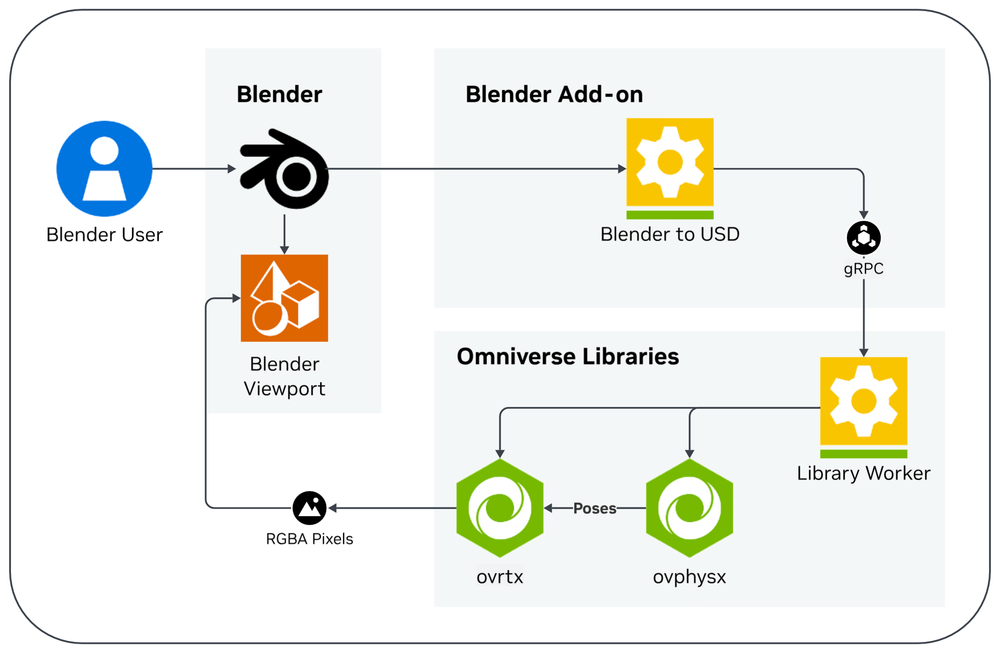

# ovrtx Blender Example

Bring NVIDIA RTX rendering into Blender. Keep creating in the Blender workflows
you already know, review your scene through NVIDIA ovrtx, and render a final
image without moving your work into a separate application.

*Scene: [The Junk Shop](https://download.blender.org/archive/gallery/blender-splash-screens/blender-2-81/)
by [Alex Treviño](http://www.aendom.com/), original concept by
[Anaïs Maamar](https://www.artstation.com/chatonlaser), licensed
[CC BY](https://creativecommons.org/licenses/by/4.0/). This image was rendered
with NVIDIA ovrtx.*

> **Sample release:** This is a public example for Blender 5.1, packaged for
> supported NVIDIA RTX workstations. It demonstrates focused creative rendering
> and SimReady prop review workflows. It is not a supported production renderer
> and does not reproduce every Cycles, EEVEE, or Blender feature.

## What you can do

- View the current Blender scene through NVIDIA ovrtx in the rendered viewport.
- Orbit, pan, and frame your work while the ovrtx image updates.
- Render a final image using the active Blender camera.
- Adjust supported materials, lights, cameras, and object transforms and review
  the result without leaving Blender.
- Play supported SimReady rigid-body motion with NVIDIA OVPhysX in the Blender
  Timeline before taking an asset into a larger Isaac or Omniverse workflow.

The add-on works with the scene already open in Blender, whether you created it
in Blender, opened a `.blend` file, or imported USD through Blender's normal
import workflow.

## Before you install

You need:

- Blender 5.1.
- A supported 64-bit release platform listed in
  [Support Platforms](docs/support-platforms.md).
- A compatible NVIDIA RTX GPU and NVIDIA driver.
- Internet access if installing the runtime from GitHub.

From the
[ov-blender-example project](https://github.com/NVIDIA-Omniverse/omniverse-labs/tree/main/projects/ov-blender-example),
download `ov-blender-example-<platform>.zip` and copy the paired Release page
URL listed there for an online runtime install, or download all assets for your
platform into one directory for a local install.
You do not need to unzip `ov-blender-example-<platform>.zip` before installing
it in Blender.

## Install

1. Open Blender.
2. Choose **Edit → Preferences → Add-ons**.
3. Open the add-on menu and choose
   [**Install from Disk**](https://docs.blender.org/manual/en/latest/editors/preferences/extensions.html#bpy-ops-extensions-package-install-files).
4. Select the downloaded `ov-blender-example-<platform>.zip`.
5. Enable **ovrtx Blender Example** if Blender does not enable it automatically.
6. For an online install, enable
   **System → [Allow Online Access](https://docs.blender.org/manual/en/latest/editors/preferences/system.html#bpy-types-preferencessystem-use-online-access)**
   in Blender preferences.
7. Open the add-on's **View Details** panel. **Install Runtime From** starts
   empty. Paste the exact Release page URL paired with the add-on ZIP, or select
   the absolute directory containing all downloaded release assets. The add-on
   never guesses or remembers this location.
8. Choose **Install Runtime** and leave Blender open while the progress bar
   verifies and installs every component, downloading them if needed.
9. Wait until the panel shows **Runtime: ready** and **Preflight: pass** before
   selecting the render engine.

The runtime is installed separately from the Blender add-on. This keeps NVIDIA
rendering and physics components outside the Blender process while the add-on
provides the Blender experience.

OVRTX uses GPU `0` by default. Set `OVRTX_ACTIVE_CUDA_GPUS` before launching
Blender to select another physical GPU index or a comma-separated set; use
`OVRTX_ACTIVE_CUDA_GPUS=all` (or an explicit empty value) to allow all GPUs.

## Render your first scene

1. Open a `.blend` file or create a scene in Blender.
2. In **Render Properties**, set **Render Engine** to **ovrtx Example**.
3. In the 3D Viewport, select **Rendered** shading.
4. Use Blender's normal orbit, pan, zoom, camera, selection, and transform
   controls.
5. Press **F12** to render the active camera.

The first image can take longer while the runtime starts and prepares rendering
resources. Later viewport updates reuse the active rendering session.

## How it works

Blender remains the place where you create, edit, and view your scene. The
add-on translates the current Blender scene to USD and sends it to the
separately installed NVIDIA Library Worker. NVIDIA ovrtx renders the scene and
returns pixels to the Blender viewport. When supported physics properties are
present, NVIDIA OVPhysX supplies updated poses for ovrtx to render.

## Workflows

### Review a creative scene with ovrtx

Use this workflow when preparing a product, industrial, or keynote-quality hero
image.

1. Compose the scene in Blender and choose the camera framing you want.
2. Switch the Render Engine to **ovrtx Example** and use **Rendered** viewport
   shading.
3. Adjust supported Principled material values and textures.
4. Place and tune supported lights.
5. Select objects and use Blender's move, rotate, and scale controls.
6. Review the result in the ovrtx viewport, then press **F12** for the final
   image.

ovrtx and Cycles are different renderers. Use the ovrtx viewport to review the
actual ovrtx result rather than expecting an exact Cycles match. See
[Known limitations](#known-limitations) for the currently supported subset.

### Check a SimReady prop with OVPhysX

Use this workflow when preparing a prop for a production-line, robot-handled,
Isaac, or Omniverse workflow.

1. Prepare a supported SimReady uni-body asset in the current Blender scene,
   including its collider, mass, physics material, and other required metadata.
2. Switch the Render Engine to **ovrtx Example** and use **Rendered** viewport
   shading.
3. Move the Blender Timeline to its start frame and press **Play**.
4. Watch the OVPhysX motion and contacts in the ovrtx viewport.
5. Stop playback and return the Timeline to its start frame to reset the
   simulation.
6. If the behavior is not what you intended, adjust the SimReady asset at the
   start frame and play the Timeline again.

This example complements the SimReady Blender add-on. It does not replace
SimReady authoring, preflight, or export, and it is not a general-purpose
physics sandbox.

## What currently updates

The ovrtx viewport supports a focused set of Blender edits:

- Camera placement and supported viewport navigation.
- Object translation, rotation, and scale for supported selections.
- Supported light placement and values.
- Supported material values and texture changes.
- Complete scene refresh when an edit cannot be applied incrementally.

Save your `.blend` file normally. Selecting ovrtx changes the render engine; it
does not replace Blender's scene or authoring workflow.

## Known limitations

- Blender 5.1 is the supported Blender version for this sample release.
- Only the platforms listed as supported in
  [Support Platforms](docs/support-platforms.md) are included.
- Material support covers a documented subset; complete Blender shader-node
  graph translation is not included.
- ovrtx output can differ from Cycles and EEVEE in materials, lighting, color,
  and effects.
- Hair, volumes, every Blender light or world configuration, and every material
  feature are not guaranteed to render equivalently.
- Geometry topology editing, deletion, reparenting, collection restructuring,
  and live material graph topology editing are not complete workflows.
- The OVPhysX experience is a focused SimReady prop check, not robot authoring,
  a complete Blender physics replacement, or a full Isaac Sim workflow.
- SimReady physics conversion currently supports the documented uni-body
  subset; separate collider meshes and joint constraints are not supported.
- NVIDIA runtime components run separately from Blender and require their own
  disk space and compatible drivers.

## Troubleshooting

### Install Runtime is unavailable

Enter the exact paired Release page URL or complete local artifact directory in
**Install Runtime From**. For a Release URL, also confirm that **Allow Online
Access** is enabled and Blender can reach the internet.

### Runtime does not become ready

Open the add-on's **View Details** panel and read the runtime and preflight
message. Confirm that you installed the ZIP for your platform and that your GPU
driver meets [Support Platforms](docs/support-platforms.md).

### The viewport is blank

Confirm that:

- **ovrtx Example** is the selected Render Engine.
- The viewport is using **Rendered** shading.
- The runtime reports **ready** and preflight reports **pass**.
- The scene has a supported camera, visible geometry, and lighting or a
  supported world setup.

### A Blender edit does not appear

Some edits require a complete scene refresh, and some Blender features are not
supported by this sample. Save the scene, switch away from and back to ovrtx if
needed, and check [Known limitations](#known-limitations).

## License

Project-authored source and documentation are licensed under Apache-2.0.
NVIDIA ovrtx, NVIDIA OVPhysX, their separately installed runtime components,
and third-party assets retain their own license terms. See [LICENSE](LICENSE),
[Licensing and Distribution](docs/licensing.md), and
[Third-Party Notices](THIRD_PARTY_NOTICES.md).
