# Runtime and Authoring Architecture

Blender owns the [current Blender scene](../CONTEXT.md#language). The add-on
turns that scene into one private scene generation, retains accepted authoring
state, and coordinates OVRTX rendering and OVPhysX simulation. OVRTX and
OVPhysX remain external services behind add-on-owned adapters.

This document is the authority for current module responsibilities, ownership
flows, and lifecycle sequences. [`CONTEXT.md`](../CONTEXT.md) owns domain terms
and focused invariants. Private decision records retain why the current shape
was chosen without becoming another current-system narrative.

## Primary current-scene pipeline

One pipeline carries a native Blender edit to a presented OVRTX frame:

```mermaid
flowchart LR
    Blender[Blender authoring] --> Capture[Callback-group capture]
    Capture --> Normalize[Selection normalization]
    Normalize --> Mapping[Authoritative scene mapping]
    Mapping --> Typed[Typed edit construction]
    Typed --> Resolution[Candidate group resolution]
    Resolution --> Planning[Complete-group planning and atomic admission]
    Planning --> Runtime[Authoring runtime retention and scheduling]
    Runtime --> OVRTX[OVRTX application and rendering]
    OVRTX --> Publish[Rendered publication]
    Publish --> Present[Blender presentation]
```

`BlenderEditCallbackAdapter` observes each current-scene depsgraph callback
group once. It does not route the group through each active render engine.
Viewport engines are presentation consumers: their sole association with the
scene runtime is `AuthoringGenerationRuntime.attach()`, and detaching a pane
does not transfer or end runtime ownership.

### One question per system

| System | Question it answers | Responsibility | Consequential decisions elsewhere |
| --- | --- | --- | --- |
| Blender authoring | What native data changed? | Own current values, type-qualified changed IDs, selection evidence, and saved `.blend` state. | USD identity, group admission, runtime ordering, and presentation policy. |
| `BlenderEditCallbackAdapter` | What did this callback report? | Capture one immutable callback group and pass it once to current-scene observation. | Whether selection owns the edit or whether the edit is supported. |
| Selection normalization | Did an explicit helper or child designate another interaction owner? | Redirect only a proven interaction-owner association; otherwise preserve native selection evidence. | The authoritative USD target and atomic group validity. |
| Active `SceneGeneration` mapping | Which current USD prim corresponds to the Blender ID that changed? | Resolve the type-qualified Blender ID through the accepted generation mapping. | Value conversion, edit mechanism, application order, and presentation. |
| Typed edit construction | What exact value or topology change was authored? | Convert mapped Blender state into immutable `InteractiveEdit` values using focused conversion policies. | Atomic admission and runtime effects. |
| Current-scene group resolution | Can every source participate in one candidate group? | Validate every mapped source and, for a selection-driven operation, require the same candidate operation for every selected source. Pass all or none to planning. | Final support classification and execution. |
| `InteractiveEditPlanner` and workflow | Can the complete candidate group be admitted, and which mechanism and data authority apply? | Plan every edit before effects; atomically submit a uniformly supported update group, route a uniformly supported reconciliation group, or reject the group. | Runtime cadence, service calls, durable exact-stage writes, and rendering. |
| `AuthoringGenerationRuntime` | What state and runtime lifetime belong to this Blender scene? | Own one scheduler, OVRTX controller, OVPhysX adapter, retained desired values, lifecycle state, activation, and attached presentation wakeups. | Per-pane texture/refinement state and protocol details. |
| `ViewUpdateStream` | Which latest view-authoritative targets await application? | Retain current pending VIEW values by semantic target and apply them through an operation-scoped OVRTX port. | Application order, OVRTX resource lifetime, and rendering. |
| `SimUpdateStream` | Which initial-condition values await or survive OVPhysX application? | Retain current pending and accepted SIM values by semantic target across OVPhysX replacement. | Application order, simulation lifetime, and pose projection. |
| `RuntimeScheduler` | What applies next, and in what order? | Serialize SIM application, complete-pose projection, VIEW application, physics cadence, and refinement invalidation. | Value retention, scene identity, durable persistence, OVRTX resource ownership, and Blender drawing. |
| `OvrtxSessionController` | What OVRTX session is active, and what render result is available? | Own replaceable OVRTX session state, construct operation-scoped value ports, advance rendering, and acquire results. | Edit admission, authoring lifetime, protocol binding, and Blender publication. |
| OVRTX and OVPhysX runtime clients | How does one typed service operation reach the protocol? | Resolve protocol bindings, construct protocol shapes, execute exact proto-named operations, and decode results. | Scene policy, runtime ordering, session reuse, and presentation. |
| Viewport session | What does this pane present? | Own one pane's render thread, refinement, texture, publication acknowledgement, draw, and viewport artifacts. | Current-scene scheduling, OVRTX lifetime, and edit retention. |

The implementation seams are deliberately narrow. Scene lifecycle and mapping
live in [`scene_generation_sessions.py`](../addon/ovrtx_blender_example/scene_generation_sessions.py)
and [`scene_generation.py`](../addon/ovrtx_blender_example/scene_generation.py);
capture lives in
[`blender_callback_adapters.py`](../addon/ovrtx_blender_example/blender_callback_adapters.py);
planning lives in
[`interactive_edit_planner.py`](../addon/ovrtx_blender_example/interactive_edit_planner.py);
ordering lives in
[`runtime_scheduler.py`](../addon/ovrtx_blender_example/runtime_scheduler.py);
and OVRTX application lives behind
[`ovrtx_value_updates.py`](../addon/ovrtx_blender_example/ovrtx_value_updates.py)
and [`ovrtx_runtime_client.py`](../addon/ovrtx_blender_example/ovrtx_runtime_client.py).

## Representative transform, beat by beat

Consider a user moving one native Blender object while OVRTX rendered view is
selected.

1. Blender emits one depsgraph callback containing the changed object's
   type-qualified Blender ID and the callback's selection evidence.
2. Selection normalization redirects a selected child only when explicit
   interaction-owner metadata proves that association. Missing metadata leaves
   the native source unchanged.
3. The accepted scene generation maps the Blender ID that actually changed to
   its current USD prim. Selection cannot replace this authoritative lookup.
4. The transform conversion policy constructs an immutable view-authoritative
   `InteractiveEdit` with the complete mapped transform value.
5. Group resolution verifies the mapping. If selection evidence makes the
   operation selection-driven, every selected source must contribute the same
   candidate operation in this callback. Another callback never completes it.
6. `InteractiveEditPlanner` plans every edit before effects. Only when the
   complete group resolves to supported VIEW updates with no durable USD write
   does the workflow atomically submit all intents to the scene's one
   `RuntimeScheduler`; otherwise it rejects the complete group.
7. The authoring runtime immediately retains the latest desired transform by
   stable Blender identity. `ViewUpdateStream` keeps at most the latest pending
   value for the corresponding semantic OVRTX target.

From that point the lifecycle has two branches:

- **Runtime inactive or activating:** submission wakes the authoring
  preparation worker. The scene's accepted generation activates OVRTX and,
  when required, OVPhysX. Retained desired values are rebound through the
  generation mapping; values already pending for the same target take
  precedence. Activation becomes ready only after retained and pending values
  reach typed terminal outcomes. Raw callbacks and superseded samples are not
  replayed.
- **Runtime active:** submission advances the scheduler's presentation
  revision and wakes every attached pane. The serialized scheduler tick drains
  the current pending target once through the controller's operation-scoped
  update port. Only OVRTX acceptance makes `values_written` true and resets
  refinement. OVRTX renders from the accepted state and publishes a result.
  Each pane uploads and publishes that result, acknowledges the revision, and
  presents its own texture in Blender.

One pane may drain the shared pending value before another pane wakes. The
second pane still owes the newer presentation revision, so it publishes the
accepted result instead of treating an empty pending set as proof that nothing
changed.

## Failure and deferral

These are condition-to-outcome rules:

| Condition | Outcome |
| --- | --- |
| Selection metadata is incomplete or has no explicit interaction-owner association. | Preserve the native changed Blender ID and proceed to authoritative generation mapping. |
| The active generation has no unique authoritative mapping for a changed Blender ID. | Reject that source; do not guess from selection, name, or stale USD paths. |
| One source in a selection-driven group is absent, ambiguous, unsupported, or playback-locked. | Reject the complete callback group and apply none of it. |
| A direct data-block edit has unrelated selected objects. | Treat the changed data-block ID as the source; unrelated selection does not enlarge the group. |
| No OVRTX session is active. | Retain the latest desired state, keep it pending by semantic target, and wake authoring preparation. |
| Activation or replacement begins while values are pending. | Rebind retained desired state, then apply the latest pending values before declaring the runtime ready. Do not preserve raw callbacks. |
| OVPhysX reports BUSY before accepting a pending SIM value. | Keep the latest value for that semantic target pending for a bounded later preparation attempt; do not infer success or count discarded samples. |
| OVRTX rejects or fails value application. | Return a typed failed outcome, keep `values_written=false`, and withhold refinement reset and readiness for that application. |
| OVRTX accepts the targeted values. | Return a typed accepted outcome with `values_written=true`; rendering and presentation remain later facts. |
| Candidate generation activation fails but predecessor restoration succeeds. | Reject the candidate, keep predecessor values, and continue from the predecessor generation. |
| Candidate activation and predecessor restoration both fail. | Stop presentation and retain both artifact sets for diagnosis. |
| A pane detaches. | Remove only its presentation association; keep the authoring runtime, scheduler, OVRTX controller, and OVPhysX state. |
| File load, add-on unregister, or Blender shutdown ends the authoring session. | Move the runtime through its typed lifecycle state, stop the scheduler, then deactivate owned OVRTX and OVPhysX state. Failed teardown blocks reuse; no handoff ledger decides the result. |

## State and reporting flow

[`CONTEXT.md`](../CONTEXT.md#language) is the authority for current desired
state, pending application, typed lifecycle outcomes, bounded recent
diagnostics, and exact semantic reporting policy. In this architecture, the
authoring session supplies current desired state, the concrete update streams
materialize pending application, runtime and controller operations return typed
lifecycle outcomes, and each owning subsystem emits its bounded diagnostics
under the exact semantic reporting policy.

## Branches and boundaries

The primary pipeline stays authoritative when these secondary flows appear:

- **Final render:** borrows compatible authoring-owned OVRTX preparation. An
  incompatible request temporarily retargets that one prepared session and
  restores the viewport request afterward. Final render owns camera,
  resolution, refinement, and Blender render-result presentation, not a second
  scene generation or scheduler.
- **Exact-stage diagnostics:** `ExactStageRenderCallbackAdapter` accepts an
  explicit stage, camera, and RenderProduct for fixtures and diagnostics. It
  has no authoring session, so an exact-stage viewport owns one standalone
  scheduler and may use authoritative layer provenance for durable writes.
- **Physics:** `SimUpdateStream` retains accepted initial conditions.
  `OvphysxStageController` advances OVPhysX and publishes complete pose sets to
  `RuntimeStageHost`; the scheduler translates authoritative poses through
  `ovphysx_to_ovrtx` before OVRTX application. The stage host does not schedule
  physics or issue render commands.
- **Topology reconciliation:** a supported native topology edit requests a new
  scene generation containing an affected-ID topology delta. The predecessor
  remains current until required consumers accept the candidate and retained
  values replay successfully. Unsupported or ambiguous closure fails closed;
  there is no callback-triggered whole-scene fallback.
- **Multiple viewport presentations:** every pane calls `attach()` on the one
  scene runtime and owns its own texture, refinement, publication revision, and
  artifacts. Panes do not own or clone the scheduler, desired state, OVRTX
  controller, or edit observer.
