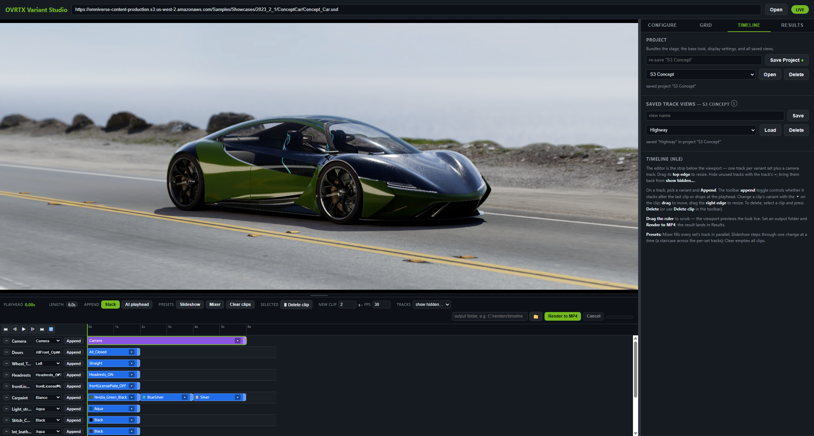

# OVRTX Dev Variant Presenter

**Status:** Working

A **hands-on example** of building a real-time, browser-streamed USD application on
**`ovrtx`** (the RTX path-tracing renderer), **`ovstage`** (the live stage host the
renderer attaches to), and **`ovstream`** (the WebRTC streamer). It loads a USD stage,
renders it live in a path-traced viewport streamed to the browser, switches **variants**
on the fly, frames cameras, and batch-renders stills, or a multi-track
timeline, to disk, end to end, in a single readable Python process.

It exists to show *how the pieces fit together*: one dedicated thread owning an
`ovstage.Stage` with an `ovrtx.Renderer` attached to it, composing USD non-destructively,
wiring `ovstream` into a FastAPI control plane, and driving it all from a plain-JS
frontend. This is a reference implementation to read, run, and borrow patterns from,
not a packaged product.



*The live RTX viewport with the multi-track timeline editor, authoring a variant and camera sequence to render out to video.*

▶ **See it in action:** [walkthrough on YouTube](https://www.youtube.com/live/cJtcHZedtXI?t=273)
*(the video calls it "OVRTX Variant Studio", same project, renamed to Dev Variant Presenter)*

The renderer runs on the machine; the browser only shows the live video stream and the
control panels. Your USD files are never modified: variant selections, cameras, and the
turntable rig are authored into composite and sidecar layers.

---

## What it demonstrates

Each capability below is a technique the source shows end to end, not a product feature
matrix. Read them as "here's how to do X on `ovrtx` + `ovstage` + `ovstream` + USD."

- **Live RTX viewport**: a real-time path-traced view of your stage, streamed to the
  browser over WebRTC, with free orbit / pan / zoom navigation.
- **Live variant switching**: click a variant chip and the stage reconfigures in the viewport,
  never touching your source files. Material and shader-parameter variants apply as live attribute
  writes and land in well under a tenth of a second; sets that move, hide or restructure geometry
  recompose the stage instead and take around 1.5 seconds. On the ConceptCar sample that is 8 sets
  on the fast path and 5 on the recompose path; the app classifies which is which on open.
- **Cameras**: snap to any camera authored in the stage, navigate freely from there, and
  dial per-camera optics (exposure, focal length, depth of field). Save a custom framing
  per camera.
- **Turntable rig**: pick a pivot on the model, frame the shot, and create a turntable
  camera that orbits the pivot one full revolution. Preview the spin live.
- **Grid / batch render**: render combinatorial stills across selected variant sets and
  cameras (one-at-a-time or full Cartesian), at a configurable quality and resolution,
  with a guard against combinatorial explosion.
- **Timeline (NLE)**: a multi-track, non-linear editor: author variant and camera changes
  over time, scrub the playhead to drive the live viewport, then render to MP4.
- **Projects**: bundle a stage with its base look, display settings, selected camera, and
  saved timeline views, and re-open the whole setup later.
- **Results & post-processing**: browse rendered stills and videos, stamp variant labels
  onto renders, and assemble a labeled contact sheet ("cut sheet").
- **Remote stages**: paste an `https://` URL to a USD stage and it is mirrored locally on
  open (the source is never written).

---

## Libraries used

| Library | Role in this sample |
|---|---|
| `ovrtx` | Renders the stage with RTX. Attached to the live stage (`attach_ovstage`), stepped by ordinal on a dedicated render thread, in Real-Time or Path Tracing mode. Also produces the batch stills and timeline frames. |
| `ovstage` | Hosts the live scene: population from the composed USD layer, live attribute writes (camera transform, optics), and USD time. The renderer attaches to it rather than opening a file itself. |
| `ovstream` | Streams the rendered frames to the browser over WebRTC and carries mouse input back for low-latency camera navigation. Owns the signaling port. |
| `usd-core` (`pxr`) | Authors the composite and sidecar layers: variant selection overrides, viewer camera, render product and settings, the turntable rig. Also scans the source stage for variant sets and cameras. |
| `warp-lang` | In-kernel post-processing on the rendered buffer (ISO/exposure gain, channel swizzle for the stream encoder). |
| `fastapi` / `uvicorn` | The control plane: REST endpoints, the `/events` WebSocket, and the static frontend mount. |
| `opencv-python` / `imageio-ffmpeg` | Batch and timeline output: still encoding, label overlays, contact sheets, and H.264 MP4 assembly. |

---

## Requirements

- **OS / GPU:** Windows 11 with an NVIDIA RTX GPU and a recent driver (see
  [Platform support](#platform-support) for Linux). Rendering is headless via Vulkan, no
  display server is required.
- **Python:** 3.11, managed with [`uv`](https://github.com/astral-sh/uv)
  (`ovrtx` ships no 3.12+ builds yet).
- **A USD stage** to open. None is bundled with the repo (see [A stage to try](#a-stage-to-try)).
- A modern Chromium-based browser (Chrome / Edge) for the viewer.
- **Node.js**: only to run the frontend timeline tests (see [Tests](#tests)); the app itself
  does not need it.
- **Network (install):** `uv sync` needs access to **`pypi.org`** *and* **`pypi.nvidia.com`**,
  see the note below.
- **Disk space:** budget **~15 GB** for the environment, and note that it grows with use. A
  fresh `uv sync` writes about **3.7 GB** into `.venv` (`ovrtx` is ~2.8 GB of that, CUDA and
  RTX runtime payloads). But `ovrtx` also writes its shader and derived-data caches *inside
  its own package directory* as you render, and those keep growing: on this machine `.venv`
  reached **11 GB** (`site-packages/ovrtx` alone 10.3 GB, ~7.5 GB of it runtime cache) after
  a few weeks of rendering. On top of that, allow room for whatever stage you open and its
  mirrored dependencies (the ConceptCar sample below is ~11 GB) and for your render output.

All dependencies, including `ovrtx` (the renderer), `ovstage` (the live stage host), and
`ovstream` (the WebRTC streamer), resolve from PyPI; `uv.lock` pins the exact validated
versions (`ovrtx` 0.4.x, `ovstage` 0.1.x, `ovstream` 0.4.x). One caveat: **installing needs
network access to `pypi.nvidia.com`, not just `pypi.org`.** The `ovrtx` package on PyPI is
only a `wheel-stub` sdist whose build backend downloads the real platform wheel from NVIDIA's
index, so an environment restricted to `pypi.org` alone (an offline mirror, a locked-down
proxy) cannot complete `uv sync`. (`ovstage` and `ovstream` publish real wheels to PyPI
directly.)

One browser-side component is **not** in this repository: the viewer needs NVIDIA's StreamSDK
WebRTC client, `web/omniverse-webrtc-streaming-library.js`. It is NVIDIA's own software, so it
is fetched rather than redistributed here; on first launch `run_server.ps1` / `run_server.sh`
download it from NVIDIA's public [ovstream](https://github.com/NVIDIA-Omniverse/ovstream)
repository at a pinned commit and verify its SHA256. The Python wheels ship no JavaScript, so
`uv sync` alone does not provide it. That first launch therefore needs network access to
**`raw.githubusercontent.com`**; afterwards the file is on disk and no download happens again.
If that host is blocked, fetch this URL on a machine that can reach it and save the file as
`web/omniverse-webrtc-streaming-library.js`:

```
https://raw.githubusercontent.com/NVIDIA-Omniverse/ovstream/af7f1f9006d1037a3cc7b8eca73f39a6469b69c2/examples/webrtc_client/omniverse-webrtc-streaming-library.js
```

### Platform support

Dev Variant Presenter is developed and validated on **Windows + RTX**; that is the only
configuration it is routinely exercised on.

**Linux is supported by the stack but not yet routinely validated here.** `ovrtx`, `ovstage`
and `ovstream` all ship `manylinux_2_35` wheels for x86_64 and aarch64, and the application
code is POSIX-clean (no Windows-only APIs, no hard-coded path separators), so it is expected
to run, but treat a Linux run as unverified territory rather than a tested path.

Practical differences:

- **Launcher:** `run_server.sh` on Linux/macOS, `run_server.ps1` on Windows. Both are the same
  watchdog: first-run `uv sync` and stream-client fetch, logs to `logs/`, relaunch on abnormal
  exit. (`run_server.sh` uses `curl`, falling back to `wget`, for the fetch.)
- **The 📁 Browse folder picker needs Tk**: on Debian/Ubuntu `sudo apt install python3-tk`,
  plus a desktop session. Without it the button degrades gracefully (it reports the picker is
  unavailable); paths can always be typed in directly, and nothing else is affected.

---

## Quick start

```powershell
powershell -ExecutionPolicy Bypass -File run_server.ps1
```

On startup the launcher prints the URL to open, **usually http://127.0.0.1:8080**, but if
that port is busy it picks the next free one and prints the actual address, so watch the
console (look for `is up - open: …`). That's it: on a fresh clone the launcher runs
`uv sync` once to build the environment, then starts the server. Use one tab: the live
stream is single-client. (Use `127.0.0.1`, not `localhost`.)

To install without launching, run `uv sync` yourself. Agent users don't need the commands at
all: just ask for the server to be started. The repo ships instructions each agent picks up
on its own: skills for Claude Code (`.claude/skills/`, covering environment setup and server
start/recovery), `AGENTS.md` for Codex, and `.cursor/rules/` for Cursor.

`run_server.ps1` (and its Linux/macOS peer `run_server.sh`) is a small watchdog that relaunches
the server on an abnormal exit and captures logs to `logs/`. To run the server directly without
the watchdog:

```powershell
.venv\Scripts\python.exe -m dev_variant_presenter --host 127.0.0.1 --port 8080
```

The control port (default `8080`) and the WebRTC signaling port (default `49100`) are
chosen automatically if the defaults are busy, so the app coexists with other local web
apps. The browser learns both ports on load.

### A stage to try

This repository does **not** ship with a stage: no USD assets are committed. The quickest
way to see Dev Variant Presenter in action is the public NVIDIA **ConceptCar** sample. Paste this
URL into the stage field and click **Open**:

```
https://omniverse-content-production.s3.us-west-2.amazonaws.com/Samples/Showcases/2023_2_1/ConceptCar/Concept_Car.usd
```

On first open the stage and its full dependency closure are mirrored into a local `data/`
cache (the source is never written); for the ConceptCar that's a ~11 GB download, so the
first open takes a while; later opens load from the cache and are fast. The ConceptCar
exposes 13 variant sets and 18 cameras, a good showcase of live switching, the camera
list, batch sweeps, and the timeline.

Any other USD stage works too: point the field at a local `.usd` / `.usda` / `.usdc`, or
paste another `https://` URL. Live variant switching needs a stage that authors variant
sets.

---

## Using Dev Variant Presenter

The window has a **live viewport** on the left (with the timeline strip below it) and a
**control panel** on the right with four tabs: **Configure**, **Grid**, **Timeline**, and
**Results**.

> Most controls explain themselves: hover any button, slider, or the small **ⓘ** icon next
> to a section heading to see a popup describing what it does.

### Open a stage

Type a stage path (or paste an `https://` URL, see [A stage to try](#a-stage-to-try))
into the field at the top and click **Open**. The stage is scanned for variant sets and
cameras, the live viewport warms up, and the panels populate.

> **First-run expectations:** the very first open of a stage compiles its MDL materials,
> for a complex stage like the ConceptCar that's around a minute before the viewport
> appears, and the first still render can take a few minutes more. Compiled shaders are
> cached, so every open after that is fast.

### The live viewport

Navigate freely with the mouse:

| Action | Control |
|---|---|
| Orbit | Left-button drag |
| Pan | Middle-button drag |
| Zoom (dolly) | Mouse wheel |

Navigation never changes a camera's saved framing; it only moves the live view.

### Configure tab: set up the live look

- **Camera**: pick any camera authored in the stage. Badges in the list show a camera's
  state: ↻ animated · ◆ has a saved framing · ✱ has optics overrides. **Save framing**
  commits your current view as the selected camera's framing; **Reset camera** reverts it
  to how it was authored.
- **Render mode**: **Real-Time** (fast, interactive) or **Path Tracing** (reference
  quality, converges to a photoreal frame). Real-Time is best for live work; Path Tracing
  is for hero output.
- **Display**: the stream/render resolution and aspect, plus per-camera optics: ISO
  (exposure), focal length, f-stop (depth of field), and focus distance. Use **Pick** to
  click a point on the model and set the focus distance there.
- **Turntable**: pick a pivot on the model, nudge it with the on-screen gizmo, then create
  a turntable camera from your current view. **Preview spin** plays it back live. Render
  the revolution from the Grid tab with **Animation range** enabled.
- **Variant sets**: every variant set in the stage. Click a chip to switch that set in the
  viewport instantly. This live look is the starting point ("base") for Grid sweeps and the
  Timeline.

### Grid tab: batch-render stills

Render many permutations to disk in one job.

- **Matrix mode**: *One-at-a-time* varies a single set across its variants while the others
  stay at the current live look (linear count); *Full Cartesian* renders every combination
  of the included sets (their product, guarded at 500 permutations).
- **Quality & output**: render mode (Real-Time / Path Tracing), resolution, samples per
  pixel (Path Tracing), and the output folder. Enable **Animation range** to render a
  numbered frame sequence (and an MP4) per permutation across a frame range, e.g. a
  turntable revolution.
- **Cameras**: render against one or more authored cameras; each produces its own output.
- **Include sets**: tick the sets to sweep and cherry-pick which variants participate. Sets
  you leave unticked stay pinned to the current live look.

The estimate line shows the render count before you start. Output files use a
`{set}-{variant}` naming convention and appear in the **Results** tab.

### Timeline tab: author a sequence and render to video

The editor is the strip below the viewport: one track per variant set, plus a camera
track.

- Add clips by picking a variant on a track and clicking **Append** (the append-mode toggle
  controls whether clips stack after the last one or drop at the playhead). Drag a clip to
  move it, drag its right edge to resize, and use the **▾** on a clip to change its variant.
- **Scrub** the ruler (or use the transport: play / pause / step / loop, plus Space and the
  arrow / Home / End keys) to drive the live viewport through the sequence.
- **Presets**: *Mixer* cycles every set in parallel; *Slideshow* steps through one change
  at a time; *Clear clips* empties all tracks.
- Set an output folder and click **Render to MP4**. The result opens in the Results tab.

**Projects** bundle the stage, base look, display settings, selected camera, and the
working timeline under a name you can re-open later. **Track views** are named timelines
saved inside a project (open a project first to manage them).

### Results tab: review and label

Point the Results folder at a render output and **Refresh** to browse the stills and
videos. **Overlay labels** writes labeled copies (originals untouched) into a `_labeled`
folder; **Cut sheet** composes all variants into one labeled contact-sheet image.

---

## Architecture: how it works


*The big picture: the browser chooses the look; a local RTX stack (`ovstage` + `ovrtx` +
`ovstream`) hosts, renders, and streams; the source USD is never modified.*

Under the hood, Dev Variant Presenter is a single Python process with a **FastAPI** control
plane and one dedicated **render thread** that owns the live scene and renderer:

- The **browser** shows the live `ovstream` WebRTC video and sends control requests (open,
  variant switch, camera, render-mode, batch, timeline) over REST. Progress and state
  updates come back over a WebSocket (`/events`). Camera mouse input travels over the
  WebRTC channel for low latency.
- The **render thread** owns an `ovstage.Stage` (population, live attribute writes, USD
  time) and an attached `ovrtx.Renderer` (`attach_ovstage` → `step` with ordinals). It
  runs a continuous loop that always submits a frame, so the stream stays alive even
  while it composes a stage or renders a batch in short bursts.
- The **stage composer** (using `pxr`) builds a composite layer that sublayers your scene
  and adds a viewer camera, render product, and render settings; that composite is loaded
  into ovstage (not via deprecated `Renderer.open_usd`). Variant selections are authored as
  override prims in that same composite layer (`OverridePrim` +
  `SetVariantSelection`), and the turntable rig lives in a sidecar layer sublayered
  alongside it; **your source USD is never modified.**

```
Browser (video + control panels)
   │  WebRTC video + mouse        │  REST + WebSocket (/events)
   ▼                              ▼
ovstream server  ───────────►  FastAPI / uvicorn
   (signaling :49100)              │ enqueue commands
                                   ▼
                 RENDER THREAD (ovstage.Stage + attached ovrtx.Renderer)
                   • continuous stream loop (never starves WebRTC)
                   • populate / live writes / step(ordinal=…)
                   • variant switch · camera · render mode · batch · timeline
                                   │ author composites (pxr) → ovstage.population
                                   ▼
              Stage composer (pxr)  ·  Variant & camera scan  ·  Batch / timeline / post
```

---

## Rebuilding from scratch: the `rebuild/` package

This repository also ships the **distilled knowledge to regenerate the entire
application**: [`rebuild/`](rebuild/) holds a build prompt, ten domain skills (ovrtx /
ovstage rendering, USD variant handling, streaming, timeline...), and two executable acceptance
gates that define "done" (an HTTP grader plus a real-browser verifier that drives every
user-facing flow on rendered pixels). Hand the prompt to a capable coding agent and it
builds a working Dev Variant Presenter at production cadence, validated blind, without access
to this reference implementation. See [`rebuild/README.md`](rebuild/README.md).

---

## Project layout

```
ovrtx_dev_variant_presenter/
  pyproject.toml  uv.lock     # uv project + locked, validated dependency set
  LICENSE                     # Apache-2.0
  THIRD-PARTY-NOTICES.md      # the one fetched third-party component + its terms
  run_server.ps1              # server launcher / watchdog, Windows (runs uv sync on first launch)
  run_server.sh               # the same watchdog for Linux / macOS
  dev_variant_presenter/      # Python server package
    __main__.py  app.py  config.py
    models.py                 # shared dataclasses (no ovrtx/pxr imports, safe anywhere)
    usd_guard.py              # process-wide lock serializing pxr stage authoring
    api/        routes.py     # FastAPI REST + /events WebSocket + static frontend
                folder_picker.py  # native folder dialog behind the 📁 Browse button
    render/     runtime.py    # render thread, command queue
                stage_session.py  # owns ovstage.Stage; attach/populate/writes/ordinals
                stream.py      # ovstream WebRTC integration
                composer.py    # composite-layer authoring (pxr) → ovstage.population
                camera.py      # orbit / pan / dolly controller
                modes.py       # render-mode / quality mapping
                commands.py    # render-thread command dataclasses
    scan/       variants.py    # variant + camera scanner
                effects.py     # per-variant effect classifier (fast-path switching)
    batch/      engine.py  jobs.py     # matrix expansion + batch render
    sequence/   timeline.py    # multi-track timeline engine
    post/       processing.py  # overlay labels, cut sheet, video assembly
    turntable.py  mirror.py  store.py  session.py   # rig, remote mirror, projects, recovery
  web/                        # vanilla-JS frontend
    index.html  app.js  style.css  timeline-core.js
    omniverse-webrtc-streaming-library.js   # NVIDIA stream client, required by the viewer:
                                            # fetched at setup, not shipped in this repo
    timeline-core.test.cjs    # node tests for the timeline state resolver
  tests/                      # pytest suite (stage-dependent tests skip without a local mirror)
  rebuild/                    # regenerate the app from scratch: prompt + skills + acceptance gates
  .claude/skills/             # agent skills: setup-environment, start-server
  AGENTS.md  CLAUDE.md  .cursor/   # agent instructions (Codex / Claude Code / Cursor)
  docs/images/                # README images
```

Everything the sample needs sits at its own root, so it is self-contained: `cd` into this
folder and `uv sync` / the launcher / `uv run pytest` all work from there. The layout departs
from the `source/` + `data/` scaffold in
[`../NEW_SAMPLE_TEMPLATE.md`](../NEW_SAMPLE_TEMPLATE.md) on purpose, this is a runnable `uv`
project, so `pyproject.toml` has to sit at the project root, and Claude Code only auto-discovers
skills at `.claude/skills/` relative to the working directory.

---

## Tests

```powershell
uv run pytest                 # Python unit + integration tests
node web/timeline-core.test.cjs   # timeline state-resolution tests (frontend logic)
```

---

## Skills

The sample ships agent-callable skills in two places:

- **`.claude/skills/`**: operating this sample. `setup-environment` (fresh clone to a working
  `.venv`, including the `pypi.nvidia.com` and StreamSDK-fetch caveats) and `start-server`
  (launch, restart, and recover the stream after a native crash). Claude Code auto-discovers
  these when the working directory is this sample folder; Codex reads `AGENTS.md` and Cursor
  reads `.cursor/rules/`, both of which point at the same procedures.
- **`rebuild/skills/`**: ten domain skills that encode the *techniques* rather than this
  codebase: live variant switching, variant scan and classification, remote stage mirroring,
  turntable cameras, grid/batch rendering, the timeline NLE, projects and session recovery,
  post-processing and cut sheets, plus the UI and application skills. They are written to be
  reusable in your own `ovrtx` / `ovstage` / `ovstream` project, not just here.

---

## Extending this sample

Where to start, by what you want to change:

- **Open a different stage**: nothing to edit. Point the stage field at any local
  `.usd` / `.usda` / `.usdc` or an `https://` URL; `mirror.py` handles the remote closure.
  Live variant switching needs a stage that authors variant sets.
- **Change what gets composed onto the stage**: `render/composer.py` is the single place that
  authors the composite layer (viewer camera, render product, render settings, variant
  selection overrides). Add your own overrides there and they compose non-destructively over
  the user's scene.
- **Change renderer behaviour**: `render/modes.py` maps the UI's quality settings onto
  `ovrtx` render-mode and sampling attributes; `render/stage_session.py` owns the
  attach/populate/step lifecycle and the live attribute writes.
- **Swap the streamer**: `render/stream.py` is the only module that imports `ovstream`. The
  render loop hands it a device buffer; replacing it with a different transport means
  reimplementing that one interface.
- **Add a REST endpoint or a panel**: `api/routes.py` plus `web/app.js`. Commands that must
  touch the scene are enqueued as dataclasses in `render/commands.py` and executed on the
  render thread; do not call into `ovstage` or `ovrtx` from a request handler.

Known limits that would need real rework, not a config change:

- **Single client, single stage, single process.** The render thread owns one
  `ovstage.Stage`; multi-tenant or multi-viewport use is a redesign, not a setting.
- **Variants are read and selected, never authored.** Editing variant sets themselves is out
  of scope.
- **Path Tracing convergence blocks the interactive stream** during batch bursts. The loop is
  written to keep submitting frames, but heavy jobs still degrade interactivity.

---

## Notes & limitations

- This is a **reference implementation**, not a hardened product; it favors readable,
  single-machine code over packaging, scaling, or multi-tenant robustness. Read the source
  and adapt it; don't expect turnkey deployment.
- The live stream is **single-client**: open it in one browser tab. Opening a second tab
  takes over the stream.
- Dev Variant Presenter **reads and selects** variants; it does not author or edit variant sets.
- The renderer and viewer are **local-first**. Remote/LAN access is possible but not
  configured by default.
- The browser shows the video stream only; all rendering happens on the server's GPU.

---

## License

Apache-2.0, see [`LICENSE`](LICENSE). Borrow the patterns freely.

One exception: `web/omniverse-webrtc-streaming-library.js` is NVIDIA StreamSDK code covered by
NVIDIA's own terms, not Apache-2.0. It is not redistributed here; the launcher fetches it from
NVIDIA's public `ovstream` repository on first run, see
[`THIRD-PARTY-NOTICES.md`](THIRD-PARTY-NOTICES.md).
