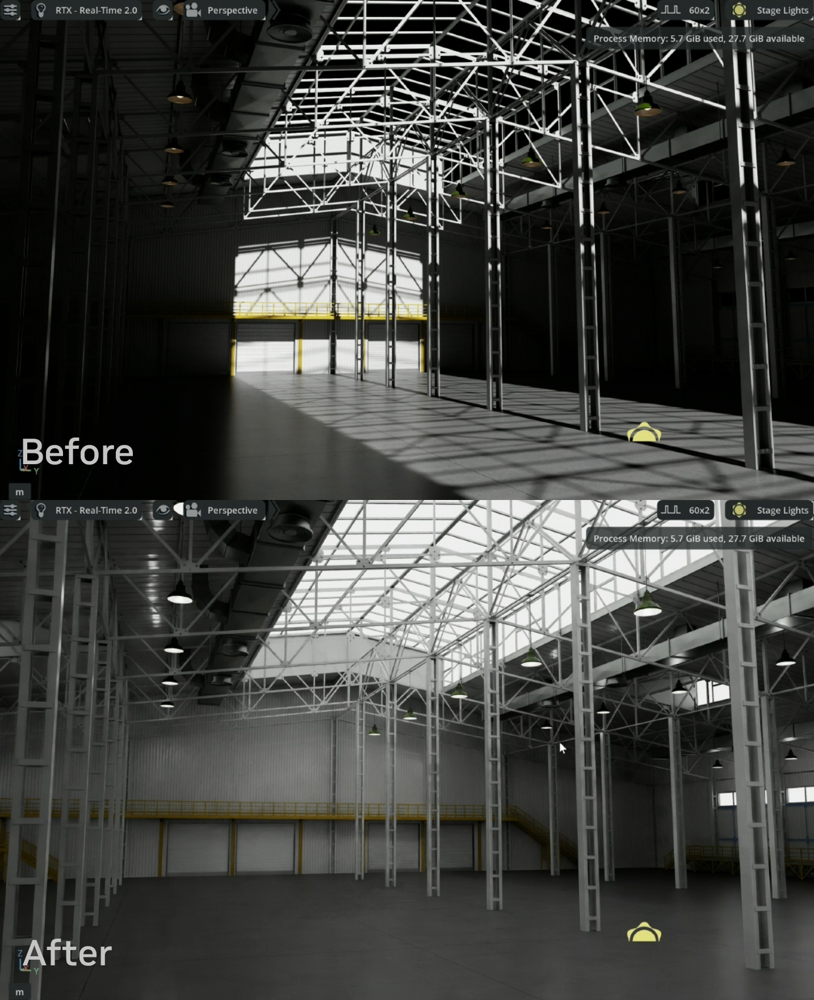

# omniverse-usdlux-lighting-skill

An agentic skill for creating and upgrading physically accurate lighting in USD scenes
using the UsdLux 2505 specification in NVIDIA Omniverse 109.0+.



## What it does

- Detects fixture geometry in the scene (merged meshes, PointInstancers, individual prims)
  and creates UsdLux lights at each fixture position
- Deactivates existing legacy lights and creates new UsdLux 2505 lights at detected fixture positions
- Applies physical light schemas from the Omniverse physical lighting extension
  (`omni.usd.schema.physicallight`) — including area, dome, and illuminant schemas
- Calculates lumens via the Lumen Method with Room Index, reflectance-aware UF,
  and empirical scene complexity correction for RTX path tracing
- Samples surface reflectances from scene materials or displayColor to improve accuracy
- Warns when per-fixture lumens exceed realistic indoor lighting ranges and explains why
- Prints camera exposure recommendations (Film ISO, F-stop, Exposure Time) matched to the
  target lux so the viewport looks correct immediately after the run (non-dry-run only)
- Supports one-step calibration: measure PT AOV Illuminance, re-run with `--measured-lux`
- Falls back to a ceiling grid when no fixture geometry is detected
- Handles any unit system (cm, m, mm), Y-up and Z-up scenes, merged meshes, PointInstancers
- Detects glass/window geometry and creates a DomeLight automatically
- Never modifies the original scene — all lights written to a non-destructive sublayer

## Requirements

- NVIDIA Omniverse Kit 109.0+ (physical light schemas require Kit's extension system)
- Python with `pxr` — provided by Kit or installable via `pip install usd-core`
  (note: `usd-core` alone supports dry-run and analysis; writing physical schemas needs Kit)

## Usage

```bash
# Dry run — analyze only, no files written
python run_lighting_skill.py /path/to/scene.usd --dry-run

# Write lighting sublayer
python run_lighting_skill.py /path/to/scene.usd

# Calibrate after measuring PT AOV Illuminance in Omniverse viewport
python run_lighting_skill.py /path/to/scene.usd --measured-lux 220

# Override target illuminance (default: auto-detected from scene type)
python run_lighting_skill.py /path/to/scene.usd --target-lux 300

# Color temperature options
python run_lighting_skill.py /path/to/scene.usd --color-temp 5000 --dome-color-temp 6500

# Dome light control
python run_lighting_skill.py /path/to/scene.usd --force-dome   # always create DomeLight
python run_lighting_skill.py /path/to/scene.usd --no-dome      # never create DomeLight
python run_lighting_skill.py /path/to/scene.usd --dome-illuminance 10000

# Custom output sublayer name
python run_lighting_skill.py /path/to/scene.usd --output-layer my_lights.usd
```

For AI agent usage, see `usdlux-lighting-skill.md`.

## Calibration workflow

1. Run the skill (writes the lighting sublayer)
2. Open the scene in Omniverse — switch to **RTX Path Tracing**
3. **Before anything else: set the camera tone mapping** — the skill prints recommended
   Film ISO, F-stop, and Exposure Time at the end of every run. Apply these in
   **Render Settings → Post Processing → Tone Mapping** first. Without this step the
   scene will look too dark or too bright regardless of how accurate the lighting is —
   the lights are physically correct, the camera just needs to be set to see them.
4. **Debug View → PT AOV Illuminance** — click floor surfaces to read lux values
5. If the reading is off target, re-run with `--measured-lux <reading>`
   The skill scales all lights to hit the target in one step

